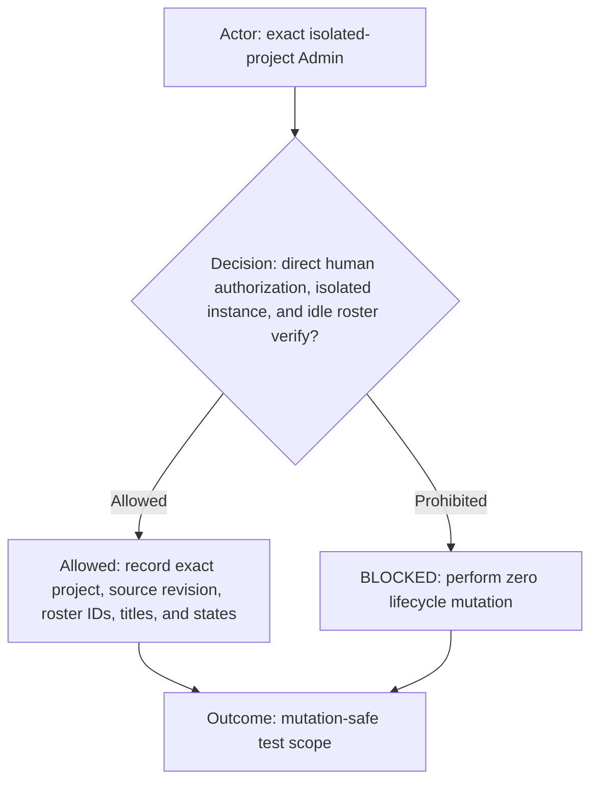
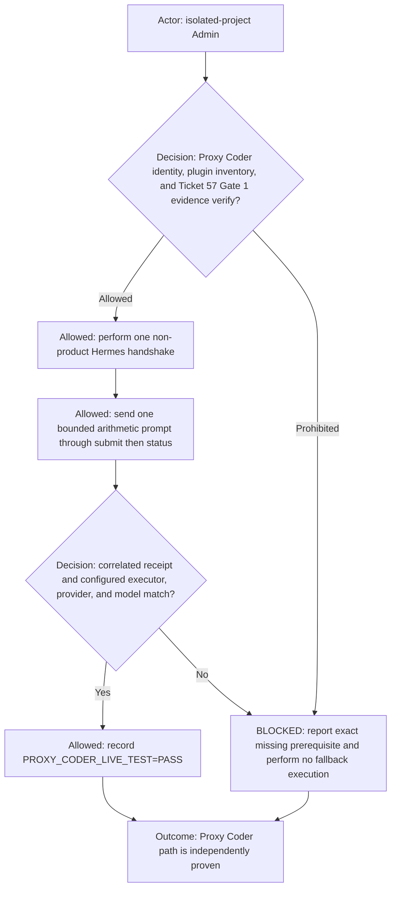
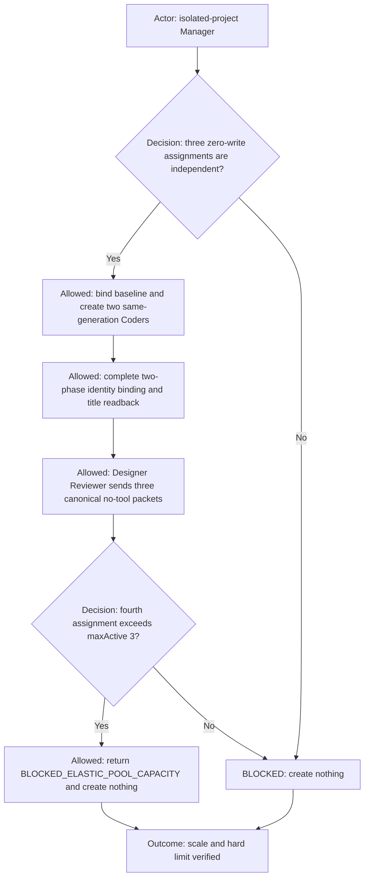
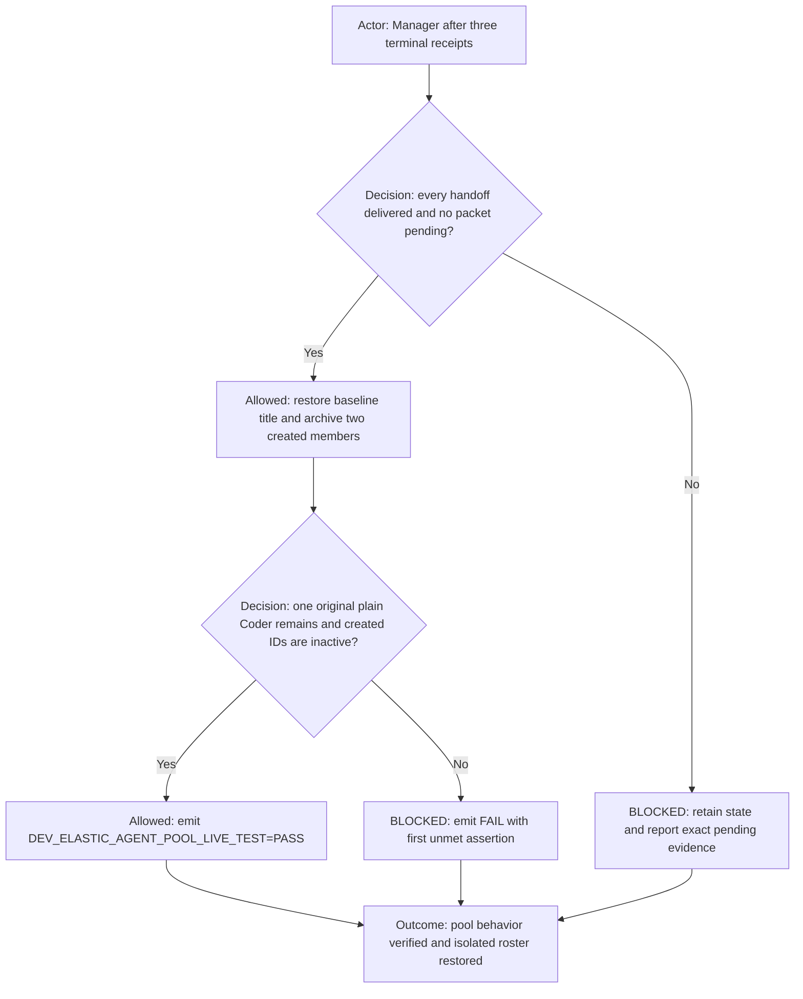

# Dev Elastic Agent Pool live acceptance

Use this non-product test to verify that the initialized SC Dev Manager scales the configured Coder Agent into multiple
same-generation runtime instances, enforces capacity, and restores the baseline. Run it only in an explicitly named,
disposable logical project such as `sc-dev-elastic-test`; never run it in base `sc-dev`.

## Preconditions

The test may create, rename, message, and recoverably archive isolated workflow tasks only. Product files, Git state,
tickets, deployments, commands, credentials, and every task in base `sc-dev` are out of scope. Record the Admin,
Designer Reviewer, Manager, and baseline Coder IDs before mutation.

## Proxy Coder round-trip

The visible Agent is named `Proxy Coder`; its stable Agent ID remains `proxy-coder`, its Role is `Worker`, and its
structured execution mode is `proxy`.
Use the prompt `Return only PROXY_CODER_4` for `2 + 2`. The Luna wrapper calls only the registered Hermes submit and
status operations and never answers independently. PASS requires a correlated completed status receipt, exact token
`PROXY_CODER_4`, and executor/provider/model values matching the initialization identity card. A missing plugin,
incomplete Ticket #57 Gate 1, submission failure, wrapper-authored answer, or mismatched receipt is a typed blocker—not
permission to ask for approval, start a local service, inspect product files, or substitute another execution route.

## Scale, dispatch, and capacity

Use correlation `elastic-live-test-<timestamp>` and these assignments:

- `elastic-a` returns exactly `ELASTIC_A_DONE`;
- `elastic-b` returns exactly `ELASTIC_B_DONE`;
- `elastic-c` returns exactly `ELASTIC_C_DONE`;
- `elastic-d` is requested only after the first three are active and must be refused.

The three active titles are `🔀 Coder (1) [elastic-a]`, `🔀 Coder (1) [elastic-b]`, and
`🔀 Coder (1) [elastic-c]`. Creation retains generation `1` and uses `initializedPoolMemberTaskId: pending` followed by
an exact `POOL_MEMBER_IDENTITY_BINDING`. Each assignment packet includes exact caller/recipient/return IDs, Agent IDs and
names, Roles, all four project coordinates, correlation, label, expected token, direct-human test authorization,
zero-write intent, prohibited effects, and evidence requirements.

Planned calls, prompt text, send receipts, commentary, or copied tokens are not execution evidence. Each token requires
the actual completed destination turn ID. The fourth request must return `BLOCKED_ELASTIC_POOL_CAPACITY` and a roster
readback proving that no fourth Coder was created.

## Settlement and result

PASS requires `PROXY_CODER_LIVE_TEST=PASS`, three distinct same-generation active IDs at peak, three exact completed-turn tokens, refusal without a
fourth creation, two archived created-member readbacks, the original Coder restored to `🔀 Coder`, and zero effects
outside isolated task lifecycle. The terminal receipt includes correlation, logical/runtime project IDs, source revision,
baseline and created IDs, before/peak/after rosters, completed turn IDs, capacity evidence, and archive readbacks.
