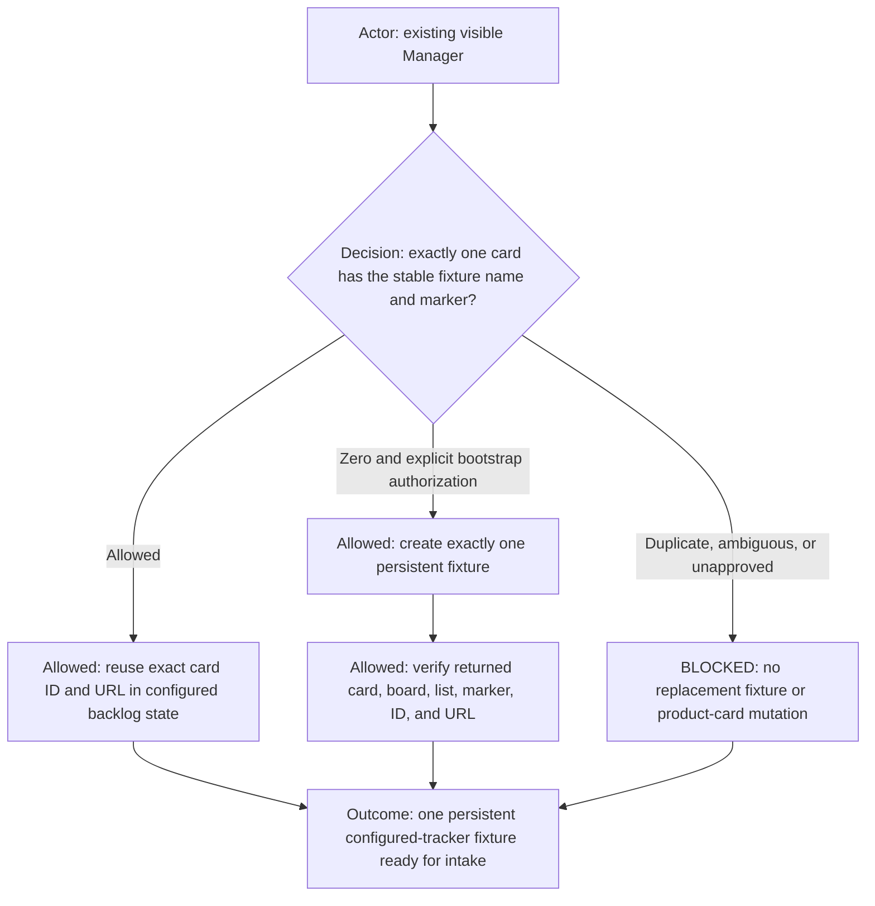
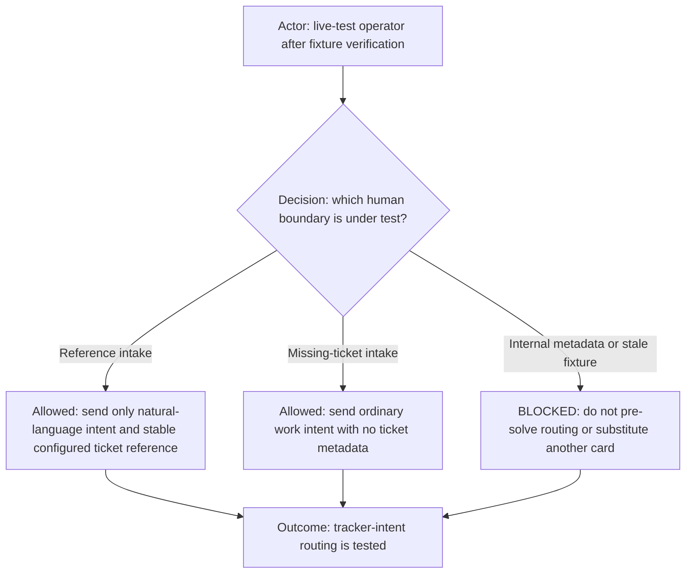
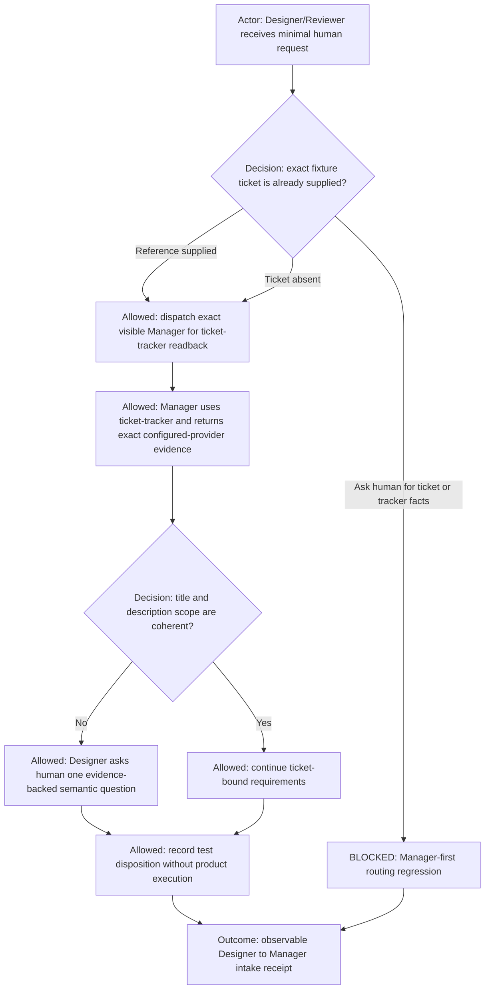
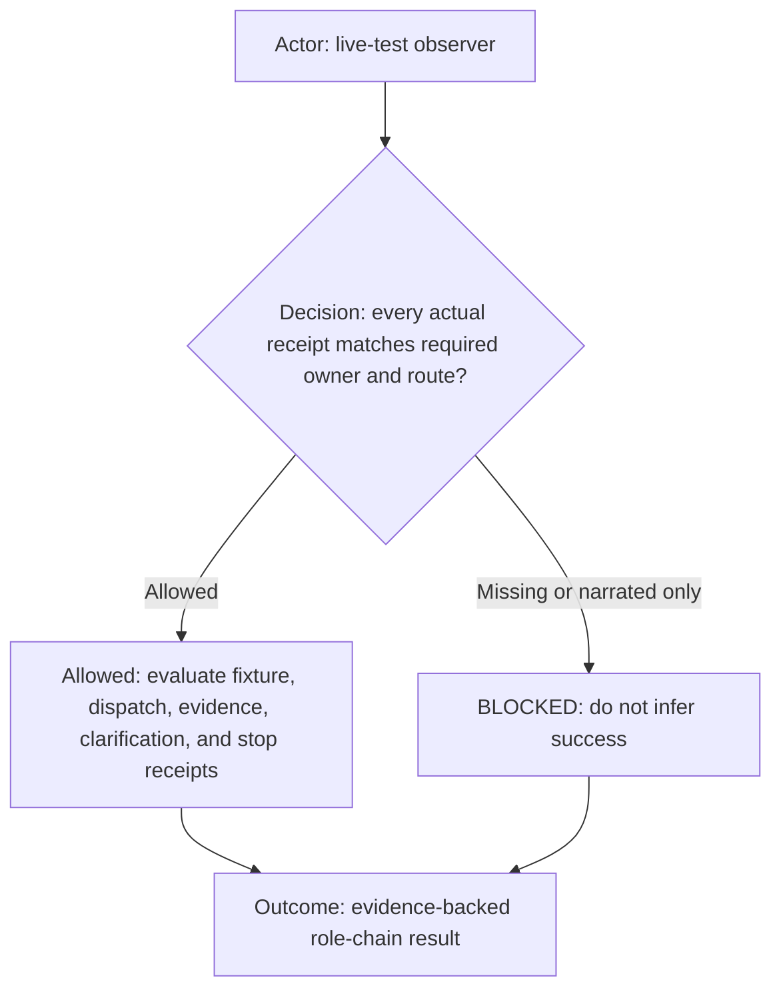
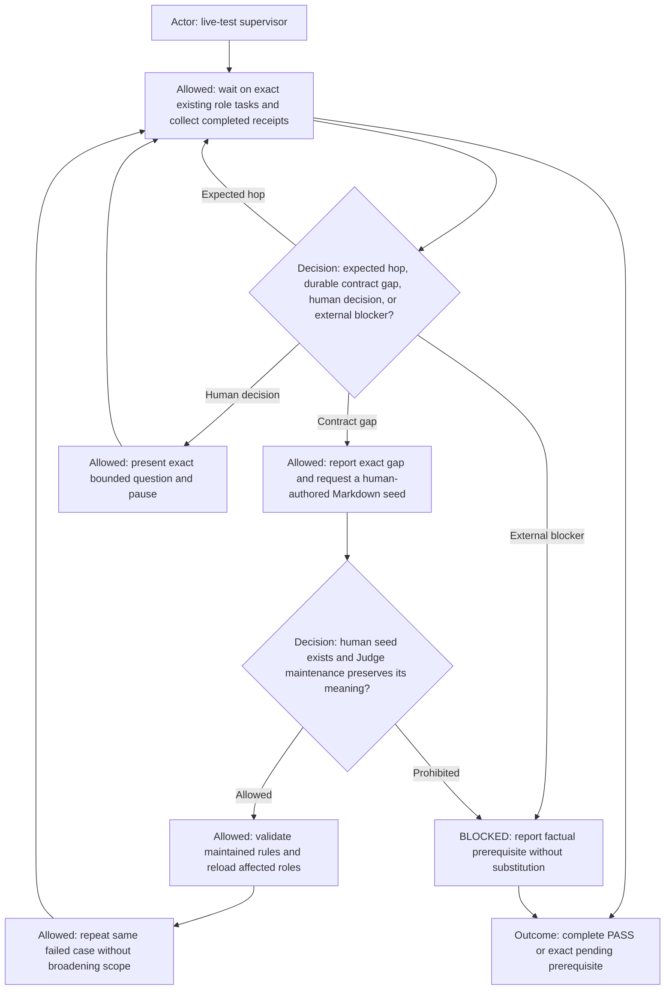
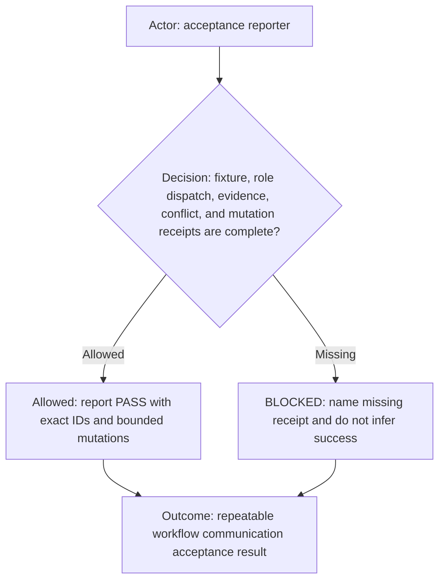
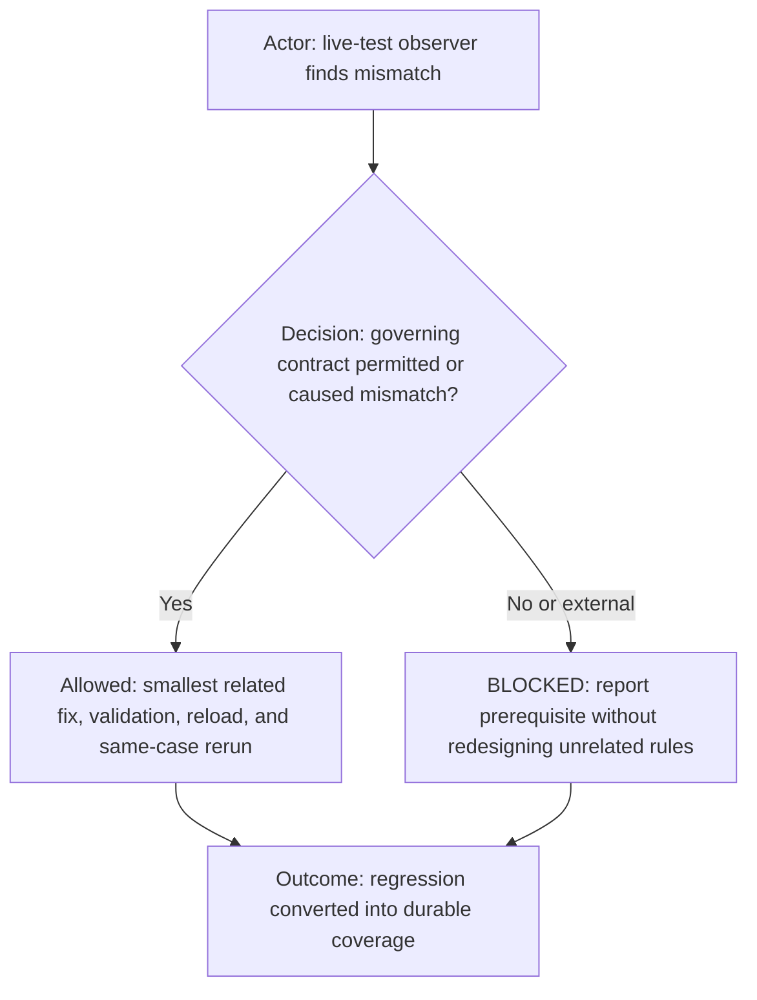
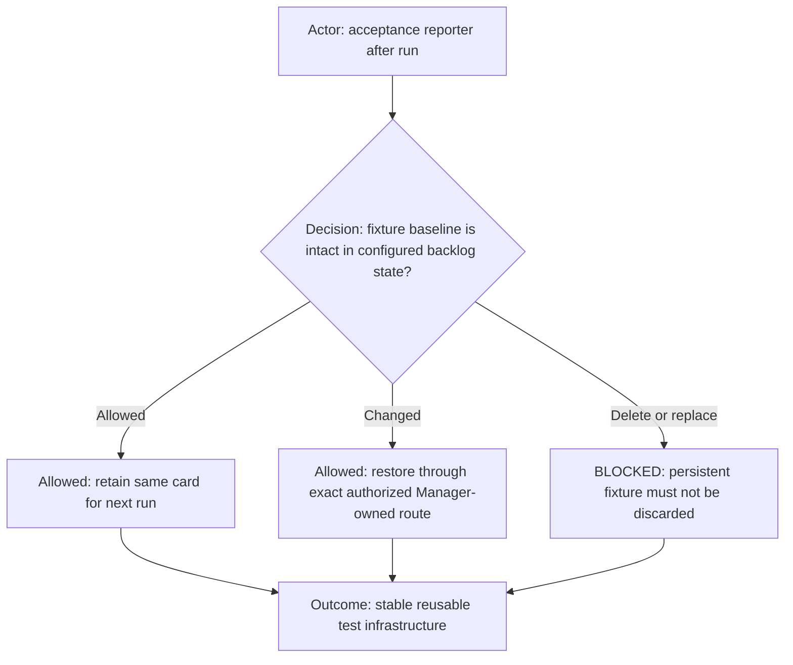
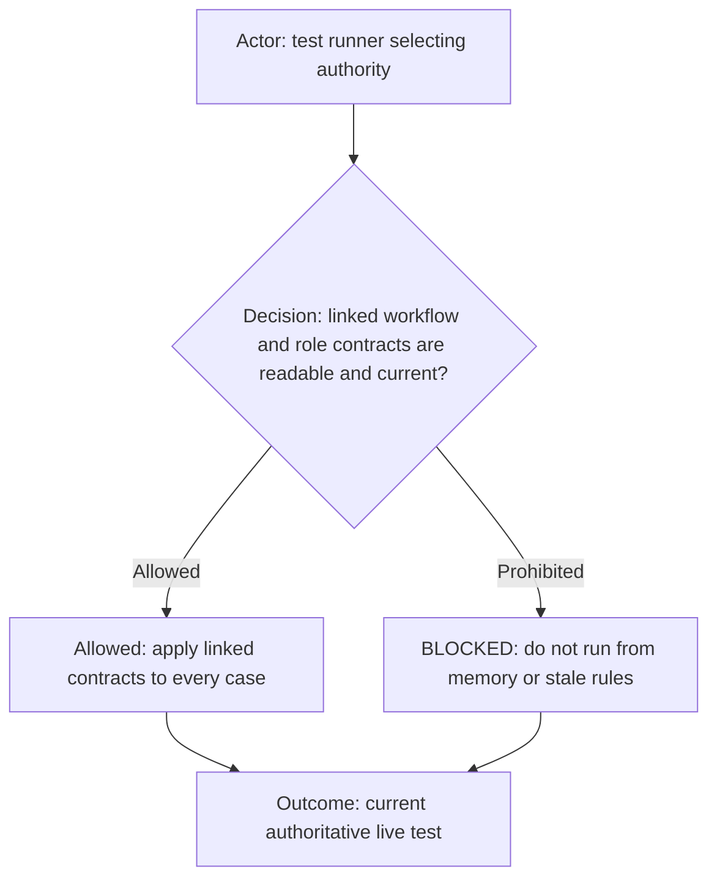

# Dev workflow live acceptance

**DIAGRAM-FIRST CONTRACT — NO UNCOVERED RULE TEXT.** Every normative chapter starts with a compact vertical Mermaid
diagram containing its actor, prerequisite or decision, allowed route, prohibited or `BLOCKED` route, and terminal
outcome. Diagram/text mismatch is `BLOCKED`.

Use this repeatable live test after workflow, role-routing, ticket-tracker, profile, session-usage, or initialization changes.
It exercises real agent-to-agent communication through the existing visible `<profile-id>-dev` roles. The current cases
reuse one clearly marked configured-tracker fixture through the Manager-owned
[`ticket-tracker`](../../ai-commands/ticket-tracker/ticket-tracker.command.md) command route. The tracker provider comes from
the selected profile and is not part of this workflow's identity. This is not a synthetic unit test, and the human prompt
must not supply internal packet metadata.

## Persistent fixture

Search before every run by exact name and board, then read the candidate and verify the marker. Reuse exactly one
match. Zero matches permits a one-time create only with explicit human authorization. Multiple matches are `BLOCKED`;
never create another card to escape ambiguity.

Persistent fixture identity comes entirely from the selected profile project's
`tracker.acceptanceFixtures.managerFirstLiveTest` record. That record supplies the provider, workspace/container, item ID,
URL, expected lifecycle state, stable name, and fixture marker. This portable workflow contains no profile-specific tracker
identity or bootstrap receipt. A missing or ambiguous configured fixture is `BLOCKED`.

The fixture is visibly non-production and deliberately conflicting. Its title concerns Manager-first ticket intake while
its description asks for Pi/GPT session-usage validation. The description begins
`TEST FIXTURE — DO NOT IMPLEMENT OR DEPLOY.` This conflict forces the role chain to obtain configured-tracker facts from
Manager through `ticket-tracker` and ask the human only for the smallest semantic clarification.

## Human request cases

Run each case in a clean `💬 Designer Reviewer` context. When role initialization is stale or a clean context is unavailable,
ask the human whether to reinitialize before the case. Reinitialization is preferred, but an explicit human instruction to
proceed permits one recorded, bounded run using the existing visible role state. A prior case's pending clarification,
returned Manager receipt, or conversational state must not be present. When the visible roles are persistent tasks,
reconcile the complete Team-declared roster between cases rather than sending the next case as a follow-up that can be mistaken
for an answer to the previous case. After the human's prescribed response has produced a terminal stop receipt with no
pending clarification, the next named case may begin as a fresh intake in the same visible task.

Case A — stable URL intake:

> We’re going to work with this one: `<configured-manager-first-live-test-fixture-url>`

Case B — Manager-first missing-ticket intake:

> Using our configured Manager-first live-test fixture, please define the concise hot-reload policy for workflow-agent rule changes.

Do not add project IDs, task IDs, worker IDs, card fields, repository paths, routing instructions, or expected
contents. Producing that context is part of the system under test.

## Expected role flow

Designer/Reviewer must actually message the exact initialized Manager. Narrating that it will consult Manager is not
sufficient. Manager owns the provider-neutral `ticket-tracker` command route, search/read semantics, unique-match evidence,
ticket identity, lifecycle facts, and factual conflict framing. Designer/Reviewer owns interpretation and the human
clarification, then returns any approved durable clarification to Manager through a new canonical packet.

The fixture marker is terminal for this acceptance test. Neither role may route implementation, browser UI, product
tests, build, deployment, publication, or product lifecycle work from this card.

When the exact expected fixture-conflict question appears, the human may reply: `Validate Manager-first ticket intake
only; this is a test disposition, so stop after recording it and do not implement, deploy, or update the fixture.` Judge
may passively observe and report scenario evidence but never impersonates the human or messages a participant task. Any
other question is unexpected and must be reported to the human.

## Required observations

1. Exactly one persistent fixture exists on the configured board and remains in the profile-configured `backlog` state.
2. Designer/Reviewer does not ask the human for a ticket ID, title, description, repository, status, or scope Manager can
   resolve through `ticket-tracker`.
3. Designer/Reviewer actually sends a complete ticket-resolution request to the exact visible Manager task.
   The request is produced by the canonical Manager packet validator and includes exact caller ID, return ID, and closed
   return-route authorization.
4. When the persistent fixture is named without its URL, Manager performs exactly one board-scoped search for the
fixture's full exact name and exactly one read of the matching card; when its URL is supplied, Manager reads that exact
card directly.
5. Manager returns the exact card ID, URL, list, title, description-derived scope, fixture marker, and conflict
evidence to Designer/Reviewer.
6. Designer/Reviewer does not silently choose between conflicting title and description scope.
7. Designer/Reviewer asks the human one concise clarification only after Manager supplies the conflict evidence.
8. No Coder, Command Runner, UI Acceptance Tester, product implementation, deployment, publication, or unrelated
tracker mutation is started.
9. Apart from the one approved bootstrap and an explicitly approved deduplicated test clarification comment, the run is read-only.
10. Three negative packet cases omit, one at a time, `callerTaskId`, `returnTaskId`, and
    `returnRouteAuthorization`. Manager performs zero tracker access and visibly returns `BLOCKED_INVALID_PACKET` to the
    trusted sender route in each case.
11. A simulated failed return receipt retries the same task once, then visibly returns `BLOCKED_DELIVERY`; neither
    Manager nor Designer/Reviewer may record a silent completed turn.
12. Initialization evidence includes the complete current contract content and matching content-derived fingerprints;
    paths and hashes alone fail the scenario.

## Active supervision loop

Use compact task waits and current cursors. Do not create substitute role tasks, duplicate requests, or concurrent retries
because a task is slow. A governing contract, routing, profile, or command gap is reported to the human with exact
evidence and receives no rule-file mutation until the human writes and identifies the intended Markdown seed. Judge may
then perform only meaning-preserving maintenance and focused tests. The authorized lifecycle owner may reload the
affected roles after separate human authorization and rerun the same case. No human decision is simulated or
auto-approved. No additional scheduler is created for an interactive run.

When observed behavior misses a known expected scenario outcome, treat it as a contract gap: report the evidence and
request the human-authored Markdown seed. After the human supplies it, Judge may faithfully maintain and validate that
seed, then reload only the affected role context when separately authorized and rerun the same case. A known expected
outcome does not permit AI-authored rule meaning. Ask the human whenever rule meaning, an ambiguous semantic choice, or
an external prerequisite is required.

## Passing evidence

A passing report records the stable configured ticket ID and reference; exact Designer/Reviewer and Manager task IDs;
Manager's returned provider/container/state/marker evidence; Designer/Reviewer's automatic Manager dispatch; the exact
conflict question when applicable; and explicit confirmation that no implementation, deployment, publication,
task-lifecycle, or unrelated tracker mutation occurred. Dispatch alone is never success.

## Failure signatures

- Designer/Reviewer asks the human to provide a ticket ID instead of messaging Manager.
- Designer/Reviewer says it will ask Manager but no Manager task message is sent.
- The run uses a product card, creates a duplicate fixture, or changes another card.
- Designer/Reviewer reads or mutates the configured tracker directly instead of routing through Manager and
  `ticket-tracker`.
- Manager fails to return exact fixture identity and conflict evidence.
- Manager fans out into synonyms, punctuation variants, individual words, or token fragments instead of using the
deterministic fixture search budget.
- Designer/Reviewer asks a semantic question before Manager returns tracker facts.
- A case is run as a follow-up to another case's pending clarification and is therefore interpreted as the
clarification answer instead of an independent intake request.
- The fixture triggers implementation, UI acceptance, build, deployment, or publication.
- A test clarification comment is duplicated or the fixture leaves the configured `backlog` state without an explicitly
tested and restored lifecycle case.

## Fixture retention

Never delete, archive, complete, or replace the fixture. Leave its exact name, warning, marker, deliberate conflict,
and profile-configured `backlog` location intact. Capture the baseline before any lifecycle-mutation test and restore
it before reporting PASS.

## Governing contracts

- [Dev workflow](dev.workflow.md)
- [Dev agent team](agents/team.md)
- [Designer/Reviewer Manager-first ticket resolution](../_common/roles/designer-reviewer.md#manager-first-ticket-resolution)
- [Manager contract](../_common/roles/manager.md)
- [Shared execution routing](agents/shared-execution-routing.md)
