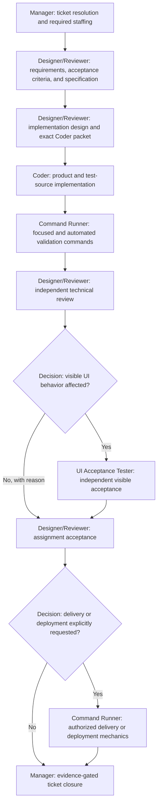

# Development workflow

Workflow-agent identity, capability, communication, and lifecycle rules: [agents.md](../agents.md).
Reusable role boundaries: [`../_common/roles/`](../_common/roles/).

Use this only for an explicitly requested development workflow. Ordinary work
uses the cost-first `AGENTS.md` instructions.

## Agent binding

The role names in this workflow bind to their reusable definitions under
[`../_common/roles`](../_common/roles/). They define responsibility boundaries rather than a required host, model,
process, transport, or task layout. A host that activates managed agents must compose the common
[workflow-agent contract](../agents.md), declare an exact roster and communication topology, and preserve every boundary
below. This public workflow does not discover or require a companion platform.

### Judge override

The Dev Judge operates only inside the initialized Dev workflow instance. It must not contact or use Designer/Reviewer,
Manager, Coder, Command Runner, UI Acceptance Tester, any host-defined proxy, or any substitute to review, approve, relay, validate,
publish, execute, or supply evidence for Judge work. It reports only to the human; the Dev dependency map therefore has
no edge to or from Judge. Protected publication remains a direct Judge action only after every common-role gate and exact
human authorization pass.

After a Dev governance change, Judge validates the exact diff before disclosure. At minimum, run the public repository
boundary check:

- `bash ai-workflows/validate-public-boundary.sh`

## Required delivery gates and role mapping

This is a specification-driven development flow: ticket context and staffing precede the specification; the accepted
specification and design govern implementation; implementation is proven through automated validation, independent
technical review, and conditional visible acceptance before delivery or closure. The development workflow owns this
order and maps each gate to its executing role. A coordinating role does not inherit another gate owner's capability.
Designer/Reviewer records the applicable gates before implementation, preserves independent ownership for each applicable
gate, and advances only after receiving the matching evidence. A host using managed agents dispatches each gate to the
mapped initialized role; a direct host must still preserve the independent review and acceptance boundaries.

| Gate                                                                            | Required owner       | Required evidence                                                                                              |
| ------------------------------------------------------------------------------- | -------------------- | -------------------------------------------------------------------------------------------------------------- |
| Ticket resolution and required staffing                                         | Manager              | Exact ticket ID, lifecycle facts, and initialized worker task IDs.                                             |
| Requirements, acceptance criteria, and implementation design                    | Designer/Reviewer    | Exact specification, scope, acceptance criteria, and implementation packet.                                    |
| Product and test-source implementation                                          | Coder                | Changed paths and implementation receipt.                                                                      |
| Focused, unit, integration, build, and automated end-to-end execution           | Command Runner       | Exact commands, results, and artifacts returned to the verified caller.                                        |
| Independent technical review                                                    | Designer/Reviewer    | Evidence-based review decision against the design and automated results.                                       |
| Visible end-user acceptance when visible UI behavior is affected                | UI Acceptance Tester | Matching ticket/change receipt with tested URL or build, visible journey, observations, result, and artifacts. |
| Assignment acceptance                                                           | Designer/Reviewer    | Every applicable preceding receipt, or an explicit reason a conditional gate is not applicable.                |
| Delivery or deployment mechanics, only when explicitly requested and authorized | Command Runner       | Exact registered command, authorization, result, state change, and cleanup evidence.                           |
| Ticket closure                                                                  | Manager              | Verified implementation, validation, review, conditional UI acceptance, and authorization evidence.            |

Automated end-to-end output, generated screenshots, Coder evidence, or Designer/Reviewer interaction never substitutes
for the UI Acceptance Tester receipt when visible UI behavior is affected. Designer/Reviewer must not execute automated
tests or visible acceptance itself. A missing, stale, foreign, failed, or mismatched required receipt blocks advancement
at the current gate; later gates and ticket closure must not proceed.

There is currently no Deployer role. Delivery and deployment are conditional rather than automatic, and their mechanical
execution maps to Command Runner only after the human explicitly requests and authorizes that effect. Designer/Reviewer
owns neither deployment execution nor permission to infer it. Manager maintains ticket and staffing lifecycle at the
entry and closure boundaries without becoming a proxy between the delivery roles.

## Helper prompts

The profile is supplied from outside this reusable workflow. See
[Workspace projects and external knowledge](../../ai-profile/README.md#workspace-projects-and-external-knowledge).
Valid Dev logical-project names are `<profile-id>-dev` and `<profile-id>-dev-<suffix>`. The exact selected profile and
workflow establish the required prefix; any remaining suffix is an opaque scope identifier and may not be used to infer
or replace the profile or workflow.

| User prompt                                                                             | Scope resolution                                                     | Expected result                                                      |
| --------------------------------------------------------------------------------------- | -------------------------------------------------------------------- | -------------------------------------------------------------------- |
| `Initialize <profile-id>-dev[-<suffix>] workflow` or `Initialize <profile-id>-dev[-<suffix>] workflow agents` | Resolve the externally supplied profile, validate workflow `dev`, and preserve the complete logical-project ID. | Create the complete declared team only when none is active. |
| `Initialize agents` from a task already bound to `<profile-id>-dev[-<suffix>]`          | Use the task's verified complete logical-project binding.            | Create the team in that exact logical project, including its suffix. |
| `Initialize dev workflow` from an unbound task                                          | Workflow is known but profile is missing.                            | Ask which profile and perform zero mutation.                         |
| `Reinitialize <profile-id>-dev[-<suffix>] workflow`                                     | Resolve the exact complete logical project.                          | Archive the complete active team, then create a fresh complete team. |
| `Archive <profile-id>-dev[-<suffix>] workflow`                                          | Resolve the exact complete logical project.                          | Archive the complete active team and create nothing.                 |
| `Delete` or `remove all <profile-id>-dev[-<suffix>] agents`                             | Treat delete/remove as archive aliases.                              | Archive the complete active team; preserve history.                  |

Case and spacing may be normalized only when they resolve to exactly one configured logical project. The complete suffix
must otherwise be preserved exactly. Misspellings that could identify more than one scope are `BLOCKED`. A task may omit
the profile only when its runtime identity is already bound to exactly one validated logical project.

## Router

- For explicit Codex role-chat setup, read
  [workflow agent initialization](agents/init.md) and its
  [live test](agents/init-live-test.md).
- For an explicitly authorized isolated capacity test, use
  [Elastic Agent Pool live acceptance](dev-elastic-agent-pool.live-test.md).
- For implementation or bug fixes, follow the required delivery gates above and read `guides/coding.md` only when the
  implementation gate begins.
- For an explicit testing task, apply the matching validation or visible-acceptance gate above and read
  `guides/testing.md` only.
- For a commit, push, PR, release, or deployment request, read
  `guides/delivery.md` only.
- Never preload guides. If the action changes, load the next one then.
