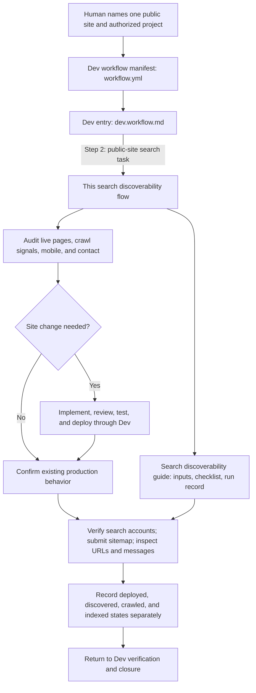

# Search discoverability flow

## Purpose

[Dev](../dev.workflow.md), from planning through deployment verification when a human asks to make one named public site eligible for Google Search. Apply the [search discoverability guide](../guides/search-discoverability.md) to the selected project. This flow owns the order, role ownership, and exit; the guide owns the site-specific checklist and run record. It does not add an agent, account authority, or a guarantee of indexing.

## Where it is registered and how to run it

The [Dev workflow manifest](../workflow.yml) selects [dev.workflow.md](../dev.workflow.md) as its entry. Dev step 2 links to this flow for public-site search work. The flow uses the [guide](../guides/search-discoverability.md) for the checklist and run record. It is a linked Dev flow, not a separate workflow or agent registration.

The diagram shows the handoff and evidence path. The numbered steps below remain authoritative for role ownership, gates, and exceptions.

## Entry

Resolve the exact public site, priority URLs, authorized project and deployment target, owner of the site and search accounts, audience/offer, and current contact path. Record the existing live baseline and the parent Dev stage. Missing account access does not block independent site work; record verification as pending with its owner. Do not infer ownership from a browser session or repository name.

If the live site already meets the selected requirements, mark implementation, change testing, and delivery steps not applicable with evidence, then continue live inspection and account checks.

## Execution mode

The same flow works with the registered Dev roles or with a directly authorized Admin coordinating in emulated mode. Admin states the exact profile, workflow, project, current stage, and roles it will perform; it follows the selected Dev project's configured Coder and Command Runner routes. A direct human instruction to implement locally overrides the Coder route for that task. Admin may perform authorized search-account operations itself. It records its own review as Admin work, not as independent review or UI acceptance. No dedicated promotion agent is required to invoke this flow.

## Steps

1. **Manager** resolves the target and tracker state; proof: one selected site and project, current work item, and a recoverable plan point. Use the parent's target-resolution and planning checkpoints.
2. **Designer / Reviewer** records the public HTTP, metadata, robots, sitemap, rendered-content, mobile, and contact baseline. Define priority URLs, minimal changes, and acceptance checks using the [search discoverability guide](../guides/search-discoverability.md). Obtain approved copy/proof facts only when publishing new claims; proof: dated baseline and candidate-specific plan with unknowns named.
3. **Coder** implements the authorized site changes through the parent's implementation checkpoint; proof: reviewable source revision and preserved working routes/contact path. Follow [coding guidance](../guides/coding.md). Account or DNS changes are not Coder-owned implementation.
4. **Designer / Reviewer** coordinates [testing](testing.flow.md), independent review, and UI acceptance where applicable. Command Runner executes configured checks through the parent workflow; proof: current build/behavior evidence and a visible mobile and contact result, with failed gates corrected before delivery. Required independent gates need their actual owners; an emulating Admin reports them unmet or not applicable with a reason, never self-certified.
5. **Command Runner** delivers the accepted candidate through the parent's [delivery](../guides/delivery.md) and [deployment](deployment.flow.md) path when authorized; proof: exact candidate, target, and terminal deployment result.
6. **Designer / Reviewer** reads the live site back; proof: deployed or existing revision, expected statuses, correct public metadata, sitemap, and working contact path. A local build or PR alone is insufficient.
7. **Designer / Reviewer** coordinates Google Search Console checks with the exact profile-authorized account operator. That operator checks existing ownership, verifies the property if needed, submits the canonical sitemap, inspects the homepage and an inner page with a live test, and reads property messages. Classify each message as informational or actionable; verify an actionable warning against the relevant report and live site before changing anything. Perform Bing verification only when selected and authorized, and review its site notices when available. Proof: read-back of ownership, sitemap status, discovered pages, rendered content/canonical, message disposition, and any indexing request confirmation. Preserve verification tokens outside public records. If the operator or access is unavailable, leave this step pending and retain completed site evidence. A directly authorized Admin may perform this operation when its exact scope permits it.
8. **Designer / Reviewer** compares live and search-console evidence, separates deployed, discovered, crawled, and indexed states, and records measured mobile/performance and inquiry limitations; proof: a [run record](../guides/search-discoverability.md#run-record-template) linked to actual observations and a date or event for delayed indexing review.
9. **Manager** updates the authorized work record with completed and pending items; proof: tracker state matching the run record and the next recovery point.

## Exit

Return to the parent's deployment-verification checkpoint when a candidate was delivered, then closure. For a verification-only run with no site change, return through the parent's no-delivery acceptance path to closure. The flow is complete when applicable site changes are live and verified (or existing foundations are confirmed sufficient), search-property/sitemap/live-inspection checks have real results or named access blockers, and delayed crawl/index data is explicitly pending. Failed behavior returns to debugging at the first failed gate; changed code, deployment, or account state invalidates only affected evidence. Do not report a submitted sitemap or indexing request as an indexed page.

## Later promotion capability

If repeated site work warrants specialization, first consider a search/promotion role **within Dev** that invokes this flow and coordinates with Coder, Command Runner, Designer / Reviewer, and UI Acceptance Tester. Its bounded capabilities could include site/profile inventory, ownership and sitemap coordination, eligible listing assessment, and query/referral/inquiry review. Define exact account permissions, project scope, claim approval, reporting cadence, and handoffs before activation. Keep source implementation and production deployment in their existing Dev stages. Only consider a separate workflow when the work expands into ongoing distribution or outreach beyond Dev's site lifecycle; avoid creating an agent merely to run this one flow.
