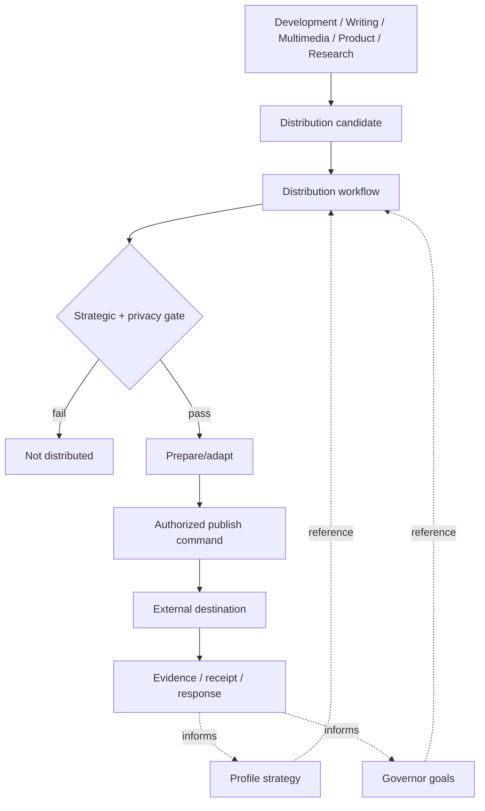

# Distribution workflow

## Purpose

Turn already-produced, authorized work into deliberate external distribution only when doing so is credibly connected to existing goals and profile/project strategy.

Distribution is horizontal. Development, Writing, Blogging, Multimedia, Product, Research, or another workflow may produce a candidate artifact/event. Those workflows do not automatically gain publication authority and do not need to become social-media workflows.

## Goal ownership

This workflow does **not** create or redefine human goals.

Human-level goals remain owned by the Personal Governor/governed-human strategy and profile-level goals/strategy remain owned by the applicable profile strategy. Distribution packets carry stable references to those authoritative goals when available.

Treat goal references conceptually as foreign keys, not copied goal definitions.

If a referenced goal cannot be resolved in the authorized context, the workflow must not invent its meaning. Mark the strategic gate unresolved.

## Entry

A candidate may be a screenshot, diagram, release, article, video, observation, research result, product evidence, or another artifact/event that already exists or is already justified by its originating workflow.

Minimum candidate context:

- source artifact/event and provenance;
- owning profile/project;
- candidate audience;
- one or more goal/strategy references;
- proposed distribution purpose;
- desired observable outcome;
- privacy/IP/classification state when relevant.

A candidate is not a commitment to publish.

## Strategic gate

Before adapting or publishing anything, Profile Strategist or another profile-authorized strategy owner evaluates:

1. **Goal alignment** — which existing goal reference does this support?
2. **Audience** — who could reasonably benefit or act?
3. **Value/evidence** — what useful evidence, lesson, release, invitation, or story exists?
4. **Desired outcome** — what should happen after exposure: repository discovery, trial, conversation, relationship, feedback, adoption, etc.?
5. **Incremental cost** — is distribution cheap reuse of existing work, or is it becoming a new content project?
6. **Channel fit** — which configured destinations fit the artifact/audience?
7. **Boundary check** — is the material authorized for external distribution and free of client/private leakage?

If no credible goal alignment, audience/value, or authorized boundary exists, stop with `not-distributed`. Do not manufacture content merely to satisfy a channel cadence.

## Preparation

When the strategic gate passes:

1. select the smallest useful distributable form;
2. adapt dimensions/format/caption only as needed for selected destinations;
3. preserve the underlying claim/provenance;
4. attach the resolved intent packet and approval/evidence state;
5. obtain human approval when required by profile/project policy.

Content-specific workflows may own substantive editing. Distribution should not rewrite an article, redesign a product, or invent a video merely to fill a channel.

## Execution

Use provider-neutral commands configured by the profile.

For social destinations, `social-publish` is the proposed mechanical command. The command receives an authorized packet and handles provider/account/channel mechanics; it does not decide whether the post advances a goal.

Other destinations may use other commands.

## Evidence loop

Record when available:

- source candidate;
- goal/profile-goal references;
- audience/purpose;
- selected destination;
- publication/queue receipt and URL;
- observable response useful to the stated desired outcome;
- cost/friction;
- follow-up decision.

Do not optimize for likes/followers by default. Evaluate evidence against the stated goal/outcome.

Useful external evidence may return to the Profile Strategist and Personal Governor as input for later allocation decisions. Distribution itself does not modify canonical goals.

## Relationship to other workflows

The originating workflow may suggest a candidate but should not silently invoke external publication.

## Non-goals

- creating human goals;
- replacing Profile Strategist or Personal Governor;
- content calendars without an explicit strategy;
- requiring every completed development task to produce a post;
- turning distribution metrics into goals by themselves;
- provider-specific publishing mechanics;
- automatic cross-profile sharing.
