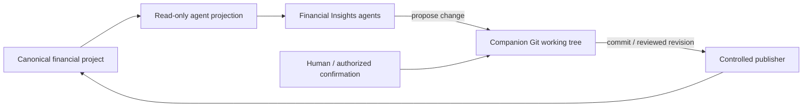

# Versioned Financial Insights data

Financial records are authoritative **data**, not Personal Governor memory. Agents should normally receive a read-only
projection of that data. Durable agent-originated mutations use a source-controlled publishing path so changes are
reviewable and reversible.

This extends the Synology memory publishing pattern to workflow data without requiring the data to be called memory.

## Compatibility boundary

Existing human-facing applications may continue using their currently authorized project filesystem path and write
behavior. Adopting this contract for agents must not silently redirect, move, rename, or make that existing UI path
read-only.

The first migration step is therefore additive:

- preserve the existing project/storage mapping used by the application;
- give operational agents a read-only projection of the same logical project;
- configure a companion Git mapping/publisher for agent-originated durable changes;
- migrate existing UI writes through the publisher only in a separately tested change.

## Access classes

- Financial Analyst: read-only financial evidence; no canonical data mutation.
- Financial Reviewer: read-only exact evidence/revision; no canonical data mutation.
- Records / Bookkeeping Agent: read-only source access plus permission to **propose** mutations through the configured
  versioned-data publisher. No unrestricted SMB/filesystem write credential.
- Controlled publisher: the only agent-facing capability holding canonical write authority.

## Mutation classes

Add/rename/classify/extract/normalize operations proposed by agents must produce an inspectable change set before
canonical publication. Destructive deletion, overwrite of historical source evidence, or replacement of a canonical
record requires explicit human confirmation unless a narrower profile policy explicitly defines an equivalent safe
authority.

Binary source documents may be versioned directly at small scale. A profile may later select Git LFS or an
immutable-binary-plus-versioned-metadata strategy without changing the agent access contract.

## Publisher requirements

The publisher uses a companion Git checkout that is not exposed as the served Synology projection. It records the
change before/with publication, validates the target project boundary, refuses silent overwrite/collision, and
preserves a recoverable previous revision. A failed publish leaves the last good canonical projection intact.

The profile owns concrete repository, branch, checkout, storage mapping, credentials, and publication mechanism.
Public workflow rules contain only the contract.
