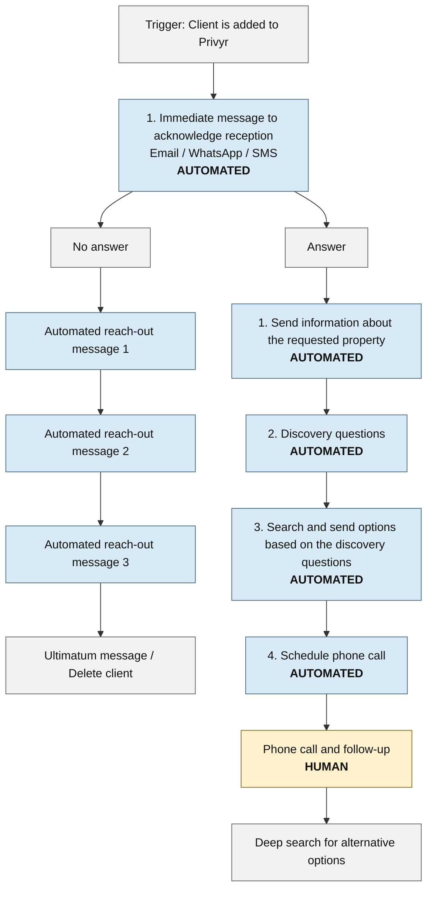
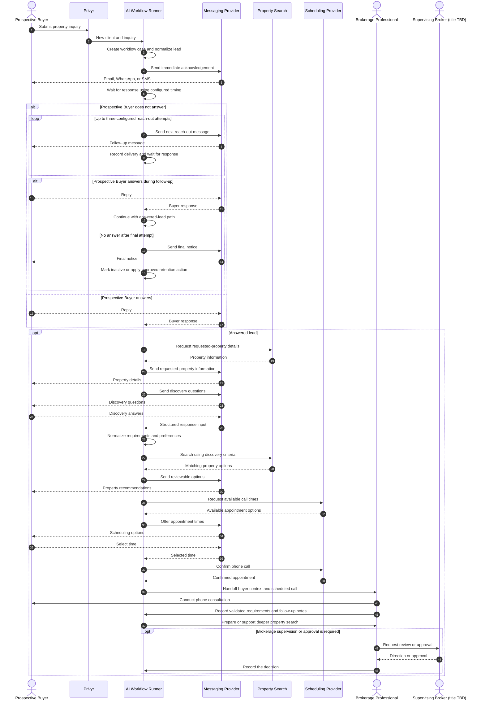

# real-estate-brokerage.workflow Spec

## Purpose

Define the operating rules for `real-estate-brokerage.workflow.md` and distinguish
the source-defined brokerage process from proposed implementation behavior.

## Authority

The source flowchart is authoritative for the business-flow stages and their
explicit automation or human labels.

This specification preserves the source flow and extends it with proposed state,
safety controls, and configuration requirements. Anything not explicitly defined
by the source flowchart is an implementation recommendation and requires
business confirmation.

## Source flowchart

This Mermaid diagram is a maintainable transcription of the original Google Docs
flowchart. It intentionally preserves “Ultimatum message / Delete client” and
does not add timing, persistence, archiving, or ownership that the source does
not specify.

## Runtime sequence

The structural flowchart above shows the stages and branches. The sequence
diagram below shows the proposed step-by-step runtime interaction between the
prospective property buyer, Privyr, the AI Workflow Runner, external services,
and the brokerage professional who serves that buyer.
Exact providers, delays, message content, and deep-search ownership remain
configuration or open business decisions.

### Actor legend

| Actor                  | Meaning in this workflow                                                                                                                                                                                      |
| ---------------------- | ------------------------------------------------------------------------------------------------------------------------------------------------------------------------------------------------------------- |
| Prospective Buyer      | The end client looking to buy a property. This is the person who submits the inquiry and receives brokerage messages and recommendations.                                                                     |
| Brokerage Professional | Our business client and the primary workflow operator. This person works with prospective buyers, conducts consultations, and performs or approves work that requires human judgment.                         |
| Supervising Broker     | A provisional name for the larger/master broker or brokerage authority under whom the Brokerage Professional works. The exact title, responsibilities, and approval points must be confirmed with the client. |
| AI Workflow Runner     | The AI Config runtime that creates and advances workflow cases, invokes integrations, waits for events, records state, and prepares human handoffs.                                                           |
| Privyr                 | The current lead-intake system that supplies a new buyer inquiry to the workflow.                                                                                                                             |
| Messaging Provider     | The approved email, WhatsApp, or SMS service used to communicate with the Prospective Buyer.                                                                                                                  |
| Property Search        | The selected MLS, portal, internal inventory, or other property-data provider.                                                                                                                                |
| Scheduling Provider    | The selected calendar or appointment service used to arrange the consultation.                                                                                                                                |

Do not use the unqualified word **client** in implementation-facing workflow
copy. Use **Prospective Buyer** for the property buyer and **Brokerage
Professional** for our business client. Use **Supervising Broker** only as a
working term until the client confirms the correct business or legal title.

The `opt Answered lead` section begins whenever a response is received, whether
the client answers the first acknowledgement or one of the later follow-ups.
The final no-response action remains non-destructive by default until the client
approves a retention and recovery policy.

## Ubiquitous language

This glossary defines the shared language for the **Brokerage Lead Funnel**
subdomain. Product copy, workflow state, events, commands, tests, and
implementation documentation should use these terms consistently.

| Term                   | Meaning                                                                                                                                                 |
| ---------------------- | ------------------------------------------------------------------------------------------------------------------------------------------------------- |
| Brokerage Lead Funnel  | The bounded business process that moves a new property inquiry from intake to qualification and brokerage handoff, or to a defined no-response outcome. |
| Prospective Buyer      | The end client seeking a property. The person communicates requirements, reviews options, and may schedule a consultation.                              |
| Brokerage Professional | Our business client and workflow operator who serves the Prospective Buyer and owns human judgment in the current funnel.                               |
| Supervising Broker     | Working term for the master/larger broker or brokerage authority associated with the Brokerage Professional. Exact title and responsibilities are TBD.  |
| Lead                   | A Prospective Buyer and their initial contact information before qualification is complete.                                                             |
| Inquiry                | The Prospective Buyer’s expression of interest, normally associated with a requested property and captured through Privyr.                              |
| Workflow Case          | The persistent AI Config record created for one Lead and Inquiry as they move through the funnel.                                                       |
| Funnel Stage           | The current business phase of a Workflow Case, such as acknowledgement, follow-up, discovery, property matching, scheduling, or human consultation.     |
| Acknowledgement        | The immediate automated message confirming that the Inquiry was received.                                                                               |
| Reach-out Attempt      | One configured automated follow-up sent because no qualifying response has been received.                                                               |
| Qualifying Response    | A buyer response that satisfies the client-approved rule for leaving the no-response path. The exact rule is TBD.                                       |
| Discovery              | The structured collection of the Prospective Buyer’s needs, constraints, and preferences.                                                               |
| Property Match         | A reviewable property option produced from the approved discovery criteria.                                                                             |
| Agent Handoff          | The transfer of the Workflow Case, buyer context, and next action from automation to the Brokerage Professional.                                        |
| Consultation           | The human phone call in which the Brokerage Professional validates the buyer’s needs and determines follow-up.                                          |
| Deep Search            | The search for alternative property options after consultation. Ownership and automation level are TBD.                                                 |
| Inactive Lead          | A non-destructive terminal state for a Lead that did not respond or should leave active work. It is not permanent deletion.                             |
| Human Approval         | An explicit decision by the Brokerage Professional or, when required, the Supervising Broker before a sensitive or judgment-based action proceeds.      |

### Candidate workflow language

Implementation names should express the business meaning rather than generic
technical activity. Candidate commands and events include:

- `AcknowledgeInquiry`
- `ScheduleReachOut`
- `RecordBuyerResponse`
- `CaptureDiscoveryAnswers`
- `FindPropertyMatches`
- `OfferConsultationTimes`
- `ConfirmConsultation`
- `HandOffToBrokerageProfessional`
- `MarkLeadInactive`
- `InquiryAcknowledged`
- `BuyerResponded`
- `DiscoveryCompleted`
- `PropertyMatchesPrepared`
- `ConsultationScheduled`
- `LeadMarkedInactive`

These names are proposed DDD language, not yet approved API contracts.

## Source-defined workflow

1. Trigger the workflow when a client is added to Privyr.
2. Immediately send an automated acknowledgement by email, WhatsApp, or SMS.
3. Branch according to whether the client answers.
4. When the client does not answer:
   - send automated reach-out message 1;
   - send automated reach-out message 2 if there is still no answer;
   - send automated reach-out message 3 if there is still no answer; and
   - proceed to an ultimatum message or client deletion if there is still no
     answer.
5. When the client answers:
   - automatically send information about the requested property;
   - automatically ask discovery questions;
   - automatically search for and send options based on the discovery answers;
   - automatically schedule a phone call;
   - conduct the phone call and follow-up as a human step; and
   - perform a deep search for alternative options.

## Explicit ownership

| Stage                               | Ownership stated by source |
| ----------------------------------- | -------------------------- |
| Immediate acknowledgement           | Automated                  |
| Reach-out messages 1–3              | Automated                  |
| Requested-property information      | Automated                  |
| Discovery questions                 | Automated                  |
| Initial property search and options | Automated                  |
| Phone-call scheduling               | Automated                  |
| Phone call and follow-up            | Human                      |
| Deep search for alternative options | Not specified              |
| Ultimatum or client deletion        | Not specified              |

Do not present unspecified ownership as source-confirmed. Deep search may be
implemented as human or AI-assisted only after the business owner confirms that
choice.

## Proposed implementation behavior

The following are recommendations rather than source requirements:

- normalize a Privyr lead into a persistent workflow instance;
- retain message history, delivery state, timestamps, attempt count, and the next
  scheduled action;
- structure discovery answers into property-search criteria;
- rank or otherwise organize matching property options;
- assign an agent and retain call notes;
- track the terminal outcome and reason;
- make timing, channel order, business hours, and message wording configurable;
- treat “delete client” as inactive or archived until a retention and recovery
  policy authorizes permanent deletion.

These recommendations must remain distinguishable from confirmed business rules
in UI copy, implementation plans, and acceptance criteria.

## Decisions required before implementation

- Delay between reach-out messages
- Wording and channel for every message
- Channel priority and fallback behavior
- Business hours, timezone, and quiet hours
- Definition of an answer and a qualified response
- Discovery-question schema
- Property inventory or search provider
- Agent assignment policy
- Scheduling provider and call duration
- Owner and automation level of the deep-search stage
- Whether the final no-response action archives, deactivates, or permanently
  deletes the client
- Retention period and recovery policy

## Safety rules

- Do not permanently delete a client automatically without an approved retention
  and recovery policy.
- Preserve a human handoff for the phone consultation.
- Keep property recommendations reviewable and traceable to the client’s stated
  requirements.
- Do not silently convert a proposed behavior into a confirmed business rule.

## UI behavior

- When this workflow is selected, show this spec in the Spec panel unless the
  user selects a project or command afterward.
- Clicking the Spec panel title opens this file in the central dialog.
- The workflow should appear in the `sc` profile as **Real Estate Brokerage**.
