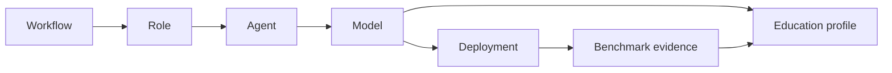

# First-class Models in AI-Fleas

Status: **implemented model-ownership refactor; runtime strategy behavior remains unchanged**.

## Why

For the human/agent-facing vocabulary and practical explanation, start with [`models/README.md`](../models/README.md). The rest of this document defines the architectural ownership and migration boundary.


AI-Fleas already treats **roles** as reusable architecture. Models have grown into another reusable entity, but their
knowledge is currently split between Dev-specific delegation strategies and `notes/models/`.

That is the wrong ownership boundary. A model is not a Dev workflow strategy and it is not merely a note. The same
model may serve a Coder, Reviewer, System agent, Writer, or another future role.

## Core entities



- **Workflow** — coordinates work toward an outcome.
- **Role** — defines the job/responsibility.
- **Agent** — an executable worker that fulfills a role on a platform.
- **Model** — the intelligence/learned capability available to an agent.
- **Education profile** — declared education, observed capability, unknowns, communication guidance, and provisional role fit.
- **Deployment** — a concrete model representation + runtime + hardware + context/configuration.
- **Benchmark evidence** — observations of a model/deployment on frozen tasks with independent acceptance.

A role does not own a model. An agent selects/receives a model. A model can serve several roles, and a role can be
fulfilled by different models.

## Target structure

The final location should be a first-class repository namespace, not under a particular workflow:

```
models/
  README.md
  schema/
    model.schema.json
    education.schema.json
  qwen3-coder-next/
    model.yml
    education-profile.yml
    benchmarks/
      gx10/
        ...
  qwen3.5-9b/
    model.yml
    education-profile.yml
    benchmarks/
      rtx-3080-ti/
        ...
```

Shared benchmark **protocols/fixtures** remain reusable infrastructure rather than being copied into every model.

The Stage-1 interim `notes/models/` registry has been promoted to top-level `models/`. Shared benchmark fixtures remain under `notes/benchmarks/local-models/`.

## Model versus deployment

Do not put deployment facts into education.

Example:

```yaml
model:
  family: Qwen3-Coder-Next

education:
  primary: [software-engineering, agentic-coding]

deployment:
  quantization: Q5_K_M
  runtime: llama.cpp
  hardware: gx10
  context_tokens: 65536
```

Q5, Q8, NVFP4, context size, GPU layers and hardware affect how the model runs. They do not define what the model was
educated to do.

## Delegation

The education profile is primarily an input to the **delegator**, not text to dump into the worker prompt.

Before constructing a handoff:

1. identify the task's required concepts;
2. resolve the target agent and model;
3. load the model education profile;
4. compare required concepts with declared/observed education;
5. speak directly for familiar concepts;
6. use Domain Context Handoff for unfamiliar but teachable concepts;
7. strengthen verification or select another worker where evidence shows a relevant limitation.

The worker receives the resulting handoff, not its entire education résumé.

## Education Profile Extractor

Trello #141 should eventually maintain these model entities:

```
public/model-card evidence
        ↓
draft education profile
        ↓
controlled multi-domain probes
        ↓
benchmark evidence
        ↓
observed education + limits + unknowns
        ↓
delegation guidance
```

Public information is the résumé. Benchmarks are education in action.

## Migration completed

GX10 Stage 1 / PR #225 is closed and merged. This branch applies the ownership migration:

1. top-level `models/` owns canonical model education and model-specific benchmark evidence;
2. canonical education files use `education-profile.yml`;
3. Dev strategy configs remain operational consumers and reference the canonical profile;
4. shared benchmark fixtures/protocols remain reusable infrastructure;
5. launchers still do not inject education automatically; future Education Profile Extractor/delegator work can consume the canonical registry.

## Architectural test

A new workflow should be able to reuse Qwen3-Coder-Next's education profile without importing anything from
`ai-workflows/dev/`.

If that is not true, the model abstraction is still owned by the wrong layer.
