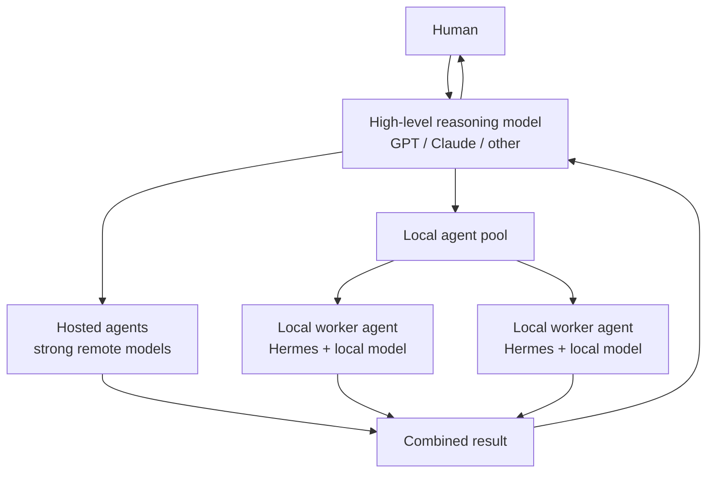

# Local Model Benchmarks

## Why local workers

A local model does not have to replace a high-level reasoning model. A useful architecture is to keep a strong hosted model such as GPT or Claude in the coordinating/reasoning role and delegate suitable work to a pool of agents. Some agents can use hosted models while others run locally.

Local workers are especially useful for repetitive, long-running, or high-volume tasks where using a hosted model for every token would be unnecessarily expensive. They can run on demand or continuously, including 24/7 worker-style workloads, while the stronger reasoning model remains available for coordination, difficult decisions, and escalation.

The purpose of these benchmarks is therefore practical: find the strongest local model that can run at an acceptable speed and reliability on the available hardware. The target is not simply the largest model that fits in memory, but a model capable enough to be useful as a real worker while remaining fast enough for sustained or on-demand operation.

## ASUS Ascent GX10 — coding-worker models

Benchmarked on a single ASUS Ascent GX10 with NVIDIA GB10 and 128 GB unified memory. The Qwen models use `llama.cpp`/CUDA and DeepSeek uses `ds4`/CUDA. All candidates were exercised through Hermes Agent using the same controlled tool-use fixture.

| Metric | Qwen3-Coder-Next Q5_K_M | Qwen3.5-122B-A10B Q5_K_S | DeepSeek V4 Flash 0731 IQ2_XXS/Q2_K |
|---|---:|---:|---:|
| Model size | 52.81 GiB | 81.40 GiB | 80.76 GiB |
| Cold-load unified-memory delta | 56.77 GiB | 82.33 GiB | 100.72 GiB |
| Cold load | 7.29 s | 66.14 s | 25.95 s |
| Prompt processing | 1,435.8 tok/s | 862.9 tok/s | 387.10 tok/s at 2K |
| Generation | 55.68 tok/s | 22.16 tok/s | 16.32 tok/s at 2K |
| Median TTFT | 202 ms | 438 ms | 325 ms |
| TTFT range | 179–205 ms | 427–456 ms | 283–345 ms |
| Configured context | 65,536 | 65,536 | 65,536 |
| Hermes tool-use test | PASS | PASS | PASS |
| Tool task wall time | 21.94 s | 149.23 s | 133.85 s |
| Model API calls | 9 | 7 | 4 |

### Hermes tool-use baseline

The reproducible baseline required the agent to read a file, sort and deduplicate its contents, write two output files, count lines, calculate SHA-256, and verify the outputs. Results were independently checked after the agent completed the task.

The exact task, input, expected files, and independent verifier are checked into the [Hermes file-tools fixture](fixtures/hermes-file-tools/README.md).

### Current choice

All three models completed the baseline tool-use task correctly. **Qwen3-Coder-Next Q5_K_M remains the default single-GX10 worker.** DeepSeek V4 Flash is operational and Hermes-compatible, but it generated about 3.4× slower at the 2K measurement point, used substantially more memory, and completed the controlled task about 6.1× slower. It remains an optional quality experiment until a coding-quality suite demonstrates enough capability gain to justify that cost.

## DeepSeek result and planned experiments

The compressed single-GX10 **DeepSeek V4 Flash 0731** configuration is now benchmarked. It passed the controlled Hermes test and reached 16.32 tok/s generation at 2K context and 12.94 tok/s at 65K. Total used unified memory peaked at 109.91 GiB.

The remaining DeepSeek configuration of interest is:

1. Full or substantially larger DeepSeek V4 inference distributed across **two GX10-class boxes**, using the combined hardware as a local worker cluster.

That distributed experiment is not benchmarked here yet. When tested, its measurements will be added using the same approach where practical.

The existing Qwen measurements will remain here for historical reference even if a later model becomes the preferred worker.

These numbers describe this specific GX10/runtime/configuration and should be treated as empirical baselines rather than general model-performance claims.
