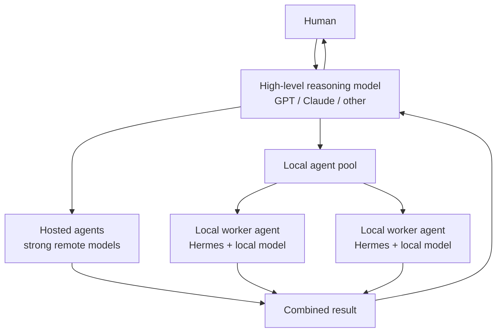

# Local Model Benchmarks

## Why local workers

A local model does not have to replace a high-level reasoning model. A useful architecture is to keep a strong hosted model such as GPT or Claude in the coordinating/reasoning role and delegate suitable work to a pool of agents. Some agents can use hosted models while others run locally.

Local workers are especially useful for repetitive, long-running, or high-volume tasks where using a hosted model for every token would be unnecessarily expensive. They can run on demand or continuously, including 24/7 worker-style workloads, while the stronger reasoning model remains available for coordination, difficult decisions, and escalation.

The purpose of these benchmarks is therefore practical: find the strongest local model that can run at an acceptable speed and reliability on the available hardware. The target is not simply the largest model that fits in memory, but a model capable enough to be useful as a real worker while remaining fast enough for sustained or on-demand operation.

## ASUS Ascent GX10 — Qwen worker models

Benchmarked on a single ASUS Ascent GX10 with NVIDIA GB10 and 128 GB unified memory. Both models were served with `llama.cpp`/CUDA and exercised through Hermes Agent using the same local OpenAI-compatible endpoint and tool-use workflow.

| Metric | Qwen3-Coder-Next Q5_K_M | Qwen3.5-122B-A10B Q5_K_S |
|---|---:|---:|
| Parameters | 79.67B (~3B active) | 124.64B (~10B active) |
| Model size | 52.81 GiB | 81.40 GiB |
| Cold-load unified-memory delta | 56.77 GiB | 82.33 GiB |
| Cold load | 7.29 s | 66.14 s |
| Prompt processing | 1,435.8 tok/s | 862.9 tok/s |
| Generation | 55.68 tok/s | 22.16 tok/s |
| Median TTFT | 202 ms | 438 ms |
| TTFT range | 179–205 ms | 427–456 ms |
| Configured context | 65,536 | 65,536 |
| Native max context | 262,144 | 262,144 |
| Hermes tool-use test | PASS | PASS |
| Tool task wall time | 21.94 s | 149.23 s |
| Model API calls | 9 | 7 |

### Hermes tool-use baseline

The reproducible baseline required the agent to read a file, sort and deduplicate its contents, write two output files, count lines, calculate SHA-256, and verify the outputs. Results were independently checked after the agent completed the task.

For Qwen3-Coder-Next the run used 6,382 input tokens and 620 output tokens and passed independent verification.

### Current choice

Both models completed the baseline tool-use task correctly. **Qwen3-Coder-Next Q5_K_M is currently the default single-GX10 worker** because it generated at about 2.5× the speed and completed the tested Hermes task about 6.8× faster. Qwen3.5-122B-A10B remains a useful candidate when additional reasoning quality may justify lower throughput.

## Planned experiments

The next model family planned for this benchmark is **DeepSeek V4**. Two configurations are of particular interest:

1. A compressed/quantized DeepSeek V4 configuration that can run on a single GX10, if a practical configuration is available.
2. Full or substantially larger DeepSeek V4 inference distributed across **two GX10-class boxes**, using the combined hardware as a local worker cluster.

Those experiments are not benchmarked here yet. When tested, their measurements will be added to this page using the same approach where practical so the results remain useful for comparison.

The existing Qwen measurements will remain here for historical reference even if a later model becomes the preferred worker.

These numbers describe this specific GX10/runtime/configuration and should be treated as empirical baselines rather than general model-performance claims.