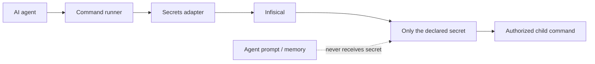

# Where Do Your Agents Keep the Keys?

A few years ago, the answer to “where should I keep my secrets?” was often simple: use AWS Secrets Manager, Azure Key Vault, Google Secret Manager, or whatever your cloud already provides.

That still makes perfect sense when the cloud is where your system lives.

But the shape of a small technology company is changing.

A company can now be one person, a laptop, a few machines at home, and a collection of AI agents doing development, bookkeeping, publishing, infrastructure work, or monitoring. Local models make those machines useful around the clock. Suddenly the home server is not just a NAS or a hobby box. It is part of the production infrastructure of a one-person corporation.

Then a surprisingly ordinary question appears:

**Where do all these agents keep the keys?**

Putting API tokens into prompts is obviously wrong. Keeping them in Git is worse. Copying `.env` files between machines works until it doesn't. And paying for a large cloud architecture merely to store credentials for infrastructure that deliberately lives at home feels backwards.

One simple pattern is to run a secrets manager yourself. I am currently experimenting with [Infisical](https://infisical.com/) behind Cloudflare Access and a Cloudflare Tunnel.

The important part is not the particular product. It is the separation of responsibilities.

The agent does not need to know a GitHub token, Synology password, database password, or Cloudflare credential. It asks to run an authorized capability. The runtime retrieves only what that command needs and injects it into the child process.

For a machine outside the secrets server's local network, there can be two gates.

Cloudflare answers one question: **may this machine reach the secrets service?**

Infisical answers another: **now that it reached me, which secrets may this machine read?**

Those should not be the same permission.

A worker machine can have its own restricted identity with read-only access to one project. A laptop used for administration can retain a different, more privileged identity. Compromising one worker should not automatically give access to every credential in the little company.

There is an unavoidable bootstrap problem. A machine needs some credential before it can ask the secrets manager for credentials. In this setup, the Cloudflare service credential and the Infisical machine-auth credential live locally in owner-only files. They are the keys to the safe, so trying to store those same keys inside the safe would be circular. They should be minimal, machine-specific, revocable, and rotated.

Ordinary commands do not necessarily need any of this. An `install-docker` command can simply run on the machine. Integration commands are different. A GitHub command may require a GitHub token; a Synology command may require credentials; a deployment command may need Cloudflare access. Those commands declare what they need, while the runtime owns how the secret is obtained.

That boundary becomes especially important with agents. An agent can be clever without being trusted with every credential available to the machine.

This is not an argument that everyone should self-host their secrets manager. Managed cloud secret stores remove operational work and are often exactly the right choice. The point is that the old choice is no longer simply “proper enterprise cloud infrastructure” versus “some passwords in `.env`.”

There is a useful middle ground.

If your infrastructure is increasingly local, your agents run locally, and you are effectively operating a one-person technology company, a small self-hosted secrets service can become a perfectly ordinary piece of infrastructure.

The interesting shift is larger than secrets management.

A single person can now own enough compute, automation, agents, software, and operational responsibility that architectural patterns once associated with companies start making sense at home—just at a much smaller scale.

Perhaps the modern one-person corporation does not need enterprise infrastructure.

But it may need **personal infrastructure designed with enterprise lessons**.
