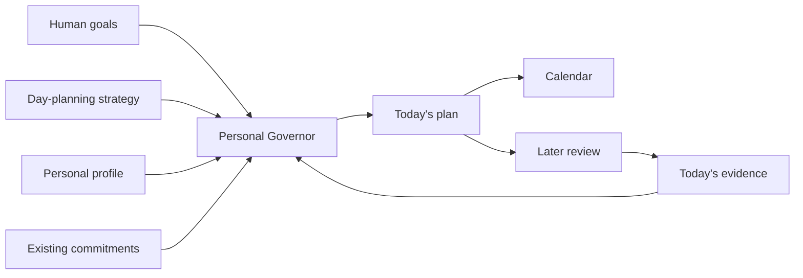

# What If AI Planned Your Day?

> “It is not that we have a short time to live, but that we waste a lot of it.”
>
> — Seneca, *On the Shortness of Life*

Most conversations about adopting AI start with work.

Can it write an email? Summarize a meeting? Prepare a presentation? Search documents? Generate code?

Those are useful questions. But they still treat AI as a tool that waits for a task.

There is another possibility that is much less dramatic and, for many people, may be more useful:

**What if AI helped you decide how to use the day itself?**

This morning I had a very ordinary problem. I had slept badly. There was work to do, some professional preparation, personal projects I wanted to advance, a dog to walk, and the usual temptation to pretend that every empty hour on the calendar was available for productive work.

So I asked my AI assistant to help plan the day.

It looked at the commitments already on my calendar, the sleep information I had given it, and the goals I am trying to pursue. We protected a recovery nap, kept two preparation blocks, reserved some useful work time, and—more importantly—kept an explicit boundary at the end of the day.

That led to a more interesting question.

Why should this be an improvised conversation every morning?

## The methodology already exists

The basic idea is not new and should not be presented as an AI invention.

**Time blocking** means assigning important work to explicit blocks of time instead of running the day from an endless to-do list.

**Fixed-schedule productivity** adds another constraint: decide when serious work ends, then fit the work inside that boundary rather than allowing unfinished work to consume the evening indefinitely. Cal Newport is a well-known modern advocate of both ideas.

The AI does not need to invent a new philosophy of productivity. It can help apply an established one to the messy reality of a particular day.

That distinction matters.

A fixed calendar says:

```text
09:00–10:00  Work
10:00–11:00  Meeting
12:00–13:00  Lunch
```

A planning strategy asks something different:

```text
What matters today?
What commitments are already fixed?
When am I likely to have my best attention?
What should receive that attention?
When does serious work stop?
What changed since the plan was made?
```

The calendar becomes an output of the reasoning rather than the entire system.

## Give the AI goals, not just tasks

Suppose someone works in sales.

Their calendar may already contain customer calls, internal meetings, travel, follow-ups, and administrative work. Then they start using AI and naturally ask it to make those individual activities faster.

That is useful, but it leaves a bigger optimization problem untouched.

Perhaps the person's actual goals are:

- keep existing customers healthy;
- create new qualified opportunities;
- improve knowledge of a market;
- protect enough energy to be effective with people;
- spend more time with family;
- learn how to use AI without turning AI adoption into another full-time project.

Now an assistant can reason about the day in relation to those goals.

A free hour is no longer automatically "more email." It might be the best available hour for preparing an important customer conversation. Or it may be deliberately left alone because the person has three demanding meetings later.

This is where AI starts moving from **task acceleration** toward **personal coordination**.

## Strategy, profile, evidence, calendar

In [AI Fleas](https://github.com/starodubtsevconsulting/ai-fleas), I am experimenting with a Personal Governor: an agent above individual workflows whose job is not to do all the work, but to help preserve the human's chosen goals when projects, obligations, opportunities, fatigue, and interesting distractions compete for attention.

For day planning, the model is deliberately simple:



The **strategy** is reusable. For example: fixed-schedule time blocking.

The **profile** is personal. One person may work best early in the morning. Another may do their best work at night. One has children waking at 06:30; another works with customers across several time zones. Those details should not be baked into a universal productivity method.

The **evidence** belongs to today. Poor sleep, an unexpected meeting, a sick child, an unusually demanding customer call, or simply a plan that took twice as long as expected can change the allocation without changing the person's long-term goals.

The **calendar** is where the resulting commitments become concrete.

## A bad day should not rewrite your life

This morning was a useful example because the sleep was unusually short.

The wrong conclusion would be:

> I am tired, therefore my goals are wrong.

Another bad conclusion would be:

> I am tired, but the plan says eight productive hours, so I should force eight productive hours anyway.

Instead I added a temporary **recovery-constrained** mode to the Personal Governor design.

It is not a medical diagnosis and it should not blindly trust one number from a watch. It is simply a planning rule: when the available evidence says capacity is materially lower than normal, reduce demanding allocation, protect recovery, keep essential commitments where possible, and do not "recover" lost hours by stealing them from tonight's sleep.

Tomorrow the underlying strategy can remain exactly the same.

## The AI should negotiate with reality

Time blocking is sometimes misunderstood as creating a beautiful calendar in the morning and then feeling guilty when reality destroys it by 10:17.

That is not very useful.

A better loop is:

```text
plan → execute → observe → re-plan → review
```

A customer calls unexpectedly. A meeting runs long. You discover that a task needs three hours rather than one. You are more tired than expected.

The assistant should re-plan the remaining day rather than pretending the original schedule still exists.

Over time it can also notice patterns.

If you repeatedly schedule strategic work at 16:00 and repeatedly fail to do it, that is evidence. Maybe 16:00 is a poor time for that kind of work. If every "quick" administrative block becomes ninety minutes, the planning assumption is wrong. If late-night work repeatedly damages the next morning, the cost belongs in tomorrow's planning model too.

The interesting part is not that AI can fill a calendar.

Google Calendar has been able to hold appointments for decades.

The interesting part is that an AI can maintain the connection between **why you said something matters** and **where your time is actually going**.

## Start much smaller

You do not need an autonomous agent system, wearable integration, local models, or a home server to try this idea.

You can start with an ordinary AI assistant and an ordinary calendar.

Tell it:

```text
These are my three current goals.
These are the commitments already on my calendar today.
I want serious work to stop at 17:00.
My best concentration is usually in the morning.
Help me time-block the day.
Leave real breaks and some slack.
If the day changes, help me re-plan the remaining blocks rather than extending the workday.
```

Then come back when reality changes.

After a week, ask a more useful question than "Was I productive?"

Ask:

**Did my calendar increasingly reflect what I said was important?**

That is a small AI-adoption experiment. It requires almost no infrastructure, and if it does not help, stop doing it.

If it does help, then you can gradually add memory, recurring strategies, calendar access, health/activity signals, or specialized agents.

## AI adoption does not have to begin with automation

There is a tendency to make AI adoption sound like a technology transformation project.

For a company, sometimes it is.

For an individual, it can begin with a conversation on Thursday morning:

> Here is what I am trying to achieve. Here is what today looks like. Help me use it better.

The AI may draft an email afterward. It may prepare a customer brief or summarize a document.

But perhaps the more important contribution happened before any of those tasks.

It helped decide **which task deserved the hour in the first place**.
