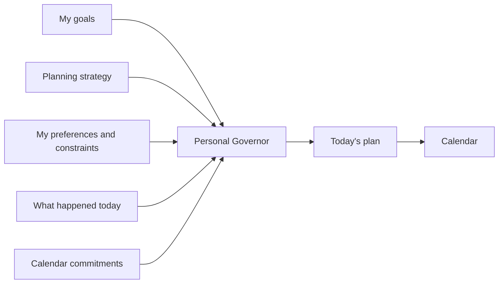

# I Asked AI to Plan My Day. It Told Me to Go Back to Bed.

> “It is not that we have a short time to live, but that we waste a lot of it.”
>
> — Seneca, *On the Shortness of Life*

This morning my watch said I had slept **4 hours and 20 minutes**.

Not ideal.

My first instinct was still completely predictable: look at the day, find the empty spaces, and put work into them.

There was professional preparation to do. There were my own projects. There was an article I wanted to write. The dog needed walking. The house was waking up. And somewhere inside all of that I was apparently supposed to recover from sleeping four hours.

So I asked AI a different question from the usual ones.

Not *write this email*.

Not *summarize this document*.

I asked:

**What should I actually do today?**

It read the commitments already on my calendar. It knew what I am trying to achieve. It had the sleep number I had just given it.

And then it did something rather useful.

It put a nap on my calendar.

From 1:30 to 3:00.

It kept the important preparation blocks. It protected some time for work on my own goals. And it kept the evening boundary I have been trying to establish: stop turning an interesting problem into a midnight problem.

Looking at the calendar, I realized that the interesting part was not the nap.

The interesting part was that I had asked AI to manage **scarcity**.

My scarcity.

## We usually give AI the wrong-sized problem

Most AI adoption starts one task at a time.

Write this.

Summarize that.

Prepare these slides.

Find something in this contract.

Draft a reply to this customer.

All useful. But imagine a salesperson with six customer conversations, three internal meetings, twenty-seven emails, a family waiting at home, and one genuinely important account that needs careful preparation.

Making every email 30 percent faster does not answer the most important question:

**What deserves the good hour?**

That is a different problem.

A calendar can tell you where meetings are.

A to-do list can tell you what remains undone.

Neither necessarily remembers *why* you said one thing mattered more than another.

An AI that knows your goals potentially can.

## Fortunately, AI doesn't need to invent productivity

Once I started thinking about this, I realized that the scheduling method itself was not particularly futuristic.

It already has names.

**Time blocking** means giving important work actual blocks of time instead of trusting an infinite to-do list.

**Fixed-schedule productivity**, a term associated with Cal Newport, adds a useful constraint: decide when serious work ends and make the work fit inside the day.

That second part matters to me.

My natural failure mode is not refusing to work.

It is the opposite.

An interesting problem expands. Dinner gets later. The computer stays open. Midnight arrives. Tomorrow quietly pays the bill.

A fixed boundary changes the question from:

> How much can I finish?

into:

> I have these hours. What is worth putting inside them?

AI didn't invent that idea. It can simply make the idea easier to follow when Tuesday refuses to behave like the Tuesday you planned.

## The calendar should be the output, not the brain

A rigid calendar looks something like this:

```text
09:00–10:00  Work
10:00–11:00  Meeting
12:00–13:00  Lunch
```

Useful, until life happens.

A better planning conversation sounds more like this:

```text
What am I trying to achieve?
What is already committed?
When do I usually think clearly?
What deserves that time?
How much capacity do I actually have today?
When does work stop?
```

Then the calendar comes afterward.

That distinction became the basis for a small experiment in [AI Fleas](https://github.com/starodubtsevconsulting/ai-fleas), where I have been building a **Personal Governor**.

The name sounds grander than the job.

The Governor is not supposed to run my life. I choose the goals. I can override it whenever I want.

Its job is to remember the decisions I already made when today's distractions start negotiating against them.

For planning a day, the model is almost boringly simple:



The strategy can be reusable.

The human cannot.

Someone else may do their best thinking at 10 p.m. I may discover that I am much better at 7 a.m. A parent with small children has a different day from a salesperson covering Asia and North America.

So the method stays general while the schedule stays personal.

## Then there are days like today

Four hours and twenty minutes of sleep should not cause a philosophical crisis.

It also should not be ignored because the calendar says "work."

So I added another small idea to the Governor: a temporary **recovery-constrained** mode.

Nothing medical. Nothing mystical. And certainly not "my watch says 65, therefore an algorithm knows my body."

It means something simpler:

When the evidence says today's capacity is unusually poor, stop pretending this is an ordinary day.

Keep what matters. Reduce demanding work. Make recovery explicit. Reassess later.

Most importantly, don't try to win the hours back at midnight.

Tomorrow's goals remain the same.

Today's allocation changes.

That separation seems obvious once written down. Humans are surprisingly good at forgetting it at 11:47 p.m.

## The plan is allowed to lose

There is another problem with productivity systems: reality doesn't care about them.

A customer calls.

A meeting runs long.

Your "quick" task contains a small archaeological site.

Your child needs you.

The two-hour job takes five hours.

A useful AI planner should not spend the rest of the day pointing accusingly at the beautiful schedule it made at breakfast.

It should re-plan.

```text
plan → execute → observe → re-plan → review
```

That is where this gets more interesting over time.

Suppose I keep scheduling difficult work at 4 p.m. and keep avoiding it. Maybe I don't need more discipline. Maybe 4 p.m. is a stupid time for me to schedule difficult work.

Suppose "one quick thing before bed" repeatedly becomes two hours. That phrase is now data.

Suppose a salesperson discovers that the hour before the first customer call consistently produces better preparation than clearing the inbox does. Protect it.

The system should gradually learn the difference between the person we imagine in our plans and the person who actually shows up every day.

## You don't need my system to try this

This is the part I would actually send to a friend who is curious about AI but has no interest in building agents.

Don't install anything.

Don't build a Personal Governor.

Don't buy a server.

Take the AI assistant you already use and tell it something like:

```text
These are the three things that matter most to me right now.
Here is what is already on my calendar today.
I want serious work to end at 17:00.
I usually concentrate best in the morning.

Help me time-block today around those constraints.
Leave real breaks and some slack.
If the day changes, help me re-plan what remains instead of extending the workday.
```

Try it for a week.

Then don't ask whether AI made you "more productive."

Ask something harder:

**Did my time start looking more like my priorities?**

If the answer is no, throw the experiment away.

If the answer is yes, then perhaps add memory. Let it see the calendar. Give it recurring rules. Maybe connect activity or health information if that is useful to you.

Start with the problem, not the infrastructure.

## My calendar now contains a nap

This article itself became part of the experiment.

I was already working on the Personal Governor. The strange little morning problem—four hours of sleep, too many things I wanted to do, and a calendar pretending that empty space meant energy—turned into a reusable day-planning strategy.

Then the strategy turned into this article.

At 1:30, however, the article loses.

There is already something else on the calendar.

**Sleep.**
