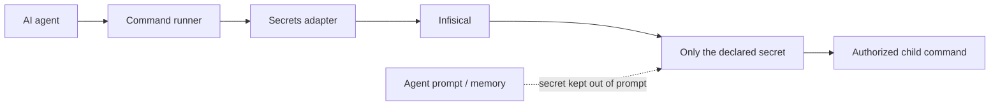

# Where Do Your Agents Keep the Keys?

*A practical way to let AI agents use GitHub, databases, and infrastructure without putting the credentials themselves into prompts.*

My AI agents need keys.

A development agent may need GitHub access. An infrastructure command may need a Cloudflare credential. Another workflow may need a database password or access to storage.

The agents need to **use** those capabilities. I do not want the credentials themselves sitting in prompts, copied into Git, scattered through `.env` files, or remembered by an agent because a tool printed too much output.

This problem becomes surprisingly ordinary once local AI starts doing real work.

A small technology company can now be one person, a laptop, a few machines at home, and a collection of agents doing development, publishing, bookkeeping, infrastructure work, or monitoring. The home server stops being just a hobby box. It becomes part of the production environment.

So the question is not simply where to store secrets.

It is:

> **How can an agent use an authorized capability without ever needing to know the underlying secret?**

One pattern I am experimenting with is a self-hosted secrets manager. The particular product matters less than the separation of responsibilities: the agent asks to perform an allowed operation; the runtime retrieves only the credential that operation needs and keeps it outside the agent's working conversation.

The agent does not need to know a GitHub token, Synology password, database password, or Cloudflare credential. It asks to run an authorized capability. The runtime retrieves only what that command needs and injects it into the child process. That keeps the secret out of the prompt only if the command also avoids printing it and the runner does not expose it through output, errors, traces, or logs. Those paths need redaction and review; prompt isolation alone is not a guarantee that agent memory never sees a secret.

For a machine outside the secrets server's local network, there can be two gates.

Cloudflare Access answers one question: **may this request bearing an approved service credential reach the secrets service?** That credential authorizes the request; it does not prove which physical machine sent it.

Infisical answers another: **which secrets may the authenticated machine identity read?** Its project role determines that scope.

Those should not be the same permission.

A worker machine can have its own restricted identity with read-only access to one project. A laptop used for administration can retain a different, more privileged identity. Compromising one worker should not automatically give access to every credential in the little company.

There is an unavoidable bootstrap problem. A machine needs some credential before it can ask the secrets manager for credentials. In this setup, the Cloudflare service credential and the Infisical machine-auth credential live locally in owner-only files. They are the keys to the safe, so trying to store those same keys inside the safe would be circular. They should be minimal, machine-specific, revocable, and rotated.

Ordinary commands do not necessarily need any of this. An `install-docker` command can simply run on the machine. Integration commands are different. A GitHub command may require a GitHub token; a Synology command may require credentials; a deployment command may need Cloudflare access. Those commands declare what they need, while the runtime owns how the secret is obtained.

That boundary becomes especially important with agents. An agent can be clever without being trusted with every credential available to the machine.

This is not an argument that everyone should self-host their secrets manager. Managed cloud secret stores remove operational work and are often exactly the right choice. A home service has to stay available, backed up, and recoverable when the machine running it fails. The point is that the old choice is no longer simply “proper enterprise cloud infrastructure” versus “some passwords in `.env`.”

There is a useful middle ground.

If your infrastructure is increasingly local, your agents run locally, and you are effectively operating a one-person technology company, a small self-hosted secrets service can become a perfectly ordinary piece of infrastructure.

The interesting shift is larger than secrets management.

A single person can now own enough compute, automation, agents, software, and operational responsibility that architectural patterns once associated with companies start making sense at home—just at a much smaller scale.

Perhaps the modern one-person corporation does not need enterprise infrastructure.

But it may need **personal infrastructure designed with enterprise lessons**.
