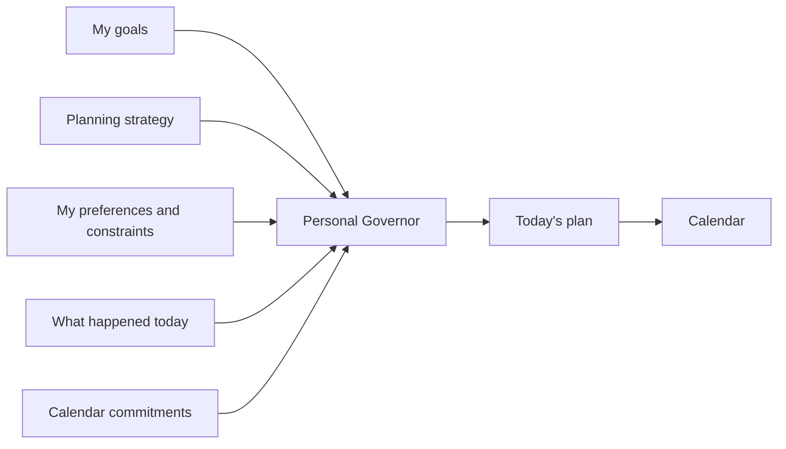

# I Asked AI to Plan My Day. It Told Me to Go Back to Bed.

*My calendar was full, my goals still mattered, and I had slept 4 hours and 20 minutes. The useful plan started by treating energy as a real constraint.*

This morning my watch said I had slept **4 hours and 20 minutes**.

My calendar did not care.

There was professional preparation to do, my own projects, an article I wanted to write, a dog to walk, and a house waking up. My first instinct was predictable: find the empty spaces and put more work into them.

Instead, I asked AI:

> **What should I actually do today?**

It had my calendar commitments, my goals, and the sleep number I had just given it. It kept the preparation that mattered. It kept some time for my own work. It also protected the evening boundary I had already chosen: do not turn an interesting problem into a midnight problem.

Then it put a nap on my calendar.

From 1:30 to 3:00.

That was the interesting part. I had not asked it to maximize the number of tasks I could squeeze into the day. I had asked it to plan around a scarce resource: **my actual capacity today**.

## What deserves the good hour?

Most of us start using AI one task at a time: write an email, summarize a document, prepare slides. All useful. But picture a salesperson with six customer conversations, three internal meetings, twenty-seven emails, and one important account that needs careful preparation.

Making every email faster does not answer the larger question: **What deserves the good hour?**

A calendar shows where meetings are. A to-do list shows what remains undone. Neither necessarily remembers why one thing matters more than another. An AI that knows your goals might help make that choice.

The planning method itself is familiar. **Time blocking** gives important work a place on the calendar. [**Fixed-schedule productivity**](https://calnewport.com/fixed-schedule-productivity-how-i-accomplish-a-large-amount-of-work-in-a-small-number-of-work-hours/), associated with Cal Newport, adds a firm stopping time: make the work fit inside the day.

That boundary matters to me. An interesting problem expands, dinner gets later, and midnight arrives. Tomorrow quietly pays the bill. A stopping time makes me ask what is worth doing with the hours I actually have.

## Let the plan follow the person

I have been building a small experiment called a **Personal Governor** in [AI Fleas](https://github.com/starodubtsevconsulting/ai-fleas). The name sounds grander than the job. I choose the goals and can override the plan. The Governor is meant to remember those choices when today's distractions start negotiating against them.

It takes my goals, planning strategy, preferences, current circumstances, and calendar commitments, then proposes a plan. The calendar receives that plan; it doesn't decide what matters.



**The strategy can be reusable. The human cannot.** Someone else may think best at 10 p.m.; I may do better at 7 a.m. A parent with small children has a different day from a salesperson covering two continents.

Today's poor sleep added one more constraint. I treated it as a reason to reduce demanding work, make recovery explicit, and reassess later. It was a planning choice, not a diagnosis or a claim that my watch knows my body.

And when reality changes—a customer calls, a meeting runs long, the two-hour job takes five—the plan should change too. It should not turn a missed block into an invitation to work past the evening boundary.

## Try the question before the system

You don't need a Personal Governor, a server, or access to your calendar to try this. Give the AI assistant you already use a short brief:

```text
These are the three things that matter most to me right now.
Here is what is already on my calendar today.
I want serious work to end at 17:00.
I usually concentrate best in the morning.

Help me time-block today around those constraints.
Leave real breaks and some slack.
If the day changes, help me re-plan what remains instead of extending the workday.
```

Try it for a week. Then ask something harder than whether AI made you more productive: **Did my time start looking more like my priorities?**

If the answer is no, throw the experiment away. If it is yes, maybe add memory or recurring rules later. Start with the problem, not the infrastructure.

This article became part of my experiment. A morning with too little sleep and too many things I wanted to do turned into a planning strategy, then into these words.

At 1:30, however, the article loses. There is already something else on the calendar.

**Sleep.**

