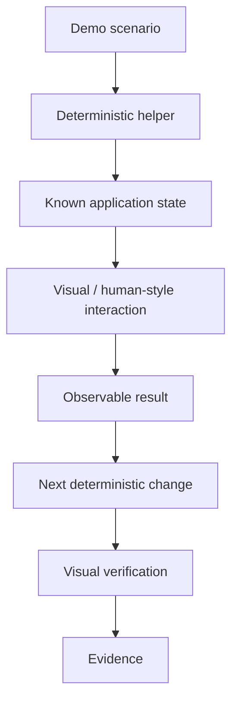
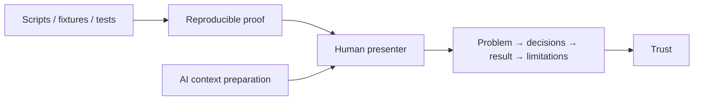

# I Stopped Trying to Automate the Demo

There is a particular kind of confidence that comes from a green test suite.

The code is merged. The API calls work. The fixtures produce exactly the state I expect. I have logs, assertions, screenshots, and enough evidence to convince myself that the feature is real.

Then somebody says: “Can you demo it?”

Suddenly all that confidence has to fit inside one human head.

This has become more noticeable for me as I use AI more heavily in development. I can work across more code and more context than I would reasonably keep in working memory. That is one of the benefits. I do not want to memorize an entire system just to prove that I am responsible for the part I changed.

But a traditional demo often assumes exactly that.

So I started treating the demo itself as an engineering artifact.

## A demo that can run without me

The basic structure is deliberately boring:

```text
demo/
└── example-demo/
    ├── scripts/
    │   └── common.sh
    ├── 01-prepare.sh
    ├── 02-create.sh
    ├── 03-change.sh
    ├── 04-query.sh
    └── example-demo.md
```

The numbered scripts do the deterministic work: create a fixture, call an API, change state, query something, prepare the next step.

The Markdown file explains the story.

That distinction matters because shell scripts are excellent at doing things and terrible at explaining why anybody should care about them. When a script performs an important mutation, I want a small comment that answers two questions:

```sh
# What: create the initial record used by the scenario.
# Why: later steps show how the visible state changes after an update.
```

Not a novel. Not comments explaining what `curl` means. Just enough context that a person—or an AI agent—does not have to reverse-engineer the intention from syntax.

## Then the UI ruined my nice automation

API-only demos are easy.

Real software is usually not.

Sometimes the evidence that matters is visible in a UI. Prepare some data. Open the application. Navigate to the right place. Observe a value. Change the data. Refresh. Observe that the value changed.

The obvious engineering reaction is: automate the UI too.

I have used Playwright for that kind of work. It is useful. But I increasingly think it solves a different problem from the one I have here.

A durable browser test wants deterministic selectors and repeatable machine behavior.

A demo wants to answer a more human question:

> If I use the system the way a person does, can I see the thing we claim we built?

For that, an AI that can look at the screen is surprisingly natural.

The Markdown can say:

1. Run the fixture step.
2. Open the application.
3. Navigate to the item details.
4. Verify the current value.
5. Run the update step.
6. Refresh.
7. Verify that the visible value changed.

No pixel coordinates. No assumption that the button will forever have the same DOM structure. The deterministic parts stay deterministic. The visual part is performed semantically.

That gives me a hybrid demo.



## Why not just Playwright?

I would still use Playwright when I want a Playwright test.

I do not think every demonstration needs to become one.

The hybrid approach gives the same demo package several lives.

A developer can follow it manually.

An AI agent can execute the scripts, navigate visually, and collect evidence.

An acceptance process can use it to prove the behavior.

And I can use the same sequence when I need to stand in front of people and show what I delivered.

That last part turned out to matter more than I expected.

## The software can prove itself. I still have to show up.

There is a tempting endpoint to all this automation: make the demo completely autonomous.

Press a button. Watch the machine prove everything. Done.

Technically, I like that.

Professionally, I am less convinced.

A client does not only need evidence that the software works. There is also a human question underneath the demo: does the person presenting this understand what matters and take responsibility for the result?

A self-running proof can accidentally remove that person from the picture.

So I now see two layers.



The machinery can remain underneath me.

Before presenting, AI can reconstruct the small amount of context I actually need: What problem did we solve? What are the important decisions? What should I show? What are the limitations? What questions am I likely to get?

I do not need the entire repository in my head.

I need enough context to exercise judgment and explain the result clearly.

The audience does not necessarily need to know how I loaded that context either. Prompts, agent topology, private preparation, local models, context-rehydration tricks—those can remain part of my operating system. What I owe the audience is an honest explanation of the work, the relevant reasoning, the evidence, and responsibility for what I am presenting.

## Let the demo improve, but not move the goalposts

There is one dangerous feature in an AI-executed demo: the agent can improve its own instructions.

That sounds wonderful until the implementation is wrong.

If the demo fails and the agent is allowed to rewrite the expected result, eventually every feature can pass.

So I want a hard boundary.

The agent may discover that navigation changed. It may improve a prerequisite check. It may make evidence capture clearer. It may propose a better mechanical step.

It must not silently change the behavior the demo is supposed to prove.

A demo that adapts its mechanics is useful.

A demo that adapts reality to make itself green is theatre.

## The larger idea

This started as a practical annoyance: I wanted an easier way to demonstrate AI-assisted work.

But I think it points toward a broader development pattern.

As AI increases the amount of implementation context a person can operate across, we should stop requiring that person to memorize all of that context merely to demonstrate competence.

The artifacts should retain the detail.

AI should retrieve the relevant slice.

The human should retain judgment, responsibility, and the ability to explain what matters.

That is the balance I am interested in: not removing the human from the demo, and not forcing the human to pretend the AI was never there.

Just building a better interface between the two.
