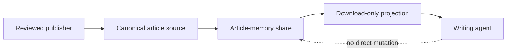
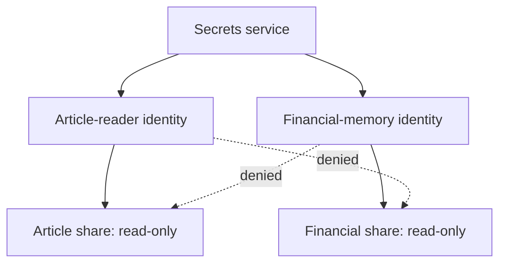
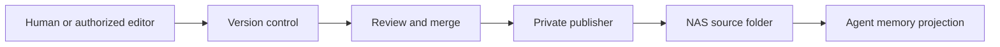
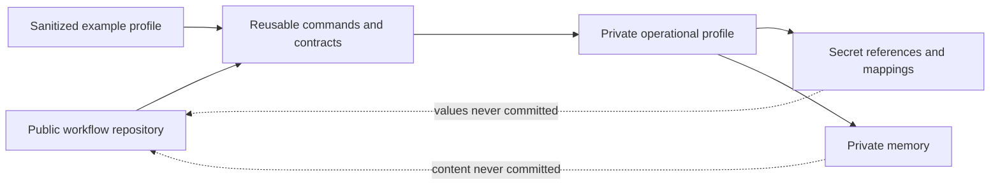

# Turn Your NAS Into Private Memory for an AI Agent Team

> **Draft:** Material rewrite pending independent review. Human listen-through and release approval remain pending.

Imagine the NAS you may already have at home or in a small office. It stores documents, photos, backups, and project files under your control.

Now imagine using it as shared memory for a team of AI agents.

Instead of copying private material into Google Drive or another third-party cloud drive, the agents read selected knowledge from infrastructure you operate. The NAS remains the source, its existing access controls define what each agent can reach, and unrelated personal folders stay outside the boundary.

The useful surprise is that a NAS is more than undifferentiated storage. Its accounts, shares, permissions, and denial rules can become capabilities for an agent team.

The design is simple: give each agent only the slice of shared memory its purpose requires, then test both the access that should work and the access that should fail.

## Start with one useful memory

My first case was a writing agent that needed to search an article archive. It needed to read drafts and references. It did not need my photos, finances, backups, or administrative access to the NAS.

I created a named share for article memory and a dedicated reader identity for that purpose.

The NAS account can read the article share and is denied access everywhere else. Synology Drive provides a download-only projection for the agent runtime. That prevents local changes from being uploaded to the NAS source.

Download-only synchronization does not necessarily make the local copy immutable. If local write denial matters, the operating-system account, mount, or sandbox must enforce that separate boundary.

This gives the agent useful memory without turning the entire NAS into its workspace.

## Map access to each agent's purpose

An agent team should not share one broad NAS identity. Each independent purpose or trust boundary should receive its own account and mapping.

A writing agent might read article memory. A financial agent might read a different, tightly controlled share. Neither identity should reach the other's material.

This is least privilege expressed in terms the NAS already understands. The share names describe purpose. The accounts identify the readers. The permission rules enforce the mappings.

Credentials belong in a secrets service. The agent profile stores references to those secrets rather than reusable passwords. At runtime, an authorized integration resolves the declared credential without placing it in Git or conversational context. Logs and errors still need redaction, and the runtime still needs a protected way to reach the secrets service.

## A path alone is not the boundary

The article archive originally lived several levels below a much larger personal share. Naming that nested path in an agent configuration would look precise, but the path by itself would not restrict the account.

[Synology DSM supports access-control rules](https://kb.synology.com/en-us/DSM/tutorial/How_to_manage_ACL_settings_on_your_Synology_NAS) on individual folders and files, including inherited and explicit permissions. A nested folder can be a real boundary when its effective permissions are configured and inspected carefully.

I still prefer a dedicated share for agent memory because the boundary is easier to inventory, audit, and test. Nested ACLs can work, but inheritance makes the effective result less obvious.

The general rule is that the storage layout, identity, and enforced permissions must agree. A path string is only a location until the NAS applies the intended access rules.

## Prove the allowed and denied behavior

An administration screen shows intent. An acceptance test shows effective access.

Test through the same identity and route the agent will use:

- list and read a known file in the intended share;
- attempt to write to the NAS source and confirm that it is denied;
- if the local projection must be immutable, attempt to change it and confirm that the local OS, mount, or sandbox denies the write;
- attempt to read an unrelated share and confirm that it is denied;
- confirm that logs and command output do not reveal the credential.

Until these checks pass, the configuration is prepared, not proven.

This step matters more than a checkbox. It catches inherited permissions, an overly broad group membership, an incorrect sync mode, or a local projection that is more writable than expected.

## Keep durable memory read-only

Agents usually search, quote, summarize, and compare memory. Those operations do not require write access to the source.

For durable material, send changes through a controlled publishing path:

The agent reads the projection. Reviewed changes update the canonical source after merge. For sensitive material, the repository, publisher, history, and backups can remain on privately operated infrastructure.

A download folder is different: its purpose may require bounded write access. Access mode should follow the purpose of the share rather than become one global policy for the NAS.

## Keep the method public and the memory private

The reusable workflow can remain public while operational data stays private.

Public code can define the Synology procedure, validation rules, and secret-reference shape. A sanitized example can use fictional hosts, paths, accounts, and repositories. The private profile supplies the real shares, mappings, credentials, and data.

That separation lets other people inspect and reuse the method without requiring the information it protects.

## Private shared memory from infrastructure you own

A NAS can become private shared memory for an AI agent team when its existing access controls are mapped to each agent's purpose and the boundaries are tested.

The practical pattern is small:

- create a named share for one purpose;
- give it a dedicated identity;
- grant the narrowest useful access;
- deny unrelated shares explicitly;
- keep durable memory read-only;
- publish changes through review;
- test both permitted and denied behavior.

That turns storage you already control into a useful agent capability. The agents gain the team knowledge they need. Your unrelated personal data remains outside their reach.
