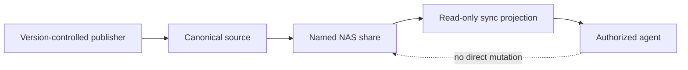
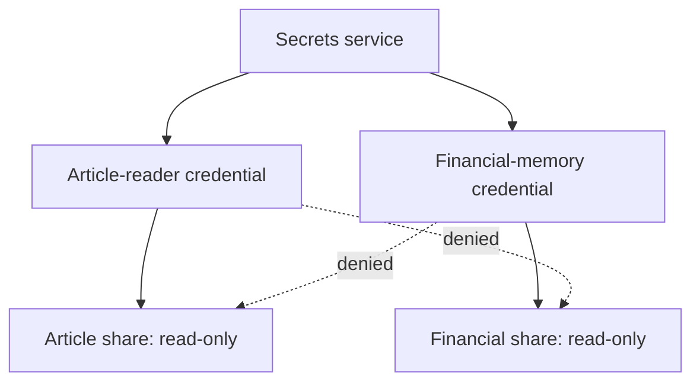
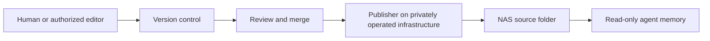
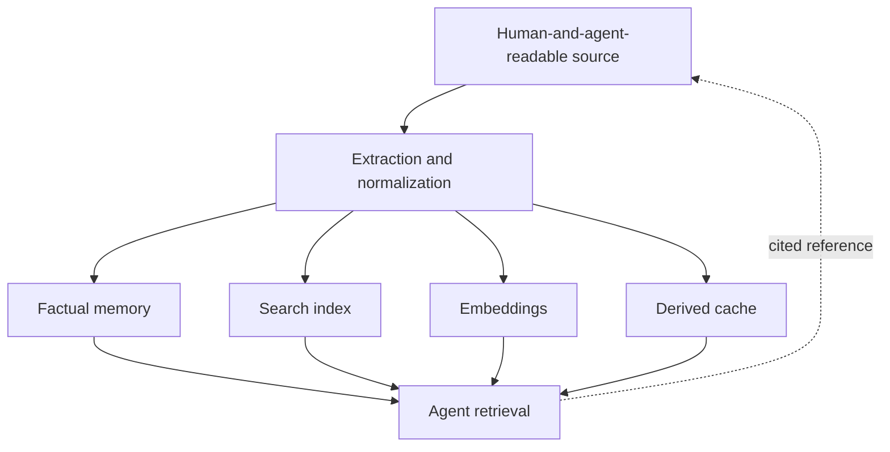
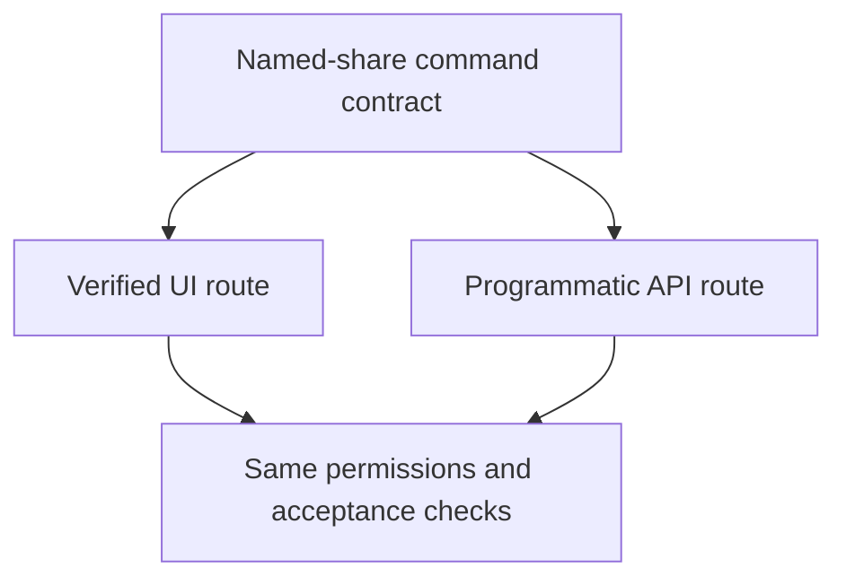
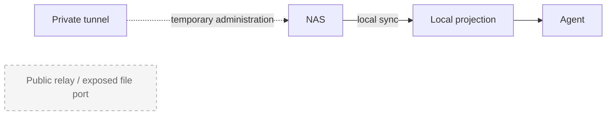
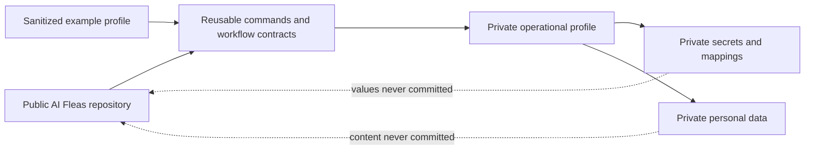

# A Folder Is Not a Permission Boundary

> “But only if they depend on us, and not we on them.”
>
> — Seneca, *Moral Letters to Lucilius*, Letter 98 ([text](https://en.wikisource.org/wiki/Moral_letters_to_Lucilius/Letter_98))

> **Draft:** This article records a working design and has not completed the Writing workflow's independent review or human release approval.

I wanted to give an AI agent access to one folder on my NAS.

The request sounded simple: let a writing agent search an article archive as memory. Keep the archive read-only. Store the login in a secrets manager. Do not expose the rest of the NAS.

Then I looked at the folder tree.

The articles lived several levels below a much larger shared folder. Creating a user and granting access to that path would look precise in configuration, but the real security boundary would still be the parent share. A filesystem folder is an organizational boundary. The NAS shared-folder permission is the access boundary.

That distinction changed the design.

## Give the agent a named share

Instead of giving an agent a path into a broad personal share, I created a dedicated top-level share for the material it is allowed to read.

The share has a name that describes its purpose. The identity has access to that share and nothing else. The local projection is read-only from the agent's point of view.

This is useful for two reasons.

First, the list of shares becomes an inventory of what the agent environment exposes. I do not need to remember that some nested path is special.

Second, the NAS can enforce the same boundary that the configuration describes. If an account is intended to read only the article memory, it receives read-only access to the article share and explicit denial everywhere else.

## One purpose, one identity

I initially thought about one general NAS account for all agents. That would have been convenient, but it would also have made every future share part of one growing trust zone.

A better pattern is one identity per share and purpose.

The account does not need permission to administer the NAS, browse unrelated files, use interactive services, or write to the memory it reads. It needs one bounded capability.

The credential belongs in the secrets service. The profile or workflow stores only secret references. At runtime, an authorized command resolves the declared username and password and passes them to the integration without putting either value in Git or in the agent prompt.

This does not make credentials disappear. A local runtime still needs a bootstrap identity to reach the secrets service. Logs and error messages still need redaction. The important improvement is that an ordinary agent does not receive a reusable NAS password as conversational context.

## Memory should usually be read-only

An agent using a folder as memory usually needs to search, quote, summarize, or compare existing material. None of those actions requires write access.

Writing directly into the memory share creates an awkward failure mode. A capable agent can reorganize, rename, or rewrite source material while trying to help. Sync software can then replicate the mistake everywhere.

For durable material, I prefer a controlled publishing path:

The agent reads from the NAS projection. Changes go through version control, review, and a publisher that updates the canonical folder after merge.

For sensitive personal material, that version control is privately operated infrastructure. The repository and its history remain on systems I control; they are not pushed to GitHub, whether the GitHub repository would be public or private. A private repository changes who the service intends to let in. It does not remove the service provider, its accounts, its infrastructure, or its attack surface from the trust boundary.

This is a threat-model decision, not a claim that a personal server is automatically secure. A self-hosted Git service still needs authentication, updates, backups, restricted network access, and recovery testing. Its advantage here is narrower: sensitive data can remain inside the same deliberately small private boundary as the NAS instead of being copied to another organization's infrastructure.

Depending on the setup, the private Git service can run on the NAS itself or on another always-on machine in the same private infrastructure. Running it on the NAS reduces the number of machines involved. A separate 24-hour server can provide stronger workload isolation and may be easier to update, back up, or recover independently. Either arrangement preserves the intended boundary when the repository, its backups, and its network access remain private.

A large, well-known code-hosting service is an obvious and valuable target. A private system may be less visible, but obscurity alone is not protection. The design relies on fewer entrusted parties, limited exposure, and explicit controls. Reduced visibility is only one small part of that boundary.

Downloads are a different use case. A download folder exists to receive new files, so a bounded write-capable share can be appropriate there. The access mode should follow the purpose of the share instead of becoming a global NAS policy.

## Start with memory both sides can read

An article folder is not the final form of agent memory.

Agents may eventually work better with an additional persistent-memory layer: extracted facts, structured relationships, indexes, embeddings, summaries, or caches optimized for retrieval. Different agents may need different representations of the same material.

Those layers can sit above the readable source.

The lower layer remains valuable because both parties can inspect it. A human can open the files without a specialized memory service. An agent can read the same source, cite it, and reconstruct a derived index when the representation changes or a cache becomes unreliable.

This suggests a practical first step: convert the material you already have into a format that agents can discover and read, then give them a safe way to propose changes. The initial result does not need to solve every problem in long-term agent memory. It needs to make existing knowledge accessible without surrendering control of the source.

Later, a more agent-oriented memory system can improve recall and context selection. It should remain a derived layer with provenance back to the readable material. Otherwise the organization may gain a memory that is efficient for a model but opaque to the person responsible for it.

The shared readable layer is therefore not a temporary workaround. It is the durable meeting point between human knowledge and machine retrieval.

## Start with the UI, preserve the procedure

I wanted this setup to become a command, but the first reliable route was the NAS administration UI.

That did not make the work non-repeatable. The command documentation can own a numbered procedure:

1. Create a top-level shared folder.
2. Enable the folder as a sync team folder when local projection is required.
3. Create a dedicated account for the share.
4. Grant that account read-only access to the intended share.
5. Explicitly deny access to every unrelated share.
6. Deny unnecessary applications and protocols.
7. Store the credential in the configured secrets service.
8. Create a download-only local projection.
9. Prove allowed reading, denied writing, and denied unrelated access.

The agent can guide or operate the UI while recording evidence for each step. Later, a programmatic adapter can implement the same contract through a supported NAS API.

Those are two execution routes for one operation, not two different designs.

The API route should remain unavailable until it can verify the same postconditions. Automation is not useful if it creates a share but cannot prove that unrelated data stayed inaccessible.

## Remote access is optional

A synced folder does not need a permanently exposed remote file service.

Most of the time, local sync gives the agent the projection it needs. Version-controlled changes can travel through the publishing path. If direct remote administration is necessary, a private tunnel can be opened for that specific purpose.

This keeps the normal data path small:

There is no need to introduce a vendor relay or an open public file-sharing port merely because the data lives on a NAS.

## The proof matters more than the checkbox

An administration screen can show the intended permissions and still leave unanswered questions.

The acceptance test should use the dedicated identity through the same route the agent will use:

- list and read a known file in the intended share;
- attempt a write and confirm that it is denied;
- attempt to access an unrelated share and confirm that it is denied;
- confirm that command output and logs do not reveal the credential.

Until those checks pass, the configuration is prepared, not proven.

That wording matters. It prevents a successful click sequence from becoming a stronger security claim than the evidence supports.

## The workflow can be public while the data stays private

This pattern is part of [AI Fleas](https://github.com/starodubtsevconsulting/ai-fleas), my public workflow and command infrastructure for AI agents. The reusable parts can be inspected and shared: the [Synology command](https://github.com/starodubtsevconsulting/ai-fleas/blob/main/ai-commands/connect/synology/synology.command.md), the workflow contract, validation rules, secret-reference shape, and a sanitized [example profile](https://github.com/starodubtsevconsulting/ai-fleas/tree/main/ai-profile/example).

The example profile demonstrates the boundary without containing my boundary. Its [fictional Synology mapping](https://github.com/starodubtsevconsulting/ai-fleas/blob/main/ai-profile/example/commands-config/synology/config.example.yml) uses placeholder hosts, paths, accounts, and repository locations. Its [example secrets configuration](https://github.com/starodubtsevconsulting/ai-fleas/blob/main/ai-profile/example/commands-config/secrets/config.example.yml) contains logical references rather than credential values.

My operational profile supplies the private facts: which shares exist, where the source folders live, which private Git service publishes them, and which secret references the runtime may resolve. The personal and financial documents, repository history, credentials, machine addresses, and real mappings remain outside the public repository.

That separation lets other people reuse and review the method without requiring me to publish the information the method protects.

## Small infrastructure, explicit boundaries

The useful lesson was not about one NAS product.

Agents make old personal infrastructure behave like shared organizational infrastructure. A folder that used to be meaningful only to its owner becomes an interface used by software identities. Once that happens, names, permissions, credentials, mutation paths, and acceptance tests need to agree.

The resulting pattern is modest:

- create a named share for one purpose;
- give it a dedicated identity;
- grant the narrowest useful access;
- resolve its credential through the secrets service;
- keep durable memory read-only;
- publish changes through version control;
- prove both permitted and denied behavior.

The NAS is still just a box of disks.

But the moment an agent can use it, a folder stops being merely a place where files happen to live. It becomes a capability, and capabilities deserve boundaries that the system can actually enforce.
