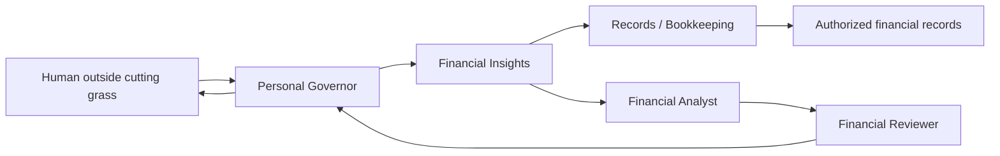

# I Was Cutting the Grass. Could My AI Team Do the Accounting?

> “It is not that we have a short time to live, but that we waste a lot of it.”
>
> — Seneca, *On the Shortness of Life*, translated by C. D. N. Costa

> **Draft:** Prepared through the Writing workflow in emulation mode. Independent fresh-context critique, human listen-through, and release approval remain pending.

The birds were singing.

The air at the chalet was cool enough to make cutting the grass almost recreational. I had the mower moving, the phone in my pocket, and—for once—I was not sitting in front of a computer.

Then I thought about the bills.

There are taxes around the chalet. There are receipts. There are financial things that do not disappear merely because the weather is good.

Normally that thought has a price.

Stop what I am doing. Go inside. Open the laptop. Find the right folder. Find the statement. Remember what I already checked. Work out what still needs attention. Perhaps open the calendar. Perhaps create another task. Twenty minutes later I am no longer cutting grass. I am doing administration.

This time I pulled out my phone and asked a design question: what would it take for my Personal Governor to hand a bounded financial question to specialists without pulling me away from the yard?

Then I went back to the grass.

## The interesting part was not the phone

We already know that phones can access financial applications.

That is not particularly interesting.

What interested me was the possibility that I would not have to reconstruct the problem for the AI every time.

Over time I had already been building the pieces:

- a Personal Governor that knows the goals and commitments I have chosen to give it;
- a Financial Insights workflow with narrowly defined financial roles;
- financial records stored privately on infrastructure I control;
- commands that can work with statements, taxes, invoices, receipts, and extracted document data;
- durable memory so yesterday's decisions do not depend on finding yesterday's chat.

The phone was just the interface.

Behind it, the useful model looks more like this:



The Governor does not need to become my accountant.

It can ask a workflow designed for financial evidence.

That distinction matters.

## Ask the specialist, not the entire universe

Suppose I remember that a chalet tax payment may need attention.

The Governor already has enough context to understand why I care. But it should not automatically load every invoice, statement, tax document, and private record into its own conversation.

Instead it can formulate a bounded question for Financial Insights.

The financial workflow can then do what it was designed to do.

A Records / Bookkeeping agent can establish what records exist, which period they belong to, what is missing, and where the evidence came from.

A Financial Analyst can calculate the relevant totals, compare periods, or model a scenario.

For a material conclusion, a separate Financial Reviewer can check the evidence and assumptions.

The result coming back to the Governor is not my entire accounting archive. It is a bounded evidence packet:

```text
question
observed facts + sources
calculations
assumptions
missing evidence
uncertainty
review state
```

Now the Governor can combine that financial dimension with everything else that actually belongs at the human level: priorities, deadlines, opportunity cost, available time, and the other things I said mattered.

That feels much closer to how a small human organization works.

You do not invite the entire accounting department into every conversation.

You ask for the answer you need, with evidence.

## Memory changes the interaction

Without durable context, AI often makes you perform a strange ritual.

Every conversation starts with autobiography.

Here is my business.

Here is my property.

Here is how my folders work.

Here is the thing we discussed yesterday.

Here is the spreadsheet.

Here is what I am trying to achieve.

Only then can you ask the actual question.

A persistent Governor changes the economics of small questions.

If the system already knows the authorized structure and can retrieve the minimum relevant evidence, a question that was previously too annoying to investigate can become cheap enough to ask while standing beside a lawn mower.

That does not mean the AI should know everything.

Quite the opposite.

My Financial Insights workflow can have access to financial evidence that an unrelated coding agent should never see. The Governor can receive a conclusion without receiving every underlying private document. My public AI Fleas repository can describe the method while the real profile, records, credentials, and storage mappings remain private.

The useful thing is not unlimited memory.

It is **memory with boundaries**.

## What concurrent AI work changes

There is another subtlety here.

If I spend an hour cutting grass while an agent spends forty minutes checking records, preparing an analysis, or creating a report, I did not spend forty minutes doing accounting.

My activity was cutting grass.

Perhaps I spent five minutes intermittently directing the work and making decisions.

Those are different facts.

This became important enough that I added an activity-reconciliation rule to the Governor's design.

It distinguishes:

```text
Human activity:       cutting grass
Human attention:      intermittent supervision
Governor activity:    financial question orchestration
Workflow activity:    records + analysis + review
Calendar relationship: concurrent / unplanned
```

That sounds like bookkeeping about bookkeeping, but it prevents a surprisingly important mistake.

AI can produce a lot while you are doing something else. If the system records all of that output as your working time, it creates a fictional picture of your day.

The Governor should govern the human's scarce time.

So it needs to know which work consumed the human and which work consumed the agents.

## The calendar can change after reality does

Suppose my calendar said:

```text
13:30–14:30  Experiment with an image model
```

But at 13:30 I am still outside, cutting grass, while occasionally talking to the Governor about finances.

The calendar is now wrong.

A useful Governor should notice.

If the image experiment was optional, it can move or replace that block. It can record the yard work as the primary human activity and the AI work as concurrent delegated activity. If the financial conversation creates two real follow-ups, it can propose or schedule those instead.

The calendar becomes evidence of allocation, not a historical fiction that insists the morning plan happened exactly as written.

This matters because planning systems usually have a strange bias toward intention.

They remember what you said you would do.

Life is made out of what actually happened.

## Is this healthy?

There is an obvious objection.

Perhaps cutting grass should just be cutting grass.

Fresh air, birds, physical work, no screens.

I think that objection is valid.

A Personal Governor that turns every walk, meal, workout, and quiet moment into an opportunity to squeeze in another task would be a terrible Governor.

The point is not to eliminate idle time.

The point is that when something genuinely useful occurs to me, I can hand it off without necessarily abandoning what I am doing.

That should be exceptional and cheap.

Ask the question.

Delegate the investigation.

Put the phone away.

Let the agents work.

If something requires my decision, bring back the smallest useful result.

If it can wait, schedule it.

Then leave me alone.

The system should protect human attention at least as seriously as it protects compute.

## A small company can fit behind one conversation

This is where the idea becomes more interesting than personal productivity.

Imagine a one-person company.

The human has a phone.

Behind that conversation are small specialized capabilities:

```text
Personal Governor
├── Financial Insights
│   ├── Records / Bookkeeping
│   ├── Financial Analyst
│   └── Financial Reviewer
├── Writing
│   ├── Writer
│   └── Reviewer
├── Development
│   ├── Designer
│   ├── Coder
│   └── Reviewer
└── other authorized workflows
```

The human does not need to navigate that organization manually every time.

The Governor can understand the request, choose the workflow, send a bounded packet to the right specialist, collect the result, and bring the decision back to the human.

On a platform that supports real agents, those can be separate persistent agents with different models, tools, memory, and access.

On a simpler platform, some roles can be emulated, with the limitations made explicit.

Either way, the human-facing interaction stays small.

That is the part I care about.

Not autonomous AI running my life.

Not an infinite swarm of agents talking to one another because they can.

A human chooses a direction.

The system remembers the structure.

Specialists do bounded work.

Evidence comes back.

The human decides.

## And then I kept cutting the grass

The point is not that a verified accounting result arrived that afternoon. This was a design exercise, not a completed financial run.

The useful possibility is simpler: I can hand off a bounded investigation without immediately becoming the accounting department. In a real run, any answer would still need sources, uncertainty, and review before I acted on it. Genuine follow-ups could then become calendar commitments instead of thoughts bouncing around my head.

Then the phone went back into my pocket.

The mower was still there.

The birds had not gone anywhere.

And neither had the bills.

The design question was whether those had to remain the only two choices.
