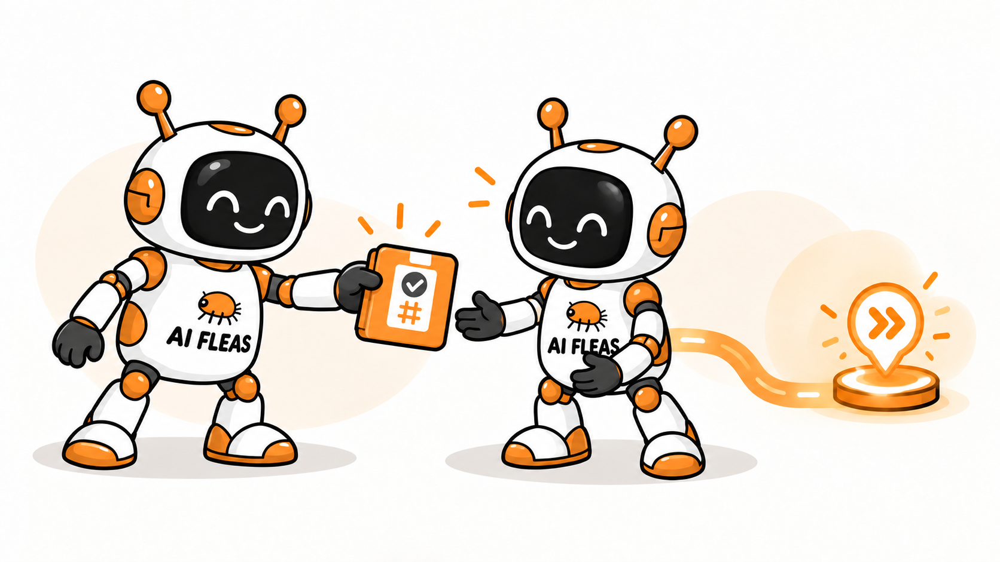

# Your AI Agents Aren't Failing at Their Jobs. They're Failing at the Handoff.

*A capable Writer and Reviewer can still produce an unreliable workflow when the work, authority, evidence, and return path between them are ambiguous.*

*An AI Fleas handoff carries the work and evidence the next agent needs. Illustration generated from the author's character reference.*

A Writer finishes an article and tells the Reviewer:

> Please review this article.

That sounds perfectly reasonable.

But which revision? Is the source file authoritative, or the destination draft? May the Reviewer edit it or only report findings? Which claims need verification? Where should the evidence go? And what happens when the Writer changes the article after the review?

Neither agent has to be bad at its job for this workflow to fail.

The Writer can write well. The Reviewer can review well. The failure can live entirely in the space between them.

That is the part of multi-agent systems I increasingly care about: **what exactly crosses the boundary when one capable agent hands work to another?**

Specialization creates useful roles. It also creates boundaries. Reliability depends on making those boundaries explicit.

That is what an explicit handoff is for.

## A handoff is more than a message

“Please review this article” sounds clear to a person who already knows which article, which revision, and what “review” means. To an agent, it leaves several hidden decisions open:

- Is the source file or the destination draft authoritative?
- May the reviewer edit the text, or only report findings?
- Which claims need verification?
- Where should the result go?
- Does a previous review still apply after the draft changes?

An explicit handoff turns those assumptions into data. It names the work, the exact revision, the sender and recipient, the permitted actions, the prohibited effects, the evidence expected back, and the return route.

This can look bureaucratic. In practice, it is a compression format for trust.

## Precision prevents accidental authority

AI agents are often capable of doing more than their assigned role allows. A reviewer may be able to rewrite an article. A release coordinator may be able to press Publish. A general-purpose agent may have access to several projects at once.

Capability is not the same as authority.

A good handoff makes the distinction visible. The reviewer can read and critique a specific revision but cannot silently replace it. The writer can prepare an unpublished destination draft but cannot schedule it. The release coordinator can evaluate timing only after review and human acceptance are proven.

These limits are not obstacles around the workflow. They are part of the workflow. They keep a useful action from quietly becoming a different action with a larger consequence.

## Evidence makes the next step dependable

Without a defined return, an agent may report that a task is “done” when it has only attempted it. A saved editor field is not proof that a destination page rendered correctly. A sent message is not proof that another agent received or acted on it. A review of yesterday's revision is not a review of today's changes.

An explicit handoff specifies what completion must look like. That might include a content hash, a draft URL, screenshots of the rendered result, passage-level findings, or a delivery acknowledgement. The next agent does not have to reconstruct history from conversation fragments. It receives a bounded result with evidence attached.

This also improves recovery. If the process stops halfway through, the team can tell the difference between work that was completed, work that was attempted, and work that is still waiting on a human decision.

## Narrow packets make teams easier to change

Explicit handoffs also reduce dependence on a particular model or conversation. A role can be replaced when its context is exhausted because the durable state lives in the work artifacts and the transfer packet, not only in the agent's memory. Safe replacement has an order: initialize and verify the successor, make it the authoritative binding, then deactivate or archive the predecessor last. The process should finish with exactly one active agent bound to that role.

The same principle makes systems easier to test. You can ask:

- Did the writer identify the exact draft?
- Did the reviewer inspect that revision independently?
- Did the findings return to the correct owner?
- Did the release step wait for the required gates?

Those are observable questions. “Did the agents collaborate well?” is not.

## The smallest reliable team

More agents do not automatically make a workflow safer. Every additional role creates another boundary where context or authority can leak. The goal should be the smallest team with genuinely independent responsibilities—and a clear contract at every crossing.

For a writing workflow, three editorial specialists may divide the work: a writer owns the draft, a reviewer owns independent critique, and a release coordinator owns timing. They are not the whole team, and they do not hand work directly to one another. An Admin operates the control plane, sending each assignment and receiving every result, while a Judge remains outside ordinary editorial routing as an oversight role. The human still accepts the final revision and controls publication.

The handoffs make those responsibilities real. They say not only who acts next, but what is being transferred, what remains with the current owner, and what proof must come back.

AI agent teams become reliable when their collaboration stops depending on implication. The intelligence may live inside the agents. The trust lives between them.

---

## Sources and provenance

This article is an original synthesis based on the public AI Fleas workflow contracts for [agent communication](https://github.com/starodubtsevconsulting/ai-fleas/blob/main/ai-workflows/_common/agents/communication.md), [reliable delivery](https://github.com/starodubtsevconsulting/ai-fleas/blob/main/ai-workflows/_common/agents/delivery.md), [continuity](https://github.com/starodubtsevconsulting/ai-fleas/blob/main/ai-workflows/_common/agents/continuity.md), and [Writing editorial routing](https://github.com/starodubtsevconsulting/ai-fleas/blob/main/ai-workflows/writing/agents/editorial-routing.md). No quotations are used; the AI Fleas header illustration was generated from the author's character reference.
