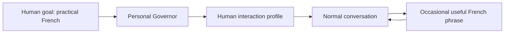

# Your AI Already Talks to You. Make It Teach You Something.

> **Draft:** Prepared through the Writing workflow in emulation mode. Independent fresh-context critique, human listen-through, and release approval remain pending.

I was talking to my AI assistant in English when a small idea appeared.

I am trying to improve my French. Not classroom French in the abstract. The kind I can actually use in Montreal: in a meeting, at a coworking space, on the phone, or during an ordinary conversation.

The usual answer is to create another habit.

Open the language app. Do a lesson. Review vocabulary. Schedule a tutor.

All useful.

But I already spend a surprising amount of time talking to AI.

So I changed the rule.

English remains the default. But when an ordinary phrase comes up that would be useful in French, the assistant can occasionally add a tiny aside:

> BTW, in French: *Ça vaut la peine d’essayer.* — “It’s worth trying.”

Then it continues with whatever we were actually discussing.

No lesson. No vocabulary dump. No interruption.

The language I want to learn starts appearing inside the work I am already doing.

That made me think about a larger question:

**What if an AI profile described not only what an assistant may access, but how interacting with it should gradually help the human?**

## Personalization is more useful when it has a purpose

Most software personalization is about preference.

Dark mode.

Notification settings.

Language.

Which dashboard opens first.

AI makes another kind possible because the interface itself is a conversation.

If I have a durable goal to improve practical French, the assistant does not have to wait until I explicitly say, “Teach me French.”

It can support that goal at moments when the cost is almost zero.

The important part is restraint.

I do not want every answer translated into French. I do not want a grammar explanation while debugging a server. And I definitely do not want an enthusiastic language tutor jumping into every conversation because it discovered a new engagement strategy.

The rule needs boundaries.

For my case they are simple:

```yaml
interaction:
  defaultLanguage: en
  frenchReinforcement:
    enabled: true
    variety: fr-CA
    frequency: occasional
    style: contextual-aside
```

The implementation can vary. The idea is more important than the YAML:

**keep the primary task primary, but use good moments to reinforce a human-owned goal.**

## Put the preference on the human, not the project

This led to another design decision.

I use AI across different contexts. There may be a work profile, a personal project, a writing workflow, or a client environment.

My desire to improve French does not belong to any of them.

It belongs to me.

So in AI Fleas I have been experimenting with a human profile above those work contexts:

```text
human
├── governor
├── memory
├── interaction preferences
└── authorized work profiles
```

The public repository uses a fictional example human. My private configuration contains my real profile.

That distinction matters.

A client project should not need to know my personal learning history. A coding agent does not need a biography. An operational workflow should receive only the context required for its job.

But the human-facing layer can know that, when appropriate, one useful French phrase is welcome.

The preference follows the person without flattening all of the person's private context into every agent.

## This is ambient learning

Traditional learning asks you to enter a learning context.

You open the book.

You start the course.

You sit down with a teacher.

Ambient learning does something smaller: it attaches learning opportunities to situations that already occur.

The phrase is relevant because I just needed it in English.

That gives it context immediately.

If the same useful phrase appears again a week later, even better. Repetition is happening around actual use rather than around an arbitrary vocabulary list.

For example, project work naturally produces phrases such as:

> *On va essayer.* — We’ll try.

> *Ça vaut la peine.* — It’s worth it.

> *Je vais vérifier.* — I’ll check.

> *On peut reporter ça.* — We can postpone that.

Those are much more valuable to me than learning the French word for a giraffe because Lesson 14 happened to contain one.

The assistant does not need to become the teacher of record. It can simply notice that the current conversation contains something worth carrying across languages.

## The Governor makes the rule durable

A one-off prompt can do this:

```text
Sometimes show me useful French equivalents of phrases we use.
```

That works until the chat disappears or the instruction gets buried under everything else.

I wanted the preference to survive because it represents a longer-term goal.

That is where my Personal Governor experiment becomes useful.

The Governor is a human-scoped strategic layer. It remembers goals and constraints that should survive individual workflows and conversations. The human still owns those goals and can change or remove them.

The interaction preference becomes one projection of that strategy:



The coding workflow does not suddenly become a French course.

The writing workflow does not translate every paragraph.

The Governor simply has another low-cost way to make ordinary interaction align a little better with an existing goal.

## The pattern is bigger than language

French is a convenient example because the behavior is easy to see.

But the same design can support other human-owned strategies.

Someone learning a technical field could ask for an occasional connection to a concept they are studying.

Someone trying to become a clearer writer could ask the assistant to point out one especially useful phrasing improvement when it naturally appears.

Someone learning the vocabulary of a new profession could receive the domain term beside the ordinary explanation.

The dangerous version is an assistant that decides what the human ought to learn and constantly nudges them toward it.

The useful version is almost the opposite.

The human declares the direction.

The assistant remembers it.

The current task keeps priority.

Small opportunities are used when they genuinely fit.

And the human can turn the behavior off.

## You can try this without building anything

You do not need AI Fleas, a Governor, YAML, or a private profile to test the idea.

Tell the assistant you already use:

```text
Keep speaking to me normally in English.

I am learning practical Canadian French.

When a phrase comes up naturally that would be genuinely useful in everyday
conversation, occasionally add:

“BTW, in French: <natural French phrase>.”

Keep it brief. Do not translate every answer and do not turn unrelated work
into a French lesson.
```

Then use AI normally.

The interesting test is not whether the assistant can translate English into French. Of course it can.

The test is whether a month of ordinary conversations leaves you with ten or twenty phrases that you actually remember because they arrived at the moment you needed them.

That is a very different kind of personalization.

Software used to remember how you wanted the interface configured.

AI can remember something more useful:

**who you are trying to become — and, occasionally, help without getting in the way.**
