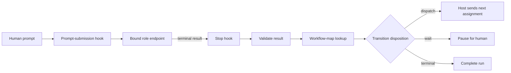
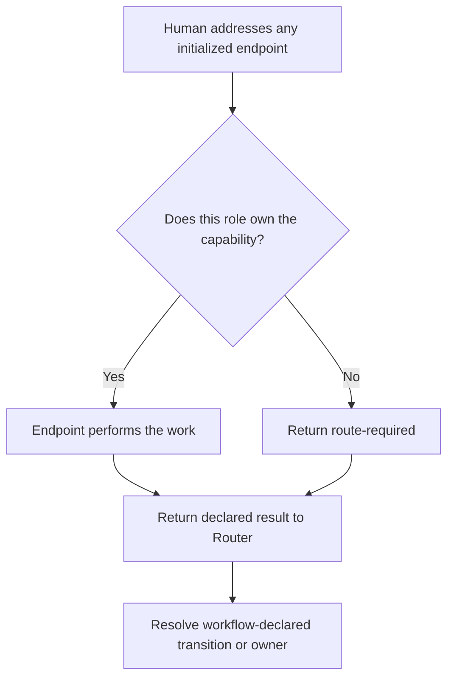

# Your AI Agents Do Not Need to Talk to Each Other

*A workflow can coordinate an AI team without turning every agent into a coordinator.*

When people imagine a team of AI agents, they often draw a network.

The Writer talks to the Reviewer. The Reviewer sends corrections back to the Writer. The Release Coordinator asks both
of them whether the work is ready. Soon every agent needs to know which peers exist, what they are called, when they may
be contacted, and how to interpret their replies.

That looks collaborative. It also gives every endpoint part of the orchestration problem.

There is a simpler design: agents do their assigned work, return a small result, and let a mechanical runtime execute the
workflow.

The agents do not need to talk to one another because the workflow already knows what happens next.

## The workflow is the program

Consider a small editorial workflow:

```text
Draft -> Review -> Release
           |
           +-- changes required -> Correction -> Review
           +-- human decision required -> Wait for human
```

This is more than a picture. Each stage can declare:

- the role that owns it;
- the events that may finish it;
- the next stage for each event;
- the evidence that must accompany the event; and
- whether execution should dispatch another agent, stop, or wait for a human.

An executable projection might contain a transition like this:

```json
{
  "review": {
    "role": "reviewer",
    "transitions": {
      "changes_required": {
        "to": "correction",
        "requiredReferenceKinds": ["findings"]
      },
      "human_action_required": {
        "to": "human_review",
        "waitForHuman": true,
        "requiredReferenceKinds": ["human-action"]
      }
    }
  },
  "correction": {
    "role": "writer",
    "transitions": {
      "review_ready": {
        "to": "review",
        "requiredReferenceKinds": ["revision", "review-packet"]
      }
    }
  }
}
```

Nothing in that map says that Reviewer must discover Writer or send Writer a message. It says that when the `review`
stage returns `changes_required`, the workflow advances to `correction`, which is owned by Writer.

That distinction matters:

> The workflow declares the route. The agents perform the work on the route.

## The Router is the runtime

A declarative workflow does not execute itself. Something must observe that a stage ended, validate its result, find the
declared transition, resolve the next role to a live endpoint, and deliver the next assignment.

That component is the **Router**.

The Router is not another workflow and it is not another specialist agent. It is a small state machine that performs a
deterministic lookup:

```text
(current stage, returned event)
    -> declared transition
    -> next stage
    -> owning role
    -> exact initialized endpoint
```

For example:

```text
review + changes_required -> correction -> writer -> exact Writer task
correction + review_ready -> review -> reviewer -> exact Reviewer task
review + human_action_required -> human_review -> wait
```

The Router does not decide whether the article is good. Reviewer does that. It does not decide how to fix a paragraph.
Writer does that. It does not decide whether a human enjoyed the narration. The human does that.

The Router only executes outcomes that the workflow already permits.

## Hooks are the bridge between a conversation and the state machine

The phrase “hidden Router” can make the mechanism sound mysterious. It is not.

In one practical Codex implementation, a plugin installs lifecycle hooks around agent turns. A prompt-submission hook
recognizes the addressed task's trusted workflow binding and prepares a Router-owned assignment. A stop hook observes
the endpoint's terminal result after the agent finishes.

The hook itself does not reason about who should work next. It invokes ordinary JavaScript that validates the result and
executes the registered workflow map. If another stage should run, the host dispatcher starts a turn on the exact task
bound to that stage's role.

<!-- diagram-id: hook-router-runtime-v1 -->


This separates four things that are easy to blur together:

- **Hooks** observe lifecycle boundaries.
- **Router code** validates results and advances state.
- **The workflow map** declares legal transitions and stage ownership.
- **The host dispatcher** delivers an assignment to a concrete endpoint.

The plugin is therefore an adapter for this host, not the workflow itself. Another host could execute the same contract
with a service, queue consumer, state-machine engine, or another lifecycle mechanism.

## The endpoint returns an event, not a message to a peer

After completing one assignment, an endpoint returns a narrow result to the Router:

```text
COPY THAT
WORKFLOW_ROUTER_RESULT {
  "correlationId": "<router-owned-correlation>",
  "stage": "review",
  "role": "reviewer",
  "event": "changes_required",
  "references": [
    {"kind": "findings", "ref": "<bounded-reference>"}
  ]
}
```

The result does not name Writer. Reviewer is not authorized to choose its successor. The Router checks that the
correlation, stage, role, event, and required reference kinds match the active assignment, then follows the map.

That gives each component one job:

```text
Reviewer: "I completed review; changes are required; here are the findings."
Workflow: "That event moves review to correction, owned by Writer."
Registry: "This exact task currently represents Writer in this workflow run."
Router:   "Validated. Dispatch correction there."
```

The agents remain independent execution endpoints. They do not need peer task IDs, a communication matrix, or a shared
conversation.

## A human can enter through any initialized endpoint

Removing peer communication should not force the human to begin every request with an Admin or orchestration chat.

A human may start with any initialized workflow endpoint. If the addressed role owns the requested capability, it does
the work. If another stage owns it, the endpoint returns a route-required outcome and the Router resolves the declared
owner.

In both cases, control returns to the Router when the endpoint finishes.

<!-- diagram-id: universal-human-entry-v1 -->


The receiving endpoint still does not select another agent. It either performs work it owns or reports that routing is
required. Undeclared or ambiguous capabilities stop visibly rather than being guessed from conversational similarity.

## Waiting is a real workflow state

Our first mechanical loops exposed an important modeling error: we had described agent stages, but not the moment when
the workflow genuinely belonged to a human.

Suppose Reviewer determines that the source is sound but a person must listen to the rendered narration. Sending the
task to Writer would be wrong; Writer cannot manufacture human acceptance. Sending it back to Reviewer repeatedly would
create a loop.

The correct transition is neither “pick another agent” nor “let the Router decide.” It is:

```text
review + human_action_required -> human_review -> waiting-human
```

The runtime records the state and stops dispatching. Only an explicit human outcome resumes it:

```text
human_accepted -> release
human_rejected -> correction
```

This is one of the advantages of a deterministic Router: missing workflow states become visible. A reasoning agent might
improvise around the omission and make the design appear to work while choosing a different behavior next time.

## Why not make the Router another AI agent?

A lightweight Router agent is possible. It could read a communication matrix, interpret every completion, and decide
who should receive the work next.

That approach is useful when the route is genuinely ambiguous. But for known transitions it adds cost, latency, and
variance to a problem that is already specified.

If `review + changes_required` always means `correction`, asking a model to rediscover that answer on every turn is not
intelligence. It is nondeterminism.

A practical boundary is:

```text
ambiguous human intent -> optional AI classification
declared workflow event -> mechanical validation and routing
domain judgment        -> specialist agent
human decision         -> explicit pause
```

An AI classifier may help translate an unclear request into one declared capability. But deterministic code should
validate the classification against the workflow and execute the final route.

## Mechanical does not mean opaque

The Router can remain hidden as a participant while still being observable as infrastructure.

Useful runtime state includes:

```text
current stage: review
assigned role: reviewer
assigned endpoint: <runtime ID>
last event: changes_required
next stage: correction
delivery status: confirmed
```

Transition history should contain identifiers, events, dispositions, and bounded references—not entire conversations or
artifact bodies. Failed validation or failed delivery should leave the current stage unchanged.

That makes routing inspectable without creating a fake teammate named Router.

## Exact bindings make the map executable

A workflow map contains role names, not live destinations. Initialization must therefore register an exact endpoint for
each role in one workflow scope:

```text
portable workflow map + private role-to-task bindings = executable registered map
```

The portable map can be public. The runtime overlay remains private because it contains concrete task identifiers and
scope coordinates. Display names are not identity.

Dispatch is transactional: the Router commits a transition only after the host confirms delivery to the exact endpoint
whose binding matches the workflow and role. Missing identity, mismatched scope, or failed delivery leaves the run where
it was.

## Keep each Router inside one boundary

A Router controls where context goes. It must therefore belong to one exact workflow scope.

Every run is bound to explicit coordinates such as profile, workflow, logical project, and runtime scope. Every result
must match them through trusted host state before the Router considers its event. Two teams may reuse the same public
workflow without sharing task bindings, artifacts, or history.

Reuse belongs in the workflow definition. Isolation belongs in the runtime instance.

## The boring part is the point

Specialized agents still need judgment. Review still needs independence. Dangerous actions still need explicit
authority. Humans still need places to approve, reject, and intervene.

But ordinary coordination does not need another mind.

It needs a workflow that declares legal transitions, hooks that observe turn boundaries, a small runtime that validates
events, exact bindings that resolve roles to endpoints, and a dispatcher that moves the next bounded assignment.

The workflow is the program.

The Router is the runtime.

The hooks let the runtime see when work begins and ends.

And the agents can concentrate on the work instead of learning how to talk to one another.
