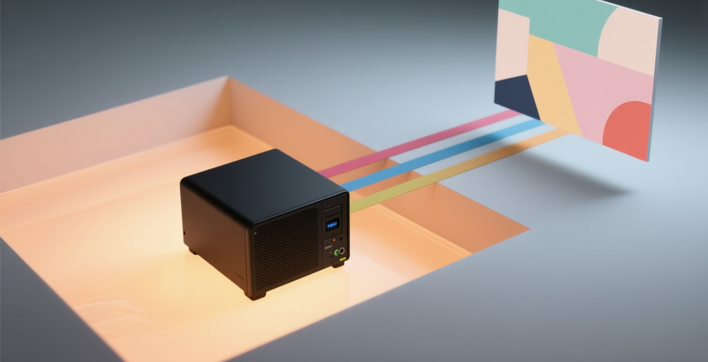

# What Do We Gain by Generating Images Locally?

**September 23, 2026**



*A locally generated image moving from owned compute to an editorial asset.*

What is the point of owning an image-generation machine if the first image I ask it to make never reaches me?

That happened while I was preparing the header for this article.

The prompt passed the input policy. The model generated the image. Then a separate local evaluator rejected the output.
The service returned an error instead of the pixels.

It was inconvenient. It was also a fairly good demonstration of why I wanted the system in the first place.

The useful part of local image generation is not that every prompt becomes free, instant, or good. It is that the image,
the policy, the failure, and the decision about what happens next can remain inside a workflow I control.

## The asset stays with the work

An editorial image is not merely decoration. It is part of the article's source material.

There is a prompt. There may be references. There is a model and a seed. There are policy decisions, rejected attempts,
cropping decisions, captions, alt text, and a final file whose exact bytes should match the reviewed version.

When generation is part of the owned editorial workflow, those records can live beside the article. The Writer can
produce one bounded candidate. A Reviewer can inspect that exact file. The archive can retain the prompt, receipt,
hash, dimensions, and visual notes. A publishing destination receives the reviewed asset, not a mysterious download
from somebody's browser history.

That makes the image reproducible in the practical sense. It does not mean the model will recreate identical pixels on
every machine forever. It means I can identify what I generated, how I generated it, and which exact output entered the
workflow.

## Privacy is useful, but control is the larger benefit

Keeping prompts and candidate images local reduces the number of outside systems that see unpublished material.
That matters when a visual is derived from a private draft, internal diagram, client context, or an idea that is not yet
ready to leave the archive.

But “local” is not a magic privacy label.

The machine still needs access controls. Logs can still retain too much. A local service can still expose a careless
network endpoint. Models, containers, and dependencies still come from somewhere. Privacy comes from the whole route,
not from the location of the GPU alone.

The stronger advantage is control over that route.

I can choose the model. I can pin its version. I can decide which machine runs it, which workflow may call it, where its
outputs are stored, and which policy evaluates both the request and the result. If a provider changes its pricing,
interface, retention policy, or product direction, my editorial contract does not have to change with it.

That is provider independence at the workflow boundary. The model is replaceable; the evidence and review gates remain.

## Policy can surround the model

Image models are variable systems. A careful prompt is useful, but it is not enforcement.

In my current setup, the workflow selects a named policy profile. A separate evaluator checks the prompt before
generation and checks the candidate before the service releases it. If either decision fails, the workflow gets a
visible failure instead of quietly accepting the image.

That is exactly what happened here:

```text
editorial prompt
    -> input policy: allow
    -> local generation
    -> output policy: deny
    -> no image released
```

I do not yet know whether the candidate contained a real problem or whether the evaluator produced a false positive.
Because the output gate correctly withheld the file, I cannot inspect it and pretend to know. That uncertainty is part
of the evidence.

A moderation system that never blocks anything is not much of a gate. A moderation system that blocks safe work too
often is not much of a production tool. Both failure modes need measurement, and local ownership does not make either
one disappear.

## The economics are not simply “local is cheaper”

Once the machine is already running, another image does not arrive with a per-image invoice. That can make iteration
predictable. Local network latency is also easier to reason about than a remote queue.

But the machine was not free.

There is hardware to buy, memory to size, storage to manage, power to consume, and heat to remove. Large image models
can displace other useful workloads. A generation that takes ninety seconds is fast compared with some remote jobs and
slow compared with others. The correct comparison depends on volume, quality requirements, electricity, utilization,
and the value of keeping the work private.

The operational cost is real too. Someone has to install the model, keep one compatible mode active, monitor memory,
protect the endpoint, update the runtime, preserve evidence, and recover the service when it fails.

Cloud providers sell relief from much of that work. Local generation trades some of that convenience for control.

## Quality still has to earn its place

Owning the generator does not make its images editorially useful.

Local models can misunderstand object relationships, invent interfaces, deform hands, produce accidental text, or turn
a restrained concept into science-fiction theatre. The same seed can help diagnose a configuration, but it cannot turn
a weak composition into a strong one. Different models have different strengths, and the best local model I can run may
still be worse for a particular job than a specialized external service or a licensed photograph.

That is why I do not want generation to imply selection.

The generated file should enter the same visual review as any other candidate: relevance, focal point, crop behavior,
rights and provenance, factual description, weaknesses, and an explicit verdict. If it fails, the workflow should say
so. It should not keep generating until something merely looks expensive.

## Repeatability is a workflow property

The model is probabilistic. The process does not have to be vague.

I can make the surrounding steps deliberately boring:

```text
resolve authorized provider
    -> record prompt and settings
    -> apply input policy
    -> generate one candidate
    -> apply output policy
    -> hash and inspect released file
    -> send exact evidence to review
```

That sequence is more valuable to me than a button that says “make image.”

It connects the visual to the article, keeps the asset inside the same ownership boundary, and makes failure visible.
It also prevents a convenient local tool from becoming an unreviewed side door around editorial policy.

## Local is not the conclusion

I still like the idea of generating editorial images on machines I own.

I like knowing where an unpublished prompt went. I like being able to preserve the exact configuration. I like keeping
the article, candidate, and evidence in one workflow. I like that the policy layer belongs to me rather than being an
undocumented provider behavior that may change next week.

But the honest version includes the machine cost, energy use, operational burden, variable quality, and a moderation
gate that can reject an image after the expensive work is already done.

The failed header for this article is not proof that the architecture is bad. It is proof that the architecture is
capable of saying no.

The next question is whether it can explain that “no” well enough to improve the system without weakening the gate.

That is the kind of control I actually want from local infrastructure: not guaranteed success, but a failure I can see,
measure, and own.

---

*This article is part of the [AI Fleas](https://github.com/starodubtsevconsulting/ai-fleas) initiative: a public,
portable collection of AI workflows, commands, roles, and conventions.*
