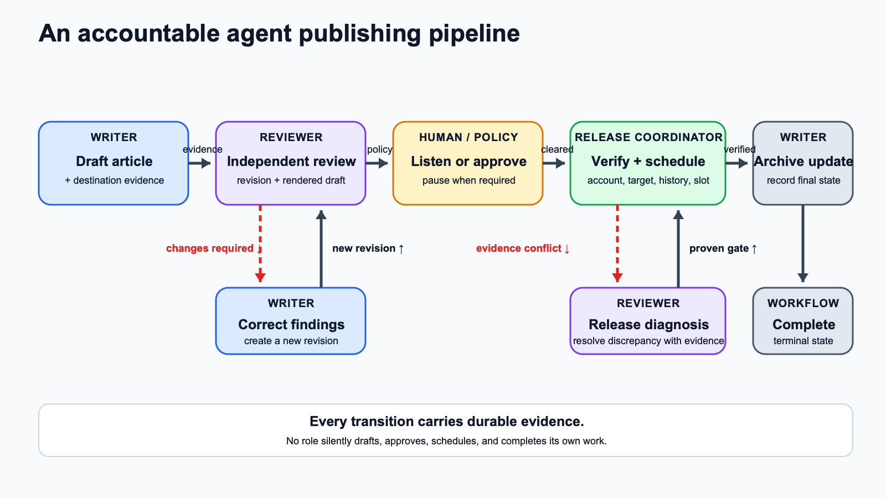

# From Idea to Publication: Designing an Accountable Agent Workflow

*A practical state-machine pipeline for drafting, independent review, human gates, and scheduled release.*

*A human and an AI Flea check each editorial stage before release. Illustration generated from the author’s AI Fleas character references.*

Publishing automation becomes useful when it does more than generate prose. A reliable system must know who owns each decision, what evidence moves work forward, and when to stop for a person.

That is why an agent-based publishing pipeline works best as a state machine. Each stage has a named owner, a limited responsibility, and a small set of valid outcomes. Drafting cannot silently become approval. Approval cannot quietly become publication. Every transition has to carry durable evidence that the next role can inspect.

*A state-machine publishing pipeline keeps drafting, independent review, human gates, release checks, and completion distinct.*

## Start with specialized roles

The Writer turns an idea into an article, preserves the canonical revision, and prepares an unpublished destination draft. That role also owns corrections when review finds a problem. Its job is to make the work reviewable—not to declare its own work finished.

The Reviewer examines the exact article revision and the rendered destination. This distinction matters. A Markdown file can look correct while the destination contains a clipped image, broken hierarchy, missing caption, or stale copy. Review should therefore identify the revision, destination URL, visual assets, and evidence it actually checked.

The Release Coordinator acts only after the review gate is satisfied. It verifies the destination account, publication target, recent release history, policy limits, and an eligible time slot. This is operational work, separate from editorial judgment.

Keeping these responsibilities separate prevents a single agent from drafting, approving, and releasing its own output without challenge.

## Make transitions evidence-based

A state-machine workflow replaces vague instructions such as “finish the article” with explicit transitions.

When the Writer is ready, it returns a revision and review packet. The Reviewer can accept the work, request changes, or pause at a human gate. If changes are required, the findings return to the Writer, which creates a new revision and sends it through review again. The old review does not automatically apply to changed copy or visuals.

The same rule applies at release time. If the Release Coordinator cannot prove that the current revision passed review, that the target account is correct, or that the selected slot is eligible, the workflow does not guess. It routes the discrepancy to a diagnosis stage. Reviewer diagnosis can return prepared evidence to review, send missing preparation to the Writer, or prove that the release gate is already valid.

Durable references make this possible. A file path with a content hash, a saved destination URL, a review record, or a verified schedule is more useful than a conversational claim that something “looks done.”

## Treat human gates as real workflow states

Some publishing policies require a person to listen to a narration, approve the final revision, or both. That pause should be modeled as a state, not handled as an informal message.

The system can generate a narrated preview and present playback without autoplay. It then waits. Only the allowed human response advances the run. A rejection returns the work to correction; a confirmed listen-through or approval advances it according to policy.

This design also makes responsibility clear. AI assistance does not make every sentence human-written. The person or organization publishing under its name remains responsible for deciding whether to approve, reject, revise, or publish the work. Human permission attaches responsibility to the publication decision; it does not rewrite the authorship history.

## Separate scheduling from publication

Destination preparation should stop at a saved draft. Scheduling belongs to a release role with access to the relevant account, cadence policy, time zone, and publication history. This example keeps immediate publication or submission as a human action even when future scheduling is automated.

After a schedule is verified, the workflow updates the archive with the final URL, reviewed revision, local slot, time zone, and gate classification. Only then does the run reach completion. This final archival step prevents the external destination and the internal record from drifting apart.

## A practical checklist

An accountable agent publishing pipeline should answer these questions before it finishes:

- Which exact revision was reviewed?
- Did review include the rendered destination and its visual assets?
- Can the Writer correct findings without overwriting the review history?
- Is the human listen-through or approval gate explicit when policy requires it?
- Did the Release Coordinator verify the account, target, history, and eligible slot?
- Can a release discrepancy return to diagnosis with evidence instead of guesswork?
- Does the archive record the actual scheduled or published state?

The value of this design is not that agents remove people from publishing. It is that automation becomes legible. Every role knows its boundary, every gate has evidence, and every release remains a deliberate decision.
