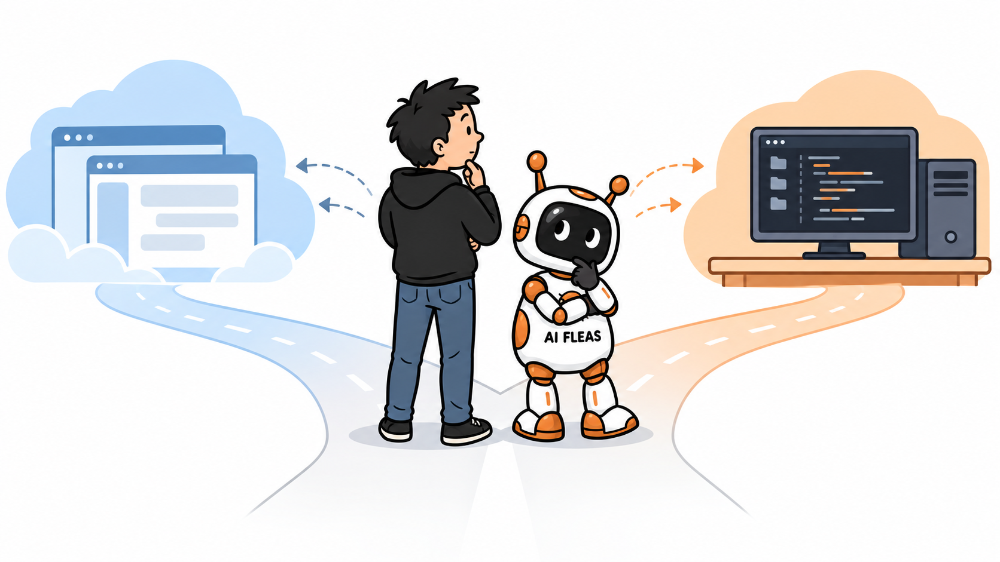

# Where Should a Hybrid AI System Start: Hosted or Local?

*I connected ChatGPT to a local Hermes agent. The connection worked—and showed me that communication was not the real architectural decision.*

*A human and an AI Flea choose between a hosted front door and a local workspace. Illustration generated from the author's character references.*

I connected ChatGPT to a local Hermes agent.

Technically, it worked.

ChatGPT could send coding work to Hermes. Hermes could run a local model on my own hardware. I even replaced a crude process call with Agent2Agent, so the two systems had a proper communication boundary.

Then I discovered that communication was not really the problem.

The harder decision was **which side should be the front door**.

Should a strong hosted model receive the request first and delegate selected work to local capacity? Or should the local agent own the interaction and call hosted intelligence only when the work deserves it?

Those architectures can use many of the same components. They optimize for different things: convenience, control, context, cost, availability, and where orchestration lives.

That was the question I actually needed to answer.

*The following is a scripted dialogue. Host and Anna are fictional voices used to explain a real implementation; this is not a transcript of an actual interview.*

**Host:** You just argued that hybrid AI is worth considering. Hosted intelligence for some work, local models for other work. Fine. Where do I actually start?

**Anna:** That turned out to be a harder question than I expected.

My first instinct was ChatGPT. I already work there. The interface is polished, the tools are easy to understand, and a strong hosted model can coordinate complicated work very well.

So I connected ChatGPT to a local Hermes agent.

**Host:** And?

**Anna:** Technically, it worked.

ChatGPT could send coding work to Hermes. Hermes could run a local model on my own hardware. I even replaced a crude process call with [Agent2Agent, or A2A](https://github.com/a2aproject/A2A/blob/main/docs/specification.md), so the two systems had a proper communication boundary.

Then I discovered that communication was not really the problem.

**Host:** What was?

**Anna:** The local coder kept returning work that needed correction.

ChatGPT would delegate something. The local agent would make a change. ChatGPT would inspect it, find a problem, send another instruction, inspect the next result, and correct it again.

I had built delegation, but the expensive model was still supervising every move.

**Host:** So local AI was not saving much.

**Anna:** Exactly.

A local model can be free per token and still be expensive if another model has to babysit it.

That matters to me because I already spent real money on the local side. The machine cost me around $6,000 with taxes when I bought it.

So naturally I keep asking: what am I actually getting back?

**Host:** And are you getting your money back?

**Anna:** Not yet. At least not in a way I can honestly measure.

I can run coding models. I can generate images locally. I can process private files without uploading the whole collection somewhere. I can experiment without counting every token.

There are also smaller uses that are difficult to put into a return-on-investment spreadsheet.

For example, I can give someone access to a local AI interface without asking them to buy another subscription. That can become a way to teach prompting: describe something, see what the model misunderstood, change the prompt, and try again. Image generation makes that feedback particularly obvious.

Prompting starts to look less like learning magic commands and more like learning to write your thoughts clearly enough that another intelligence can act on them.

Those things have value. But they still don't answer the larger economic question.

**Host:** Which is?

**Anna:** Can this machine become useful capacity instead of an expensive experiment?

In a strange way, not having that answer yet is useful. It keeps pushing me to connect the pieces and find workloads where local compute genuinely earns its place.

But there is a danger there too. You can spend unlimited time trying to prove that an expensive purchase was a good idea.

At some point the machine has to do the work.

**Host:** And that changed how you looked at the hybrid setup?

**Anna:** Yes.

The question stopped being “Can I run this model locally?” I already know I can run models.

The question became “Can I give useful work to this machine and get something useful back without babysitting it?”

That led to another question: who should actually run the workflow?

**Host:** And that brought you to Hermes?

**Anna:** Yes, somewhat surprisingly.

ChatGPT is the environment I would rather sit in. It reminds me of Apple products: polished, minimal, and usually obvious enough that I don't spend much time thinking about the interface itself.

Hermes feels closer to Linux.

That is not an insult. Linux can be less immediately pleasant, but when you want to connect things, replace things, automate things, or decide exactly how they should work together, that flexibility becomes the point.

**Host:** What does Hermes give you that changes the hybrid setup?

**Anna:** [Native delegation](https://github.com/NousResearch/hermes-agent/blob/main/website/docs/user-guide/features/delegation.md).

A strong hosted model can be the main model inside Hermes. It can keep the larger problem, use tools, and delegate a focused goal to another model.

That worker can have fresh context and work on the assignment independently.

So instead of this:

**hosted model → local model → correction → local model → correction**

you can aim for this:

**hosted coordinator → goal → local worker → result**

The worker gets the goal and enough context to solve it. It can inspect, implement, test, fail, diagnose, and try again. The coordinator should not have to become the retry loop.

**Host:** Does the worker have to be another giant model?

**Anna:** That is what I want to avoid.

I have been experimenting with several local coding models. One large model was simply too slow on my current hardware to be useful. Another smaller model looked fast but did not meet the context requirement to run as the primary Hermes agent with my current configuration.

But that limitation matters much less if the smaller model is a worker.

It does not need to understand my entire world. It needs enough context to complete the goal it was given.

**Host:** So the expensive hosted model thinks, and the local models do the cheaper work?

**Anna:** Potentially. But I would not assume that split works until it survives real tasks.

A weak worker that creates bad code is not cheap. A fast worker that needs five corrections is not fast.

The useful measurement is not tokens per second. It is how often delegated work comes back usable without intervention.

**Host:** Where does A2A fit now?

**Anna:** At the boundary between systems.

If I am sitting in ChatGPT and want to delegate to Hermes somewhere else, A2A makes sense. They are separate systems.

Inside Hermes, adding A2A between agents would solve a problem that Hermes already knows how to solve. Native delegation is simpler.

That distinction took me longer than it should have.

**Host:** Does that mean you are leaving ChatGPT?

**Anna:** No.

This is not another attempt to choose one platform and declare the other obsolete.

I may still prefer ChatGPT as the place where I talk, think, review information, or work from my phone. Someone else may prefer Hermes as the main workspace.

The architecture should support both.

But if the immediate goal is to prove that hybrid AI can actually save money and use local hardware productively, Hermes may currently be the shorter experimental path.

Put the strong hosted model at the top. Give it local workers. Let Hermes handle the delegation it already knows how to handle. Then measure whether the workers actually earn their place.

**Host:** So which platform is better?

**Anna:** For me, ChatGPT is currently the better cockpit.

Hermes may be the better engine room.

And perhaps that is the mistake in asking which one should win.

A hybrid system becomes interesting when the interface, coordinator, workers, models, and machines no longer have to come from the same place.

The real question is whether each part is doing something useful enough to justify being there.

---

## Sources and provenance

This scripted dialogue uses fictional Host and Anna voices to explain the author's real hybrid-AI experiments; it is not a transcript of an actual interview. The hardware purchase price and observations about repeated correction are the author's firsthand experience, not general benchmarks. Hermes delegation behavior was checked against the current [Hermes Agent delegation documentation](https://github.com/NousResearch/hermes-agent/blob/main/website/docs/user-guide/features/delegation.md), which describes isolated child agents with fresh conversations and final-result return. A2A behavior was checked against the current [Agent2Agent specification](https://github.com/a2aproject/A2A/blob/main/docs/specification.md). The public [AI Fleas project](https://github.com/starodubtsevconsulting/ai-fleas) contains the implementation notes and workflow material; profile-specific configuration remains private. No claim is made that Hermes, ChatGPT, or local models will produce the same cost or quality outcome for another user.

## Related local-AI reading

- **Previous:** [*Hosted AI Wasn't Enough. Local AI Wasn't Enough Either.*](2026-09-26-why-hybrid-ai-is-worth-considering.md)
- **Next:** [*You Bought the Local AI Machine. Now Make It Earn Its Keep.*](2026-10-07-you-bought-the-local-ai-machine-now-make-it-earn-its-keep.md)
- **Also related:** [*What 27B, 4-Bit, and 64K Actually Mean in an AI Model*](2026-09-29-what-27b-4-bit-and-64k-mean.md)

These links follow the conceptual local/hybrid-AI thread rather than publication chronology.
