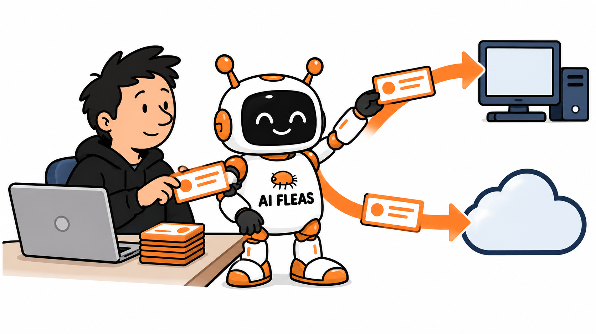

# Hosted AI Wasn't Enough. Local AI Wasn't Enough Either.

*I stopped treating hosted and local AI as competing choices when I realized each solved a different part of the same workflow.*

*The AI Fleas team routes work between local capacity and hosted AI. Illustration generated from the author’s AI Fleas character references.*

Hosted AI gave me the strongest reasoning and the easiest interface.

Local AI gave me capacity I already owned, more control over where selected work ran, and somewhere to continue when hosted limits became the bottleneck.

Neither was enough by itself for the system I wanted.

If I sent everything to hosted AI, I kept the convenience but also the cost, limits, and dependence on one external path. If I forced everything onto local models, I gained control and capacity but gave up too much capability on the work that still benefited from stronger hosted reasoning.

So I stopped treating **hosted versus local** as the decision.

The useful question became: **Which work should run where?**

That is the practical reason I started building a hybrid setup: hosted intelligence for the work where it adds the most value, local capacity for bounded work it can handle well, and an orchestration layer that can choose between them.

*The following is a scripted dialogue. Host and Anna are fictional voices used to explain a real implementation; this is not a transcript of an actual interview.*

**Host:** Let’s begin without the technical language. What is hybrid AI?

**Anna:** It means using hosted AI and local AI together. A strong hosted model may handle coordination or difficult reasoning, while a model running on local hardware handles selected tasks.

**Host:** Why should an ordinary person or a business care?

**Anna:** Because convenience can become dependence. Hosted AI is easy to use, but token prices, limits, and availability can change. If every task depends on one service, there are fewer choices when that service changes.

**Host:** So is this mainly about saving money?

**Anna:** Saving paid tokens is one reason. The larger reason is flexibility. A task can run where cost, capability, privacy, speed, and availability make the most sense.

Think of it a little like a hybrid car. One energy source may be excellent, but another source gives you options. AI tokens are not oil, of course. The useful part of the comparison is choice.

**Host:** What does that look like in a practical setup?

**Anna:** In the example here, GPT coordinates the larger workflow. A local machine runs models through Hermes and can take bounded assignments. That reserves hosted-model use for the work where it adds the most value.

**Host:** Does local always mean cheaper or better?

**Anna:** No. Local hardware costs money and electricity. Models have different strengths. A local result may need so much correction that the saving disappears.

The useful question is not, “Is local AI cheaper?” It is, “Which tasks can the local system complete well enough to reduce paid usage in this workflow?”

**Host:** The example connected GPT and Hermes. Did it work?

**Anna:** The first version technically worked. GPT sent an assignment through a process call, the local system did something, and a result came back.

**Host:** If the result came back, what was missing?

**Anna:** The conversation. It was difficult to see what GPT had sent, which local agent had handled it, or how the reply related to the request. The handoff had disappeared into the plumbing.

Saving hosted tokens is useful. Saving them through a process nobody can inspect is not.

**Host:** How did you change that?

**Anna:** The connection moved to Agent2Agent, or A2A. In plain language, A2A is an open protocol that gives independent AI systems a standard way to identify each other, exchange work, and track the result.

**Host:** Why keep them independent? Why not make GPT and Hermes feel like one system?

**Anna:** Because they are not one system. They may run different models, follow different rules, and fail in different ways. A clear boundary is more honest and easier to inspect than pretending the boundary does not exist.

**Host:** Does A2A make the local model better?

**Anna:** No. It improves the handoff, not the intelligence. One later coding task still needed several corrections.

That separates communication quality from work quality. A dependable connection can show that the right agent received the task and returned a result. It cannot guarantee that the result is good.

**Host:** What would you try first if you were starting today?

**Anna:** One small task that would normally go to the hosted model. Send it to the local system. Make sure the handoff and result are visible. Then ask three questions: Was the work usable? How much correction did it need? Did it actually reduce paid-model use?

**Host:** And if it passes that test?

**Anna:** Then try another task. Hybrid AI is not an escape from hosted AI. It is a way to avoid having only one source of AI capacity—and to keep the freedom to choose where the next task should run.

---

## Sources and provenance

This scripted dialogue uses two fictional voices—Host and Anna—to explain a real GPT-to-Hermes implementation and its move from a hidden process handoff to A2A. It is not a transcript of an actual interview, and neither speaker represents a real interviewer, employee, customer, or historical person. Protocol details were checked against the current [Agent2Agent protocol specification](https://github.com/a2aproject/A2A/blob/main/docs/specification.md). The public [AI Fleas project](https://github.com/starodubtsevconsulting/ai-fleas) is available on GitHub. The profile-specific platform configuration is private and is not linked here. The energy comparison is an analogy, not evidence that AI prices behave like oil markets. No claim is made that local AI is always cheaper or better, or that A2A guarantees model quality.
