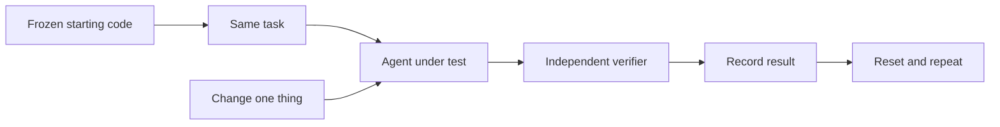

# I Bought an AI Powerhouse. Then the Agent Kept Giving Up.

*What tuning Hermes around a local Qwen coder taught me about the layers between a model and useful work.*

I hate having capacity I cannot quite unlock.

I remember this from when I was a student. I had an old pre-Pentium IBM-compatible computer — I think it was a 486-era machine. It ran at one speed, and I used it that way for years.

Later I sold it. The buyer opened the case, moved a few jumpers on the motherboard — those tiny plastic connectors that bridge pairs of pins — and suddenly the same machine ran dramatically faster. In my memory it was close to twice the speed.

I just stood there watching him.

The hardware had been mine the whole time. The extra capacity had been there the whole time. I simply had never figured out the configuration that unlocked it.

That experience stayed with me. Whenever I own something capable and suspect I am using only part of what it can do, it bothers me disproportionately. I start digging.

That is almost exactly how I feel about my ASUS Ascent GX10.

I bought it because I wanted serious local AI capacity. It has 128 GB of unified memory and can run coding models that do not fit on an ordinary workstation. On paper, this is exactly the kind of machine that should make local AI agents interesting.

The numbers around these models are easy to mix together, so I now try to translate them into something closer to a person.

Think of the model itself as the part of the brain that has already been shaped by years of education and experience. An “80B” model has roughly 80 billion learned parameters. Those parameters are not 80 billion stored facts. They are closer to learned wiring: patterns that affect what the model can recognize, connect, and produce.

Then there is **Q5**, or sometimes “4-bit” in other model names. That is not how educated the brain is. It is closer to how precisely that learned wiring is stored when I load the model onto my machine. Lower precision can make the model much smaller in memory, a little like keeping a compressed copy of something rather than the full-resolution original.

And **64K context** is something else again. I think of that as working memory: how much of the current conversation, code, instructions, tool results, and recent work the model can have “in mind” at once.

So a model can be highly educated but have a crowded desk. It can have a huge desk but work slowly. It can speak quickly without being more capable. These numbers describe different parts of the system.

I wrote a separate primer, [“What 27B, 4-Bit, and 64K Actually Mean in an AI Model”](https://medium.com/@sergii_96457/what-27b-4-bit-and-64k-actually-mean-in-an-ai-model-f43ea724c683), because I realized that throwing around numbers like 27B, Q5, and 64K assumes the reader already knows what kind of number each one is.

Then my coding agent kept giving up on assignments.

That was difficult to reconcile with the hardware. I had a machine people describe as an AI supercomputer, a coding model designed for agentic work, and an agent framework built to use tools. Yet a task that should have been ordinary could turn into a long loop, stop without finishing, or return something that still needed repair.

My first reaction was predictable: perhaps the model was not good enough.

I spent time testing that idea. I tried larger and newer local models. Some were slower. Some consumed much more memory. None gave me a convincing reason to replace my current Qwen3-Coder-Next Q5_K_M worker. I wrote about that experiment in [“I Tried to Replace My Local Coder. The Bigger Model Wasn't the Answer.”](2026-09-27-i-tried-to-replace-my-local-coder.md)

That left a more annoying possibility.

Maybe the model was only one part of the problem.

## The model is not the agent

My setup is not simply “Qwen running on a GX10.”

If Qwen is the brain, Hermes is closer to the executive layer around it. Hermes is an open-source AI agent program: instead of only chatting with a model, it can give the model tools and let it work through a task. It keeps the working session, decides what recent information stays in view, and keeps asking what to do next. The tools are the hands: read this file, edit that one, run a command, check the result.

The brain itself is not even running on the same machine. Hermes runs on my Mac. It talks over an OpenAI-compatible API to a llama.cpp server on the GX10, where Qwen actually runs.

So the path from “please fix this code” to a changed file is already a chain:

**assignment → Hermes on Mac → working memory + tools → API → llama.cpp on GX10 → Qwen → tool call → Hermes → filesystem**


*Failures can happen at different layers — not only in the model.*

The speed of Qwen generating tokens is roughly the speed at which the brain can produce its next words. It says very little about whether the executive layer keeps the right information in working memory, whether the hands do what was intended, or whether the communication channel reports the right state.

And when one agent delegates to another, there is another layer around that.

That changed the debugging question.

Instead of asking, “Why is this model bad at coding?” I started asking, “At which layer does a working model turn into an unreliable agent?”

<!-- VISUAL PLACEHOLDER: AI Fleas three-panel strip — “A Big Brain / A Big Desk / Still Wrong?”
Use the canonical human + AI Fleas characters.
Panel 1: ~80B / Q5 ≈ learned capacity / education.
Panel 2: 65K context ≈ working memory / what can stay on the desk now.
Panel 3: capability ≠ understanding the assignment.
Asset target: assets/2026-09-28-ai-fleas-big-brain-big-desk-still-wrong.png
-->

Then I noticed something else: I kept looking **inside** the components, while many of the interesting failures were happening **between** them.

The model could work. Hermes could work. The tool could work. The filesystem could work.

And the whole worker could still fail at the **joint**.

In more technical language, these are integration boundaries. I prefer “joints” because it describes what I was actually debugging:

**task ↔ agent ↔ working memory ↔ model server ↔ model ↔ tools ↔ result**

Each joint asks a different question. Did the worker understand the task? Did Hermes keep the right context? Did the model call the tool correctly? Did the agent notice that the work was already finished? Did “failed” actually mean the child process stopped?

That made the numbers more useful too. They stopped being specifications and became clues around particular joints.

There was already evidence that mattered. The same Qwen Q5 model had passed a controlled Hermes file-tools test: read a file, transform it, write outputs, calculate checksums, and verify the result. So the model could use tools successfully in this environment.

The failures appeared more often on longer, messier assignments.

That contradiction was useful.

## One innocent-looking number was not doing what I thought

My Qwen coder has a **65K context window**. I think of that as the size of its working-memory desk.

Hermes can clean that desk by summarizing older context. I had configured what looked like a 25% cleanup threshold, but for a context this size Hermes effectively would not start until much later — around three quarters full.

So I had a plausible idea: keep the full 65K desk, but ask Hermes to clean it earlier, around **32K**.

Then we tested it.

The first coding tasks never even reached 32K, which meant they could tell me nothing about the change. So I forced a longer run that actually crossed the threshold.

When compression finally fired, Hermes spent about **53 seconds** summarizing and then immediately wanted to summarize again. The run became slower and less useful instead of cleaner.

That was enough to roll the change back.

Not because compression is bad. The lesson was simpler: **a tuning knob that sounds sensible is not a win until the workload actually reaches it and the result improves.**

## Then there was the communication layer

Context was not the only moving part.

I had also been using A2A — basically a protocol for one AI agent to hand a task to another — between the hosted coordinator and the Hermes coder. Architecturally, I still like that boundary.

Operationally, I found an unpleasant lifecycle problem.

In one of my real coding experiments, the A2A task reached its timeout and was marked failed, but the underlying Hermes gateway continued working. It made another model call and wrote another file after the caller already believed the task had failed.

That is much worse than a slow answer. It means “failed” did not necessarily mean “stopped.”

A later matched experiment used Hermes CLI one-shot instead. It was not magically faster, and I still did not see a convincing coding-quality advantage over A2A.

But the process lifecycle was much easier to reason about. I could see whether the process was still alive, send a termination signal, and verify that it had exited.

That distinction became important enough that I changed my normal coding delegation route from **A2A to CLI one-shot**.

This is not a verdict that CLI is “smarter.” So far I have not measured that. It is a control decision: when something fails, I want “failed” to mean I know what is still running.

I had already been circling this idea in [“Should Your Hybrid AI Start in ChatGPT or Hermes?”](2026-09-26-should-your-hybrid-ai-start-in-chatgpt-or-hermes.md): communication between agents is not automatically the hard part. Sometimes the difficult part is knowing what is actually running, what context it has, and whether a reported state corresponds to reality.

## Then we stopped guessing and froze the task

At this point I needed something more useful than impressions.

So I took a small real coding task from my Financial Insights workflow and froze it.

The task was deliberately boring: extend a snow-removal contract recognizer so English text containing **SNOW REMOVAL CONTRACT** and **PAYMENT** is recognized, while preserving the existing French behavior.

Why use such a small task?

Because a benchmark is only useful when the thing being compared stays the same.

Same starting file. Same instructions. Same model. Same verifier. Same machine. Then change **one variable at a time**.

The verifier was intentionally stricter than “the agent said it was done.” It checked positive cases, negative cases, old French behavior, evidence flags, unexpected files, and whether the result really matched what the agent claimed.

### What the little test bench actually looks like

I did not set out to build a benchmarking platform. It emerged because I needed to stop arguing with my own impressions.

The pattern is small:



The important part is the **independent verifier**. The agent is allowed to say “done.” The verifier is allowed to disagree.

One negative case was basically this:

```js
const result = recognizer.recognize({
  normalizedText: 'SNOW REMOVAL CONTRACT\\nREPAYMENT DUE'
});

assert.deepEqual(result, { recognizedFamily: false });
```

That tiny check caught a very human-looking mistake: searching for `payment` also finds it inside `repayment`.

So the reusable recipe became:

**frozen start + fixed task + independent definition of success + recorded result.**

That is enough to turn “this feels better” into an experiment.

### Then I realized what the local machine should be doing

I had been watching an agent run these experiments since the morning. By hour eight it was still doing useful but mechanical work: reset, run, measure, verify, record, repeat.

And I realized: **this is exactly the kind of work I eventually want the local model to do.**

The hard part is deciding what experiment matters and what result would change my mind. A stronger hosted model can help design and interpret that.

But once the protocol exists, the repetitive middle is closer to a lab technician following instructions. Latency matters less. Repetition and cost matter more.

There is some irony in spending most of a working day with a hosted agent to discover one of the jobs the local machine should eventually take over.

Maybe that is another kind of jumper: not a setting that makes the model twice as smart, but a better division of labour.

That gave me my first surprise.

The baseline assignment passed only **2 of 8** runs.

The failure was subtle. Qwen could correctly recognize the word `PAYMENT`, but it also used a more permissive text representation where `REPAYMENT` could accidentally count as `PAYMENT`.

So I changed the handoff, not the model.

I explained what the component was doing, why the distinction mattered, which text representation preserved word boundaries, and which behavior had to remain unchanged.

Then I repeated the same task.

**8 of 8 passed.**

That is the strongest Phase 1 result so far.

I started calling the idea **Domain Context Handoff**: before asking for the change, give the worker the smallest piece of domain reality it needs to make good decisions.

But even that is not one magic recipe.

You can explain a domain badly.

Imagine teaching biology to someone with a software background by throwing unfamiliar molecular terminology at them. The facts may all be correct and still be useless. A good teacher translates the new domain into concepts the listener already has.

Agents seem to deserve the same treatment.

So there are at least two very different versions of “give it domain context”:

**Domain dump:**  
“Here are the domain terms, internal representations, and rules. Good luck.”

**Translated domain context:**  
“You have two versions of the same PDF text. One behaves like normal text and preserves word boundaries. The other is deliberately more permissive for fuzzy recognition. This business rule depends on an exact standalone word, so use the first representation here. `PAYMENT` counts; `REPAYMENT` does not.”

Same domain. Very different teaching.

So I tested that distinction directly.

I froze the same recognizer task and ran three versions of the handoff, nine fresh attempts each:

- **task only:** 3 of 9 correct on the first attempt;
- **raw domain context:** 5 of 9;
- **translated domain context:** **8 of 9**.

Same model. Same starting code. Same verifier. Same execution route.

The thing that changed was how the domain reached the worker.

That does not prove a universal prompting law. It is one task, and the translated version bundled several things together: a familiar analogy, a positive example, a misleading near-match, and a hint about the relevant code boundary.

But it is exactly the kind of result I wanted from the test bench. Instead of arguing that one explanation “sounds clearer,” I can see whether the worker gets the job right before somebody has to correct it.

Corrections complicate the picture: after one identical correction was allowed for failures, all three groups recovered much more often. So the strongest signal here is **first-pass understanding**, not eventual recoverability.

The useful handoff now looks more like:

**what this thing is → translate it into concepts the worker already understands → why it matters → positive and misleading examples → invariants → relevant code boundary → task → acceptance checks**

Not the whole domain. And not domain jargon for its own sake.

**Translate the domain. Don’t dump the domain.**

<!-- VISUAL PLACEHOLDER: AI Fleas three-panel strip — “Task only / Raw domain context / Translated domain context”
Use the canonical human + AI Fleas characters.
Show the frozen recognizer result directly: Task only 3/9 → Raw context 5/9 → Translated context 8/9.
Keep the bottom takeaway: “Translate the domain. Don’t dump the domain.”
Asset target: assets/2026-09-28-ai-fleas-domain-context-handoff-3-5-8.png
-->

Then I tried the same idea on a different kind of coding problem — process cleanup rather than document recognition.

This time it did **not** transfer.

The task-only runs had produced **0 of 8** accepted first attempts. Raw domain context also produced **0 of 8**. So I translated the problem more aggressively into a familiar mental model: think of the direct child process as the team leader and the process group as the whole team. The leader going home does not mean everybody else has left the building.

The explanation was clearer. The implementation was not.

**Translated context: 0 of 8 accepted first attempts.**

All eight workers still made essentially the same mistake around cleaning up the whole process group. After a fixed correction, only one of the eight was fully accepted after both automated verification and source review.

That failure matters as much as the 8-of-9 result.

Domain Context Handoff is not a magic prompt pattern. Better teaching can help a model use capability it already has. It cannot guarantee that the model has enough underlying reasoning or implementation ability for the problem in front of it.

That brings me back to the old motherboard jumper.

A jumper can unlock capacity that is already there.

It cannot turn the motherboard into a different computer.

I also tried one of the obvious mechanical fixes: fewer agent turns. Six sounded safer than twenty. In the small matched test, the shorter limit was actually slower, so I kept the existing turn budget.

## The loop problem is still real

Better handoff did not magically make the runtime efficient.

In one case the Coder reached the correct file, then kept patching it anyway. The agent made **17 successful patch calls** before finally stopping.

That became one of the clearest Phase 1 findings: the problem was not only whether the model knew the answer, but whether the surrounding agent knew when the work was done.

The stage therefore kept the guardrails that were justified — hard deadlines, scope boundaries and independent verification — while leaving broader completion-detection experiments for later.

## I still have not touched the GX10 server

That is now more deliberate than before.

There are still plausible GX10-side variables: llama.cpp version, Qwen tool parsing, the GGUF artifact, cache configuration, memory headroom, and server flags.

But the Mac/Hermes experiments already produced several concrete findings without touching them:

- the 32K compression cap was not justified;
- CLI gives me better lifecycle control, but not proven better intelligence;
- lowering the turn cap did not help;
- translated domain context produced the strongest first-pass result on one fixture, but failed to improve first-pass acceptance on a harder process-lifecycle fixture;
- repeated tool calls remain a measurable source of waste.

If I had changed the GX10 server at the same time, all of those lessons would have been blurred together.

So the server stays put until the next experiment actually requires moving that layer.

## Where I am in the experiment

At this point I find it useful to think of the work in layers rather than as one giant tuning exercise.

**Phase 1 — agent and handoff layer. _Closed._**  
This stage ended with findings explicitly classified as accepted, rejected, provisional, or unanswered. The goal was not to prove that the worker was “good” or “bad,” but to learn which parts of the handoff and execution loop actually changed accepted work.

**Phase 2 — GX10 inference layer.**  
Only after the first layer is understood: llama.cpp, tool parsing, cache and memory behavior, context/server flags, and the exact model artifact.

**Phase 3 — model choice.**  
Only then does it make sense to compare another model or quantization against Qwen again.

The order matters. If I change the agent framework, the server, and the model at the same time, an improvement teaches me almost nothing.

So the current goal is not to keep turning knobs until the graph looks better. It is to move **joint by joint**: understand one boundary, keep the measurements that tell me something about it, then move one layer deeper.

## What six hours of testing actually changed

The interesting result was not a parameter.

By the end of Phase 1, I had kept the existing compression settings and the 20-turn limit. Some attractive tuning ideas had failed. Some guardrails became clearer. And one communication experiment had gone from **3/9 → 5/9 → 8/9** — then failed to transfer to a harder problem at **0/8**.

That contradiction led to something more useful than another setting.

I started thinking about a model as a worker with an **Education Profile**.

The usual numbers still matter. Parameter count says something about capacity. Quantization says something about how that capacity is represented on my machine. Context tells me how much material can sit on the desk at once.

But none of them tells me **who is sitting at the desk**.

What was this model educated to do? What conceptual language does it speak naturally? What can I say directly? What needs translating? And when does better explanation stop helping because I simply gave the job to the wrong worker?

That led to a new structure in AI Fleas:

**Model → Education Profile → Deployment → Benchmark Evidence**

And a new process:

**public model information → draft Education Profile → controlled work → observed strengths and failures → revised profile**

I call that **Education Profile Extraction**.

The public model card is the résumé. The benchmark is the interview. Repeated real work is where you eventually discover who you actually hired.

That also changed how I think about Domain Context Handoff. It is not “give the model more context.” It is:

> **Translate unfamiliar reality into the conceptual language this particular worker can use.**

Sometimes that unlocks capability already there.

Sometimes it does not.

Knowing the difference may be more useful than another parameter to tune.

## So, did I actually make the local agent better?

Yes — but not in the way I expected.

I started with a machine people describe as an AI powerhouse and a local coding agent I did not trust. It could spend minutes working, claim success, keep writing after it should have stopped, and produce plausible code that still failed independent checks.

I went looking for a parameter that would fix that.

I did not find one.

What I did get was measurable progress.

**Before Phase 1:**

- no reliable hard boundary around a runaway coding turn;
- an A2A failure did not necessarily mean the worker had stopped;
- completion prose was too easy to mistake for completion;
- domain handoff was mostly intuition;
- compression and turn limits were knobs I was tempted to change without evidence;
- I knew the model as “80B, Q5, 65K,” but not as a worker I knew how to brief.

**After Phase 1:**

- the CLI route has an enforced process deadline and exact write boundary;
- artifacts are independently verified instead of being accepted from the agent's prose;
- the proposed 32K compression change was tested and **rejected**;
- reducing the turn budget from 20 to 6 was tested and **rejected**;
- on the frozen recognizer, better handoff moved first-pass acceptance from **3/9 → 5/9 → 8/9**;
- on the harder process-lifecycle fixture, translated context still produced **0/8** accepted first attempts, showing that better explanation is not always the missing piece;
- on a reviewed source-port task, acceptance-stop kept **8/8 accepted artifacts** while reducing Coder time from about **417 seconds to 269 seconds** and model calls from **55 to 29**;
- the model now has an evidence-backed **Education Profile** rather than being described only by model/runtime numbers;
- the experiment now leaves reproducible evidence instead of a collection of good and bad impressions.

So did I solve the original problem?

**Partly.**

I did not turn Qwen into a universally reliable autonomous coder. I did not establish a magic Hermes setting. And I still have not shown that changing the GX10 inference layer will improve accepted coding work.

What I did solve was the first layer: I can now **bound the worker, verify it, communicate with it more effectively on some tasks, recognize when communication is not the problem, and measure the difference**.

I started with:

> *This expensive thing feels disappointingly stupid.*

I ended Phase 1 with something much more useful:

> *I know which parts are the model, which parts are the agent, which interventions actually helped, and which ones did not.*

That is a much better starting point for Phase 2.

## The expensive lesson

The GX10 may still turn out to be exactly the machine I wanted.

But “powerful local AI hardware” and “reliable local AI worker” are not the same product.

The useful worker is the whole chain:

**hardware + inference runtime + model + working memory + tool parser + agent framework + communication + task design + verification**

In human terms, that is closer to asking about the whole worker: the brain, what is currently in mind, how quickly thoughts can be expressed, the hands, the instructions, the communication channel, and whether somebody checks the result.

A benchmark can tell me that a model generates 50 tokens per second.

What I needed was a different kind of benchmark: give the worker the **same real task repeatedly**, verify the result independently, and change one thing at a time.

That is when the numbers became useful.

They did not reveal one magic setting. They killed attractive theories and exposed a more interesting result: the biggest Phase 1 gain came from giving the worker enough domain context to understand the job.

The machine did not suddenly become more intelligent. I became more precise about the reality I was handing to it.

The model matters. The hardware matters.

But once AI starts doing real work, the plumbing — and the way we hand work into that plumbing — becomes part of the intelligence we actually experience.

And apparently, I bought the powerhouse before I understood the plumbing.

The funny part is that I started this experiment looking for the modern equivalent of that old motherboard jumper.

I still think there is one.

I am just less convinced now that it is a single switch.

---

## Sources and provenance

This is a living draft based on the author's September 2026 GX10/Hermes experiments. The first half records the hypotheses that led to the tests; the later sections incorporate the measured results from the September 28 runtime/benchmark work. Those results are task-specific and should not be read as universal model rankings.

The model-number primer is published as [“What 27B, 4-Bit, and 64K Actually Mean in an AI Model”](https://medium.com/@sergii_96457/what-27b-4-bit-and-64k-actually-mean-in-an-ai-model-f43ea724c683). The earlier model-selection experiment is described in [“I Tried to Replace My Local Coder. The Bigger Model Wasn't the Answer.”](2026-09-27-i-tried-to-replace-my-local-coder.md), and the hybrid coordination design in [“Should Your Hybrid AI Start in ChatGPT or Hermes?”](2026-09-26-should-your-hybrid-ai-start-in-chatgpt-or-hermes.md). The original runtime change and article work landed in [AI Fleas PR #219](https://github.com/starodubtsevconsulting/ai-fleas/pull/219). The follow-up controlled runs, per-run benchmark data, CLI lifecycle changes, compression findings, and Stage 1 closure landed in [PR #225](https://github.com/starodubtsevconsulting/ai-fleas/pull/225). The final Stage-1-derived Qwen education/communication observations landed in [PR #238](https://github.com/starodubtsevconsulting/ai-fleas/pull/238), and the resulting first-class Models / Education Profile structure was integrated in [PR #237](https://github.com/starodubtsevconsulting/ai-fleas/pull/237).

Hermes's current [context compression documentation](https://github.com/NousResearch/hermes-agent/blob/main/website/docs/developer-guide/context-compression-and-caching.md) documents the small-context 75% threshold floor and the `compression.threshold_tokens` absolute cap. The article intentionally separates measured observations from broader conclusions: the 32K cap was rejected for this setup based on the observed probe, while compression in general remains an open tuning dimension.
