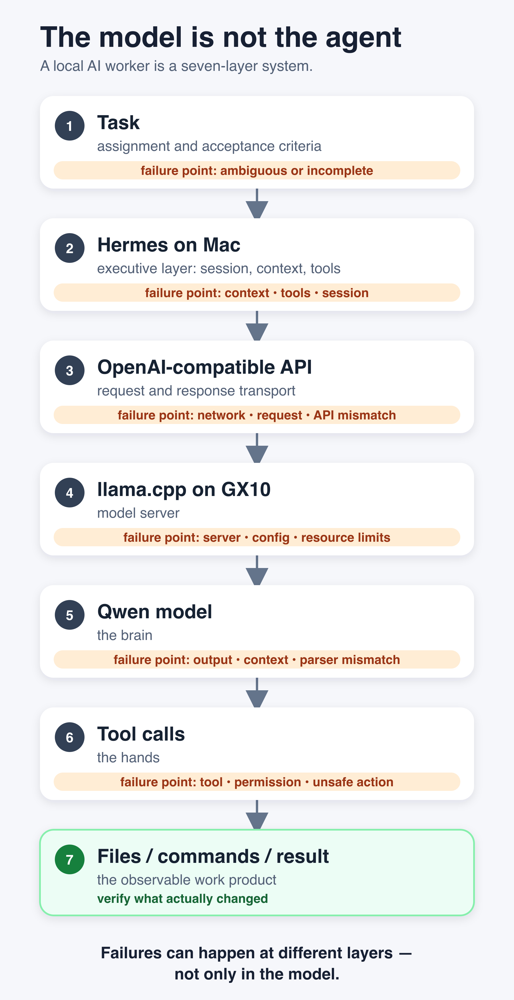
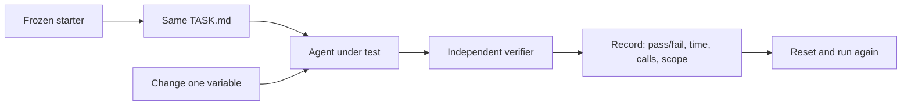

# I Bought an AI Powerhouse. Then the Agent Kept Giving Up.

*What tuning Hermes around a local Qwen coder taught me about the layers between a model and useful work.*

I hate having capacity I cannot quite unlock.

I remember this from when I was a student. I had an old pre-Pentium IBM-compatible computer — I think it was a 486-era machine. It ran at one speed, and I used it that way for years.

Later I sold it. The buyer opened the case, moved a few jumpers on the motherboard — those tiny plastic connectors that bridge pairs of pins — and suddenly the same machine ran dramatically faster. In my memory it was close to twice the speed.

I just stood there watching him.

The hardware had been mine the whole time. The extra capacity had been there the whole time. I simply had never figured out the configuration that unlocked it.

That experience stayed with me. Whenever I own something capable and suspect I am using only part of what it can do, it bothers me disproportionately. I start digging.

That is almost exactly how I feel about my ASUS Ascent GX10.

I bought it because I wanted serious local AI capacity. It has 128 GB of unified memory and can run coding models that do not fit on an ordinary workstation. On paper, this is exactly the kind of machine that should make local AI agents interesting.

The numbers around these models are easy to mix together, so I now try to translate them into something closer to a person.

Think of the model itself as the part of the brain that has already been shaped by years of education and experience. An “80B” model has roughly 80 billion learned parameters. Those parameters are not 80 billion stored facts. They are closer to learned wiring: patterns that affect what the model can recognize, connect, and produce.

Then there is **Q5**, or sometimes “4-bit” in other model names. That is not how educated the brain is. It is closer to how precisely that learned wiring is stored when I load the model onto my machine. Lower precision can make the model much smaller in memory, a little like keeping a compressed copy of something rather than the full-resolution original.

And **64K context** is something else again. I think of that as working memory: how much of the current conversation, code, instructions, tool results, and recent work the model can have “in mind” at once.

So a model can be highly educated but have a crowded desk. It can have a huge desk but work slowly. It can speak quickly without being more capable. These numbers describe different parts of the system.

I wrote a separate primer, [“What 27B, 4-Bit, and 64K Actually Mean in an AI Model”](https://medium.com/@sergii_96457/what-27b-4-bit-and-64k-actually-mean-in-an-ai-model-f43ea724c683), because I realized that throwing around numbers like 27B, Q5, and 64K assumes the reader already knows what kind of number each one is.

Then my coding agent kept giving up on assignments.

That was difficult to reconcile with the hardware. I had a machine people describe as an AI supercomputer, a coding model designed for agentic work, and an agent framework built to use tools. Yet a task that should have been ordinary could turn into a long loop, stop without finishing, or return something that still needed repair.

My first reaction was predictable: perhaps the model was not good enough.

I spent time testing that idea. I tried larger and newer local models. Some were slower. Some consumed much more memory. None gave me a convincing reason to replace my current Qwen3-Coder-Next Q5_K_M worker. I wrote about that experiment in [“I Tried to Replace My Local Coder. The Bigger Model Wasn't the Answer.”](2026-09-27-i-tried-to-replace-my-local-coder.md)

That left a more annoying possibility.

Maybe the model was only one part of the problem.

## The model is not the agent

My setup is not simply “Qwen running on a GX10.”

If Qwen is the brain, Hermes is closer to the executive layer around it. Hermes is an open-source AI agent program: instead of only chatting with a model, it can give the model tools and let it work through a task. It keeps the working session, decides what recent information stays in view, and keeps asking what to do next. The tools are the hands: read this file, edit that one, run a command, check the result.

The brain itself is not even running on the same machine. Hermes runs on my Mac. It talks over an OpenAI-compatible API to a llama.cpp server on the GX10, where Qwen actually runs.

So the path from “please fix this code” to a changed file is already a chain:

**assignment → Hermes on Mac → working memory + tools → API → llama.cpp on GX10 → Qwen → tool call → Hermes → filesystem**



*Failures can happen at different layers — not only in the model.*

The speed of Qwen generating tokens is roughly the speed at which the brain can produce its next words. It says very little about whether the executive layer keeps the right information in working memory, whether the hands do what was intended, or whether the communication channel reports the right state.

And when one agent delegates to another, there is another layer around that.

That changed the debugging question.

Instead of asking, “Why is this model bad at coding?” I started asking, “At which layer does a working model turn into an unreliable agent?”

There was already evidence that mattered. The same Qwen Q5 model had passed a controlled Hermes file-tools test: read a file, transform it, write outputs, calculate checksums, and verify the result. So the model could use tools successfully in this environment.

The failures appeared more often on longer, messier assignments.

That contradiction was useful.

## One innocent-looking number was not doing what I thought

My Hermes profile advertised a 65,536-token context window for the Qwen coder.

Using the brain analogy, that is the size of the working-memory desk. But an agent does not want to wait until every square centimetre of the desk is covered before cleaning it.

Hermes can compress older context: roughly, take piles of old notes, summarize what still matters, and clear space for the next part of the job.

I had a compression threshold of `0.25`. Reading that casually, I expected Hermes to start cleaning the desk around one quarter of the window.

But current Hermes behavior is more nuanced. Its own context-compression documentation says models with context windows below 512K have a **75% minimum ratio threshold**. Hermes also supports an absolute `threshold_tokens` cap, which can force compaction earlier than that ratio would.

For a 65,536-token model window, 75% is roughly 49,000 tokens.

That is very different from the 16,000-ish number I thought I had configured.

That gave me a very plausible hypothesis.

Keep the model at **65,536 tokens**, but ask Hermes to start cleaning the desk around **32,768**. In other words: do not make the brain's desk smaller; just tidy it earlier.

I even added support for that absolute cap in [PR #219](https://github.com/starodubtsevconsulting/ai-fleas/pull/219).

Then we tested it.

And this is where the story became more useful.

The first coding runs were too small to tell me anything about compression. The largest model input was only about **11,900 tokens**. Neither the old configuration nor the proposed 32K cap compressed anything.

That sounds obvious in retrospect, but it is exactly why I wanted a repeatable test. If the trigger never fires, any difference in speed or quality cannot honestly be credited to the trigger.

So I forced the question with a longer, read-only five-turn code-review probe.

Under the old settings, the probe finished in about **90 seconds** without compacting.

With the proposed **32,768-token** cap, Hermes finally crossed the threshold. It spent about **53 seconds** summarizing the conversation — and after that summary the context was still around 47,700 tokens. Hermes immediately wanted to summarize again. The run hit my 120-second outer limit without producing the final answer.

I tried protecting fewer recent messages. Same basic behavior.

I tried a later cap around **49K**. That version finished after one long summary, but the whole probe took about **152 seconds** and the answer missed the specific review question.

That was enough for me to reject my own 32K idea for now.

Not because “compression is bad.” The experiment does not prove that. It proves something narrower and more useful: **an intuitively reasonable tuning knob can make the system worse if you have not measured what actually happens when it fires.**

So I kept the 65K model context and restored the existing Hermes compression behavior while I looked for a stronger lever.

I also tried a coding-specific context stress test after that review probe. The agent read a frozen packet of real installer source before trying to fix process cleanup. The two capped runs compacted twice each, spending about **110 seconds total** on four summaries. The two old-setting runs did not compact. After one correction per run, **neither setting produced an accepted fix**: 0/2 in each arm. The packet was deliberately large and the sample small, so I cannot call the wall-time difference a general speed result. It does confirm that the cap fired during coding without producing more accepted work.

## Then there was the communication layer

Context was not the only moving part.

I had also been using A2A — basically a protocol for one AI agent to hand a task to another — between the hosted coordinator and the Hermes coder. Architecturally, I still like that boundary.

Operationally, I found an unpleasant lifecycle problem.

In one of my real coding experiments, the A2A task reached its timeout and was marked failed, but the underlying Hermes gateway continued working. It made another model call and wrote another file after the caller already believed the task had failed.

That is much worse than a slow answer. It means “failed” did not necessarily mean “stopped.”

A later matched experiment used Hermes CLI one-shot instead. It was not magically faster, and I still did not see a convincing coding-quality advantage over A2A.

But the process lifecycle was much easier to reason about. I could see whether the process was still alive, send a termination signal, and verify that it had exited.

That distinction became important enough that I changed my normal coding delegation route from **A2A to CLI one-shot**.

This is not a verdict that CLI is “smarter.” So far I have not measured that. It is a control decision: when something fails, I want “failed” to mean I know what is still running.

I had already been circling this idea in [“Should Your Hybrid AI Start in ChatGPT or Hermes?”](2026-09-26-should-your-hybrid-ai-start-in-chatgpt-or-hermes.md): communication between agents is not automatically the hard part. Sometimes the difficult part is knowing what is actually running, what context it has, and whether a reported state corresponds to reality.

## Then we stopped guessing and froze the task

At this point I needed something more useful than impressions.

So I took a small real coding task from my Financial Insights workflow and froze it.

The task was deliberately boring: extend a snow-removal contract recognizer so English text containing **SNOW REMOVAL CONTRACT** and **PAYMENT** is recognized, while preserving the existing French behavior.

Why use such a small task?

Because a benchmark is only useful when the thing being compared stays the same.

Same starting file. Same instructions. Same model. Same verifier. Same machine. Then change **one variable at a time**.

The verifier was intentionally stricter than “the agent said it was done.” It checked positive cases, negative cases, old French behavior, evidence flags, unexpected files, and whether the result really matched what the agent claimed.

### What the little test bench actually looks like

I did not build a grand benchmarking platform first. It emerged from the experiment.

The checked-in version is basically four things:

```text
notes/benchmarks/local-models/
├── fixtures/hermes-financial-recognizer-coding/
│   ├── TASK.md
│   ├── starter/
│   │   └── ...the frozen starting code...
│   └── verify.mjs
└── run-hermes-financial-recognizer-coding.sh
```

The **starter** makes every run begin from the same place.

`TASK.md` is the assignment the worker receives.

The runner starts the agent and measures the run.

And `verify.mjs` is deliberately outside the agent's opinion of its own work. The worker can say “done”; the verifier can still say “no.”



That last part matters more than it looks. A normal AI demo often ends when the answer looks plausible. Here, the answer is only one piece of evidence.

For example, one of the verifier's negative cases is essentially this:

```js
const result = recognizer.recognize({
  normalizedText: 'SNOW REMOVAL CONTRACT\\nREPAYMENT DUE'
});

assert.deepEqual(result, { recognizedFamily: false });
```

That tiny test caught a bug that looked reasonable in the generated code: searching for the substring `payment` also finds it inside `repayment`.

So the reusable idea is not specifically about snow contracts, Qwen, or even Hermes.

A fixture can be almost any small piece of real work if it has:

**a frozen start + a fixed assignment + an independent definition of success + recorded measurements.**

That is enough to turn “this setting feels better” into something we can actually compare.

### Then I realized what the local machine should be doing

By this point I had another realization that had less to do with model quality and more to do with economics.

I had been watching an agent run these experiments since the morning. Hours of changing one parameter, resetting the fixture, running the same task again, collecting timings, checking the verifier, saving the result, and moving to the next variation.

Useful work, but not exactly thrilling work.

And somewhere around hour eight I thought: **this is exactly the kind of job I want the local model to do.**

The hard part was deciding what experiment mattered.

Which variable should move? What stays fixed? What counts as success? What result would actually change my mind?

That is reasoning work.

But once the experiment exists, much of the execution is closer to a lab technician following a protocol:

**change → run → measure → verify → record → reset → repeat**

That changes how I think about the role of a local model.

I do not necessarily need it to replace the strongest hosted model at everything.

A stronger hosted model can help design the experiment, notice patterns, question the assumptions, and interpret the evidence.

A local worker can take the boring middle:

- run twenty variations;
- wait for each one;
- capture the measurements;
- reset the environment;
- flag the strange runs;
- come back with the evidence.

Latency matters less there. Repetition matters more. And when the machine is already sitting in my office, the marginal cost of another dozen experiments starts to look very different from spending hosted tokens for hours.

There is some irony in that.

I bought the GX10 because I wanted useful local intelligence. Then I spent most of a working day using a hosted agent to figure out how to make the local worker better.

But the experiment itself revealed one of the jobs the local worker should eventually take over.

Maybe that is another kind of jumper.

Not a setting that makes the model twice as smart.

A better division of labour.

That gave me my first surprise.

The baseline assignment passed only **2 of 8** runs.

The failure was subtle. Qwen often checked `PAYMENT` correctly as a whole word in the original normalized text — but then also searched a compacted version of the text with something equivalent to `includes("payment")`. That meant **REPAYMENT** could accidentally count as **PAYMENT**.

So I changed the handoff, not the model.

I told the coder explicitly which representation preserved the word boundary: use `normalizedText` for the whole-word English `PAYMENT` check; do not use a substring search in `compactText` for that condition.

Then I repeated the same experiment.

**8 of 8 passed.**

The baseline eight runs consumed about **319 seconds** of Coder time. The clarified eight consumed about **243 seconds**.

On this narrow task, accepted results per Coder minute went from about **0.38 to 1.97**.

That is more than a fivefold difference.

And no compression happened in either group.

That was probably the most useful result of the day.

I had been looking for the jumper in context size, compression thresholds, and transport settings.

The strongest measured jumper so far was in the **handoff itself**.

Not “write a better prompt” in the vague internet sense. Something more concrete: tell the worker which representation preserves the invariant it must protect.

## More turns were not the enemy either

Another tempting knob was the maximum number of agent turns.

If the agent loops too much, why not just cut it from 20 turns to 6?

So we tested that too on a fixed source-port task where the expected result was already known and independently verifiable.

All four runs produced accepted output.

But the two **6-turn** runs both hit their limit and averaged about **63 seconds**.

The two **20-turn** runs finished normally and averaged about **47 seconds**.

Small sample, narrow task — not a universal law.

But enough to reject another attractive assumption: **a smaller turn budget did not make this worker faster.**

## The loop problem is still real

None of this means the runtime is now efficient.

In one production port, the Coder eventually produced the correct file, but it took about **144 seconds**, reached the full 20-turn limit, and made **17 successful patch calls**. Several patches came after the file already matched the requested result.

That is exactly the kind of behavior that originally made the machine feel underused.

The model was capable of the change. The tools worked. The result was eventually correct.

But the executive layer kept moving its hands after the work was effectively done.

So the next tuning target is clearer now: not “make the model bigger” and not “compress at 32K.”

It is controlling repeated tool calls, hard process deadlines, completion detection, and the newer Hermes guard that can stop identical repeated calls.

## I still have not touched the GX10 server

That is now more deliberate than before.

There are still plausible GX10-side variables: llama.cpp version, Qwen tool parsing, the GGUF artifact, cache configuration, memory headroom, and server flags.

But the Mac/Hermes experiments already produced several concrete findings without touching them:

- the 32K compression cap was not justified;
- CLI gives me better lifecycle control, but not proven better intelligence;
- lowering the turn cap did not help;
- a more precise task boundary dramatically improved one real coding fixture;
- repeated tool calls remain a measurable source of waste.

If I had changed the GX10 server at the same time, all of those lessons would have been blurred together.

So the server stays put until the next experiment actually requires moving that layer.

## The expensive lesson

The GX10 may still turn out to be exactly the machine I wanted.

But “powerful local AI hardware” and “reliable local AI worker” are not the same product.

The useful worker is the whole chain:

**hardware + inference runtime + model + working memory + tool parser + agent framework + communication + task design + verification**

In human terms, that is closer to asking about the whole worker: the brain, what is currently in mind, how quickly thoughts can be expressed, the hands, the instructions, the communication channel, and whether somebody checks the result.

A benchmark can tell me that a model generates 50 tokens per second.

What I needed was a different kind of benchmark: give the worker the **same real task repeatedly**, verify the result independently, and change one thing at a time.

That is when the numbers became useful.

Not because they produced one magic setting. They did the opposite.

They killed several attractive theories.

The early compression cap looked sensible. It made things worse in the long review probe, and the coding-specific stress test found no accepted-work benefit.

The shorter turn budget looked sensible. It was slower in the small matched test.

CLI looked like it might make the coder better. So far its measurable advantage is control, not intelligence.

And a tiny clarification about which text representation preserves a word boundary changed one task from **2/8 accepted runs to 8/8**.

The model matters. The hardware matters.

But once AI starts doing real work, the plumbing — and the way we hand work into that plumbing — becomes part of the intelligence we actually experience.

And apparently, I bought the powerhouse before I understood the plumbing.

The funny part is that I started this experiment looking for the modern equivalent of that old motherboard jumper.

I still think there is one.

I am just less convinced now that it is a single switch.

---

## Sources and provenance

This is a living draft based on the author's September 2026 GX10/Hermes experiments. The first half records the hypotheses that led to the tests; the later sections incorporate the measured results from the September 28 runtime/benchmark work. Those results are task-specific and should not be read as universal model rankings.

The model-number primer is published as [“What 27B, 4-Bit, and 64K Actually Mean in an AI Model”](https://medium.com/@sergii_96457/what-27b-4-bit-and-64k-actually-mean-in-an-ai-model-f43ea724c683). The earlier model-selection experiment is described in [“I Tried to Replace My Local Coder. The Bigger Model Wasn't the Answer.”](2026-09-27-i-tried-to-replace-my-local-coder.md), and the hybrid coordination design in [“Should Your Hybrid AI Start in ChatGPT or Hermes?”](2026-09-26-should-your-hybrid-ai-start-in-chatgpt-or-hermes.md). The original runtime change and article work landed in [AI Fleas PR #219](https://github.com/starodubtsevconsulting/ai-fleas/pull/219). The follow-up controlled runs, per-run benchmark data, CLI lifecycle changes, and compression findings are being collected in [PR #225](https://github.com/starodubtsevconsulting/ai-fleas/pull/225).

Hermes's current [context compression documentation](https://github.com/NousResearch/hermes-agent/blob/main/website/docs/developer-guide/context-compression-and-caching.md) documents the small-context 75% threshold floor and the `compression.threshold_tokens` absolute cap. The [coding-specific pilot record](../benchmarks/local-models/gx10-long-context-coding-pilot-2026-09-28.json) and its [repeatable protocol](../benchmarks/local-models/fixtures/hermes-process-group-long-context/README.md) show where the cap actually fired. The 32K cap was rejected for this setup; compression in general remains an open tuning dimension.
