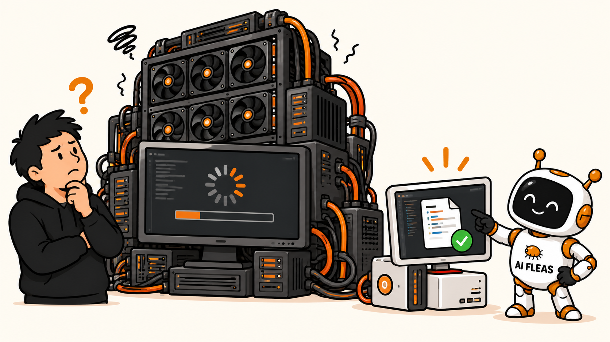
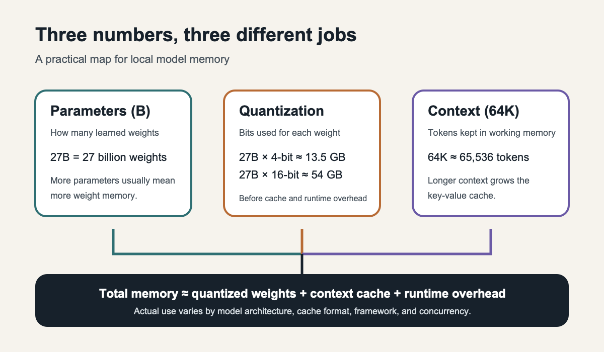

# I Tried to Replace My Local Coder. The Bigger Model Wasn't the Answer.

*A larger model only matters if it returns better work. I tested local AI workers against the outcome I actually cared about: accepted code with less correction.*

*A bigger model is useful only when its work is good enough to hand back. AI Fleas illustration generated for this article.*

I had enough memory to try a bigger local model.

That made the obvious experiment tempting: replace the coder I already had with something larger and see whether the quality improved.

But “larger” was not the outcome I needed.

My existing Q5 coding model could already use tools and finish work. It also made mistakes. If a bigger model consumed more memory, took longer, and still returned code that needed the same correction, I had improved a specification rather than my workflow.

So I changed the test.

The question became: **Can another local model return more accepted coding work than my current coder, within a useful amount of time?**

That turned model selection from a size contest into a work-acceptance test.

*The following is a scripted dialogue. Host and Anna are fictional voices used to explain a real experiment; this is not a transcript of an actual interview.*

**Host:** Yesterday you asked whether your local machine could become useful capacity instead of an expensive experiment. Did you find an answer?

**Anna:** I found a less comfortable question first: what would count as useful?

I already had a coding model running on one [ASUS Ascent GX10](https://www.asus.com/networking-iot-servers/desktop-ai-supercomputer/ultra-small-ai-supercomputers/asus-ascent-gx10/). I call it Q5, short for the Q5_K_M version of [Qwen3-Coder-Next](https://huggingface.co/Qwen/Qwen3-Coder-Next). It can use tools and finish work. It also makes mistakes. When I give it coding assignments, I sometimes have to review and correct what comes back.

So I wondered whether another local model could do better. The machine has 128 GB of unified memory, and Q5 does not use all of it. Maybe I could run something more capable without buying another box.

**Host:** More capable because it uses more memory?

**Anna:** That was the tempting shortcut. It was also the wrong test.

A model can occupy more memory and still take longer to solve a problem, fail to finish it, or return code that needs the same correction. The question I should have asked from the beginning was: can it give me *better accepted coding work* than Q5, within a useful amount of time?

**Host:** What did you try?

**Anna:** First, [Qwen3.8-27B](https://huggingface.co/Qwen/Qwen3.8-27B). It is newer, and its official model card reported promising coding results. Then [MiniMax M2.7](https://huggingface.co/MiniMaxAI/MiniMax-M2.7), a much larger model whose tested four-shard quantized download uses about 101 GiB. I kept Q5 as the baseline and ran the same small Hermes tool task and a separate coding task against the candidates.

The tool task asked the agents to read, transform, write, and verify files. All three models passed it. That told me they could use the tools correctly under those conditions. It did not tell me which one was the better coder.

**Host:** What happened on the coding task?

**Anna:** Q5 wrote a parser in about 73 seconds. An independent check found that it passed 14 of 15 cases. The remaining case was a real bug: it accepted a money amount with an invalid leading comma. I would not call that finished code.

Qwen3.8 did not write an implementation within a ten-minute limit. MiniMax did write one, but it reached the same limit without finishing cleanly. Its partial code passed 13 of 15 cases and rejected valid amounts without a dollar sign.

One small parser task cannot rank these models for every coding problem. It can tell me something practical about *this* workflow: neither candidate gave me a reason to replace Q5.

**Host:** Was either one faster at the basic tool task?

**Anna:** No. In the matched run that day, Q5 finished it in about 36 seconds. Qwen3.8 took about 128 seconds. MiniMax, using the configuration with more memory headroom, took about 117 seconds.

Those are measurements of the whole agent task, not universal model speeds. But whole-task time is exactly what matters when I am waiting for a result.

**Host:** At least the big model fit on the machine.

**Anna:** It did. MiniMax served a real 64K-token context on one GX10. With a smaller cache format, it left roughly 9 to 11 GiB available during our runs. That was an interesting technical result. It did not make the coding result better.

**Host:** I keep hearing three numbers: billions of parameters, four-bit weights, and a 64K context. How do they fit together?

**Anna:** Parameter count describes how many learned weights the model has. Quantization describes how many bits store each weight, so it changes the weight-memory bill: 27 billion parameters need roughly 13.5 GB at four bits or 54 GB at 16 bits, before cache and runtime overhead. A 64K context is different. It means the model can keep about 65,536 tokens in its working window, and that growing window needs its own key-value cache. In short: total memory is roughly quantized weights plus context cache plus runtime overhead. For mixture-of-experts models, “active parameters” helps explain compute per token, but the stored model can still be much larger.

*Parameter count, bits per weight, and context length affect different parts of the memory budget. The examples are approximate raw weight sizes; actual runtime use is higher and depends on architecture and software.*

And we made another mistake before we ever ran it: we downloaded MiniMax before checking whether its license matched my intended use. The official terms require separate written authorization for commercial use. I should have checked that first. A model that I cannot use for my business without additional permission is not a viable replacement, however well it might benchmark.

**Host:** So what did you do with it?

**Anna:** We stopped it, restored Q5 as the only active coding model, and removed MiniMax's downloaded weights from the machine. We kept the measurements in the benchmark report, including the failed coding attempt and the license restriction. The experiment still taught me something, but it cost time and a large download that an earlier license check would have avoided.

**Host:** Does that make the local machine a bad investment?

**Anna:** I do not think one comparison can answer that. Q5 remains useful, even though it is not a coder I can trust without review. The machine can run experiments, keep selected work local, and provide capacity without paying for each generated token. But I cannot turn those possibilities into savings by declaring every local result good enough.

Yesterday I imagined a hosted coordinator giving a local worker a goal and receiving a result. I still want that. This experiment made the standard clearer: the result has to be good enough that the coordinator does not spend its time repairing it.

**Host:** What will you look for next?

**Anna:** A model or setup that beats Q5 on work I actually need done, with a license I can use, enough context for the agent, and a sensible end-to-end time. That may be a different model. It may also be a better way to give the current model bounded work and check its output.

For now, Q5 keeps the job. Not because it filled the machine or won every test. Because the alternatives I tried did not earn the handoff.

---

## Sources and provenance

This is a scripted sequel to [“Should Your Hybrid AI Start in ChatGPT or Hermes?”](2026-09-26-should-your-hybrid-ai-start-in-chatgpt-or-hermes.md). Host and Anna are fictional voices; the model trials, timings, verification results, and final service state come from the public [GX10 candidate comparison](https://github.com/starodubtsevconsulting/ai-fleas/blob/main/notes/benchmarks/local-models/gx10-qwen38-minimax-m27.md). The public [benchmark methodology](https://github.com/starodubtsevconsulting/ai-fleas/blob/main/notes/benchmarks/local-models/methodology.md) distinguishes direct inference from complete Hermes tasks. MiniMax's commercial-use condition comes from its [official license](https://huggingface.co/MiniMaxAI/MiniMax-M2.7/blob/main/LICENSE). The parser task is one small synthetic test; its results do not establish a general ranking of coding ability or a return on the hardware purchase.
