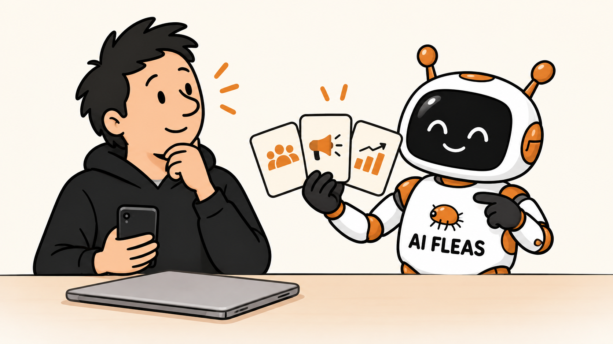

# The Sales Call That Made Me Rethink My Website

*They said $299 a year. Their own AI disclosed $299 a month under a 12-month agreement.*

*Before buying attention, clarify the audience, the message, and the result you need. AI Fleas illustration generated from the author’s character references.*

Today, a salesperson called about promoting my consulting website.

He had my attention because he pointed to a real problem. The site exists, but it could do a much better job explaining what I do, showing why it matters, and helping the right people find me.

He described better visibility on Google, new pages, keywords, reviews, ongoing support, and even a chatbot. Those are all things a business might need.

But I already work with AI agents. I can build a chatbot myself. What I wanted to understand was much simpler:

**What would his team do for my business that I actually needed help doing?**

That question never received a clear enough answer.

## When $299 a year became $299 a month

The offer was presented to me as **$299 for the year**. That sounded manageable. But when the seller’s recorded AI disclosure spelled out the terms, I heard something different: **$299 due that day, then $299 per month plus tax under a 12-month agreement**.

Twelve monthly payments of $299 would total **$3,588 before tax**. I could not tell from the call whether the $299 due that day counted toward the first month or was an additional payment. I needed the terms in writing before agreeing to anything.

That was very different from the annual price I thought I was considering. It was a meaningful commitment, especially when I could not yet explain exactly what I would be buying or how I would judge the result.

Later in the conversation, other prices and terms were offered. I kept asking for the same thing: send me a written list of the services, and give me time to decide.

The price mattered. But it was not the main problem.

## Traffic is useful only when the destination is clear

I am still deciding how to present my work across consulting, AI systems, and products I am building.

Before I pay to attract more visitors, I need to know three things:

- Who am I trying to reach?
- What problem can I credibly help them solve?
- What should they do after they arrive?

“We will add keywords” does not answer those questions.

A marketing service could improve traffic and still fail to improve the business. More people arriving at an unclear website may only produce more confusion.

I kept thinking about a Rolls-Royce. Even if someone gave me one for free, I would still need insurance, maintenance, fuel, and somewhere to keep it. An attractive offer can cost time and attention even when the sticker price sounds manageable.

That became my test for the marketing proposal:

*Would this help me move toward my goals, and could I tell whether it worked?*

I did not yet have enough information to say yes.

## My AI agent helped me hear my own hesitation

During the call, I was talking it through with my Personal Governor—an AI agent I have set up with context about my goals and past decisions.

It did not make the decision for me. It helped me notice a pattern: I was being asked to commit before I understood the service. As the salesperson continued talking, my Personal Governor suggested the same short boundary several times: “Thank you, goodbye.”

That advice was useful because the agent already had context about my goals, priorities, and broader situation. In this call, the outside seller did not have that accumulated context. The agent was not deciding for me; it was helping me recognize and express a decision I had already reached.

That was harder to do than it sounds.

I tried to be polite. The conversation kept circling back to another offer, another term, another reason to decide immediately. I repeated that I would not buy anything on the call, but I still found it difficult to say the final words and leave.

Eventually, I hung up without even saying goodbye.

Awkward? Yes. But a clear no does not become unclear because someone continues talking.

## The call still gave me something useful

The salesperson left me with a useful conclusion: my website needs work.

I have started a plan to clarify its message, fix search-discovery problems, show evidence from projects I have actually built, and measure whether the right people find it.

My agents can help me do that work. If I later need outside marketing expertise, I will approach it with a clearer offer of my own and a better way to judge someone else's proposal.

The lesson was not that marketing services are useless. It was that I should not buy distribution before I understand the message, the audience, and the outcome.

Sometimes a sales call does not sell you the service.

Sometimes it shows you the work you need to do first.

I am building this approach through [AI Fleas](https://aifleas.com/). You can also follow my consulting work—and, soon, a clearer account of how I can help—at [Starodubtsev Consulting](https://starodubtsev.consulting/).
