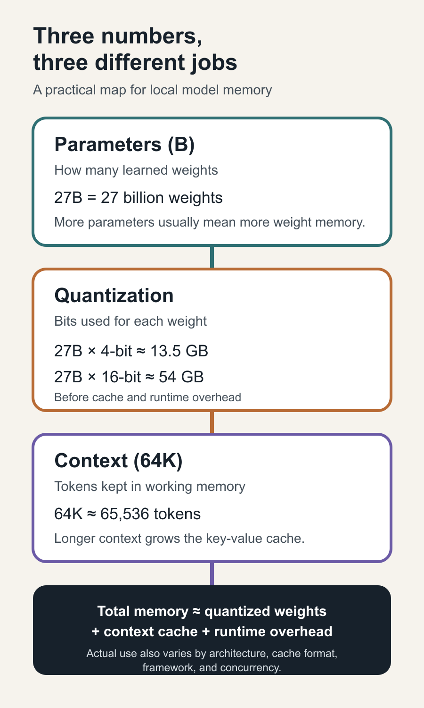

# What 27B, 4-Bit, and 64K Actually Mean in an AI Model

*A practical guide to model size, quantization, context, and why a model that looks like it fits can still run out of memory.*

*Parameter count, weight precision, and context length answer different questions. Original AI Fleas illustration.*

A local model can look as if it fits your machine and still run out of memory.

That is because three numbers that often appear beside a model name describe three different constraints:

- **27B parameters**
- **4-bit quantization**
- **64K context**

Parameter count describes how much learned model there is. Quantization changes how compactly those weights are stored. Context length changes how much working information the model can hold—and the memory needed for that working window.

Treat those numbers as one vague measure of “model size” and it becomes easy to choose a model that technically fits on disk, appears to fit in memory, and then fails or slows dramatically when you give it the context you actually wanted.

Put them together correctly and they become a practical hardware question: **How much memory will this model really need for the way I intend to run it?**

Here is the short version:

> **Memory for inference is roughly model weights + context cache + runtime overhead.**

Training adds several more large memory consumers.

## 1. Parameter count: how many learned values the model contains

A parameter is a learned numerical value inside the model. During training, the optimization process adjusts billions of these values so the model becomes better at predicting the next token.

*Parameter count describes how many learned values the model has; it does not measure answer quality by itself.*

The **B** in **27B** means billion. A 27B model contains about 27 billion learned parameters.

Parameter count is useful because it gives a rough sense of:

- the amount of weight data that must be stored;
- the compute required for each token;
- the model's potential capacity;
- the hardware class needed to run or train it.

It is not a quality score. Architecture, data, training method, post-training, tokenizer, tool-use behavior, and the task itself can matter as much as size. A well-trained smaller model can outperform a larger one on a particular job.

### Total parameters and active parameters are not always the same

A dense model uses most of its parameters for every token. A mixture-of-experts model can store a much larger set of total parameters while activating only a subset for each token.

That creates two different questions:

- **Total parameters:** how much model weight data must be stored?
- **Active parameters:** how much of the model participates in the computation for one token?

Active parameters help explain compute cost. Total parameters still matter for storage and usually for memory residency. “Only 3B active” does not necessarily mean the entire model occupies the memory of a 3B model.

## 2. Quantization: how many bits store each weight

Parameter count tells us how many weights exist. Quantization tells us how compactly they are represented.

*Quantization changes the storage precision of model weights; the illustration shows the same model represented more compactly.*

The simplest first estimate is:

> **Raw weight memory ≈ parameter count × bits per weight ÷ 8**

For a 27B model:

| Weight format | Approximate raw weight size |
|---|---:|
| 16-bit | 54 GB |
| 8-bit | 27 GB |
| 4-bit | 13.5 GB |

These are decimal approximations, not promises about actual runtime memory. Real formats include metadata, scales, block structures, tensors that remain at higher precision, alignment, and runtime buffers.

Lower precision can make a model practical on smaller hardware. It can also change output quality and speed. “4-bit” is a family of formats, not one universal implementation: two 4-bit files can have different sizes, accuracy, kernel support, and performance.

*Parameter count, bits per weight, and context length affect different parts of the memory budget. The examples show approximate raw weight sizes; actual runtime use is higher.*

## 3. Context length: the size of the working window

A **64K context** usually means a maximum working window of about 65,536 tokens. Tokens are pieces of text, not characters or words. The exact word count depends on the language, code, formatting, and tokenizer.

*Context is the material available during the current request; a larger window does not add learned parameters.*

The context window can contain:

- the system prompt;
- user instructions;
- conversation history;
- tool definitions and tool results;
- retrieved documents;
- source code;
- the model's generated output.

Longer context does not add more learned knowledge to the model. It gives the model more material to consider during the current request.

Context also has a memory cost. During generation, transformer models normally keep a **key-value cache**, or KV cache, so they do not recompute the entire prior sequence for every new token. The cache grows with context length and concurrent requests. Its size also depends on architecture, layer count, KV-head count, head dimension, and cache precision.

That is why a model's weights may fit while a long-context server still runs out of memory.

## The relationship between the three numbers

The three headline specifications divide the memory problem into two main parts:

1. **Parameter count × storage precision** estimates the weight memory.
2. **Context length × cache structure × cache precision × concurrency** drives KV-cache memory.
3. **Runtime overhead** adds temporary tensors, compute buffers, framework allocations, and operating-system needs.

For inference, a useful planning model is:

> **Total runtime memory ≈ quantized weights + KV cache + runtime overhead**

If you double the context limit, the model file does not double. The cache budget grows instead. If you move from 16-bit to 4-bit weights, the context limit does not grow automatically. You free weight memory that the runtime may then use for cache or concurrency.

## Why training needs much more memory than inference

Inference mainly needs the model weights, the KV cache, activations for the current computation, and runtime buffers.

Full training needs additional state:

- **trainable weights;**
- **gradients** for those weights;
- **optimizer states**, such as Adam's momentum and variance;
- **forward activations** retained for backpropagation;
- temporary tensors and communication buffers.

Hugging Face's training-memory guide illustrates a common mixed-precision Adam setup as roughly:

- 6 bytes per parameter for model weights: a 16-bit working copy plus a 32-bit main copy;
- 8 bytes per parameter for two 32-bit Adam optimizer states;
- 4 bytes per parameter for gradients;
- plus activations and temporary memory.

That is about **18 bytes per parameter before activations**. For a 27B model, the simple estimate is about **486 GB** before activation memory and other overhead. Exact frameworks and training methods vary, but the lesson is stable: fitting a quantized model for inference does not mean the same machine can fully train it.

### Fine-tuning is not always full training

Parameter-efficient methods such as LoRA train a small set of adapter parameters instead of updating every model weight. QLoRA combines low-rank adapters with a quantized base model.

This can reduce training memory dramatically, but it does not make every 4-bit weight independently trainable. The important specification is not only total model size; it is **how many parameters are trainable and what state the optimizer must maintain**.

## Training tokens are a different number

“Parameters” and “training tokens” are easy to confuse.

- **Parameters** are the learned values stored in the model.
- **Training tokens** are the pieces of data shown to the model during training.
- **Trainable parameters** are the subset being updated in a particular training or fine-tuning run.

A model trained on more tokens is not automatically better. Data quality, mixture, deduplication, curriculum, objective, and post-training all matter. Still, training-token count helps describe the scale of the learning process, while parameter count describes the scale of the learned state.

## Other specifications that matter

The headline three are only the beginning. For a practical deployment, check these too.

### Architecture

Dense versus mixture-of-experts changes the relationship between stored weights and compute per token. Layer count, hidden size, attention design, KV heads, and vocabulary size affect speed and memory.

### Native context versus served context

A model card may advertise a large native or extended context, while the running server is configured for something smaller. Verify the actual served slot. A claimed 256K model running with a 16K server setting is a 16K service for that deployment.

### KV-cache precision

FP16, Q8, and Q4 cache formats can have very different memory footprints. Lower-precision cache can create room for longer context or more concurrent users, with implementation-dependent tradeoffs.

### Batch size and concurrency

One request and eight simultaneous requests do not have the same cache budget. Concurrency can determine whether a server is stable even when a single prompt succeeds.

### Prompt-processing and generation speed

Prompt ingestion is often measured in prompt tokens per second. Output generation is measured separately. A model can read quickly and write slowly, or the reverse. Time to first token and complete task wall time can matter more than either throughput number alone.

### Output quality and task acceptance

Memory fit is not evidence that the model performs the work well. Use representative tasks, independent checks, and acceptance criteria. Measure completed, usable work—not only benchmark scores or tokens per second.

### Tool use and structured output

If the model will operate as an agent, test the exact chat template, tool schema, parser, and runtime. A model that answers questions well may still fail tool calls or structured-output constraints.

### License and deployment rights

A technically successful model can still be unusable for the intended product or business. Read the exact license before downloading a very large model or designing around it.

### Model file and runtime compatibility

Check the exact checkpoint revision, quantization format, runtime build, accelerator support, and required kernels. A model name alone is not a reproducible configuration.

## A practical checklist

Before choosing a model, ask:

1. How many total and active parameters does it have?
2. At what precision are the weights stored?
3. What is the actual model-file size?
4. What context length is native, and what context will the server really expose?
5. What KV-cache format will be used?
6. How many concurrent requests must fit?
7. Is this inference, full training, or adapter fine-tuning?
8. How many parameters will actually be trained?
9. What are prompt speed, generation speed, time to first token, and complete task time?
10. Does it pass the real task and independent verification?
11. Does the license permit the intended use?

## The compact mental model

When you see **27B, 4-bit, 64K**, translate it like this:

- **27B** tells you how many learned parameters exist.
- **4-bit** tells you approximately how compactly the weights are stored.
- **64K** tells you how large the token working window can be.

Then add the questions the headline leaves out:

- Is the model dense or mixture-of-experts?
- How large is the KV cache?
- Is the task inference or training?
- How many parameters are trainable?
- How much concurrency is required?
- Is the result fast, accurate, and legally usable?

The largest model that fits is not automatically the best model to run. The useful model is the one whose complete memory budget fits, whose runtime meets the workload, and whose output survives review.

---

## Sources and further reading

- [Hugging Face: GPU memory usage](https://huggingface.co/docs/transformers/model_memory_anatomy)
- [Hugging Face Transformers: bitsandbytes quantization](https://huggingface.co/docs/transformers/en/quantization/bitsandbytes)
- [Hugging Face bitsandbytes quickstart](https://huggingface.co/docs/bitsandbytes/main/quickstart)
- [Qwen3.8-27B official model page](https://huggingface.co/Qwen/Qwen3.8-27B)
- [Qwen3-Coder-Next official model page](https://huggingface.co/Qwen/Qwen3-Coder-Next)
