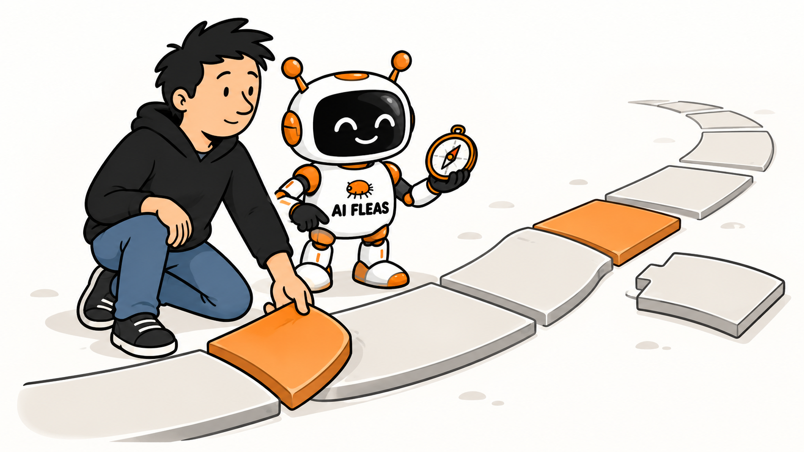
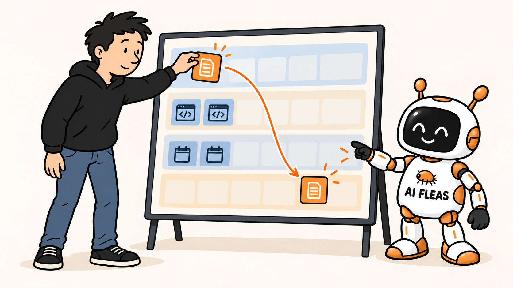

# I Asked My Personal Governor to Create a Plan for the Month Ahead

*A month plan became useful when it remembered my priorities and changed with the work.*



*I choose the direction. My Personal Governor helps me keep the plan aligned as circumstances change.*

The **Personal Governor is part of the [AI Fleas](https://aifleas.com/) platform**. It helps me keep my chosen goals, commitments, and capacity in view across the work I do. I decide what matters; the Governor helps me see the tradeoffs and adjust a plan when the evidence changes.

How many of your active projects have collected tasks, plans, and methods without a clear answer to which goal they serve?

Over the preceding days, my work had accumulated into more than a task list: goals, strategies, methods, commitments, and tickets. I designed the Governor’s monthly planning method to start with the goals I had chosen and trace them down to the work I would actually do. That is a harder question than finding open space on a calendar.

This time I asked for something harder: **plan the next month with me.**

For a month, that help means holding the priorities steady long enough to test them against real work. The Governor can point out a crowded schedule or a displaced commitment, but the goals and decisions remain mine.

## A calendar does not know why the work matters

I maintain several websites and products. I am developing AI Fleas while continuing client work. I also have ideas about local AI models, writing, and tools for my own services. Any one of these can absorb a week. They can all look productive.

The question for October was not “How can I fit them all in?” It was **“What would make this month count?”**

I gave the Governor the goals and constraints I had already chosen: meet existing commitments, set a bounded amount of time for my own projects, and make AI Fleas useful on real work rather than only promising that it could be useful. We traced each proposed monthly outcome back through its strategy and method. Work that could not explain that connection needed a decision before it earned calendar space.

For AI Fleas, the chain was concrete. The goal was to make the platform useful on real work. The strategy was to validate it through an actual Writing workflow. The method was to carry articles through drafting, independent review, correction, destination review, and my own acceptance. A completed article would be better evidence than another diagram of how agents ought to collaborate.

The plan kept necessary commitments visible as capacity constraints. They did not need to masquerade as strategic outcomes to matter.

## A plan has to land somewhere

The Governor proposed the month. I said yes, then checked the calendar where the plan was supposed to live. The events were missing.

Its first attempt to write the events had been rejected by the task’s permissions. It told me the plan was not there, but that still left a gap between our conversation and my actual week. I pointed it out. When the calendar connection was available, we created the focus blocks and checked that they appeared.

That small failure taught me something useful: an AI can produce a convincing plan in a chat without changing the system where I will live with it. For planning, the readback matters. A calendar event is not a completed project, but an invisible plan is even easier to forget.

The blocks were anchors, not an instruction to occupy every free hour. The month still had room for client work, ordinary life, and surprises.

## The month changed before it even began

While we were planning, I was working on a chalet-booking website. The payment journey needed careful testing. I had also begun defining a Smoke Tester agent: a bounded role that could follow a real customer journey, collect evidence, and tell me whether the site passed, failed, or had to stop safely.

That made me reconsider a local-model coding experiment we had put into October. I still want to learn whether local agents can help with development. But getting a local agent to do useful operational testing may be a better first job. It is close to a service I actually run, and success is easier to define.

So I changed the month plan. The Smoke Tester pilot took the coding experiment’s calendar space. The old idea did not disappear; it moved out of this month’s focus. The article work and other commitments stayed.



*I moved the pilot into October; the Governor helped keep the tradeoff visible.*

This is where a Personal Governor is more useful than a static plan. It can remember why we chose the first priority, notice the cost of a new one, and update the schedule when I make a deliberate trade. It should not silently chase whichever project was most exciting this morning.

The Smoke Tester is not yet a proven 24/7 operator. A role and a scenario exist; safe, repeatable runs still have to earn that claim. The pilot starts with a supervised local sandbox journey and evidence of what happened. Unattended production payments are a separate decision.

## The useful part is the conversation about tradeoffs

I do not need an AI to tell me that articles, websites, and testing are all good ideas. I already know that. I need it to help answer harder questions:

- Which one deserves attention this month?
- What commitment will be displaced if I say yes to something new?
- What evidence would make me keep, change, or stop the experiment?
- Which decisions must remain mine?

The Governor does not own my priorities. It helps me hold them long enough to test them against what I actually do. It can also be corrected. In this case, I corrected both the missing calendar implementation and the choice of local-agent experiment.

A month plan gives the agent a direction to protect and gives me a way to judge whether the work and the schedule moved together. The baseline records what I chose at the start; the current plan records deliberate changes; the results at month end show what actually happened. That distinction makes adaptation visible without rewriting the original decision.

## Try it without building a Governor

You can try the question with the AI assistant you already use. Give it only the context you are comfortable sharing:

```text
Here are my two or three priorities for next month.
Here are my fixed commitments and a realistic weekly time budget.
Here is one thing I keep starting instead of finishing.

Propose a small number of outcomes, weekly checkpoints, and stop rules.
Show what would be displaced by a new priority.
Leave unallocated time. Ask me to choose before changing my commitments.
Then help me put the accepted plan in my calendar and verify it is there.
```

At the end of the month, the best question may not be “Did I follow the plan perfectly?”

It may be: **“Did the plan help me make the choices I meant to make?”**

The Personal Governor is one part of the AI Fleas approach I am building. If you want to examine the reusable workflows and roles behind it, [explore AI Fleas](https://aifleas.com/). If you are working through a similar problem in your business and want a technical partner, [see my consulting work](https://starodubtsev.consulting/).
