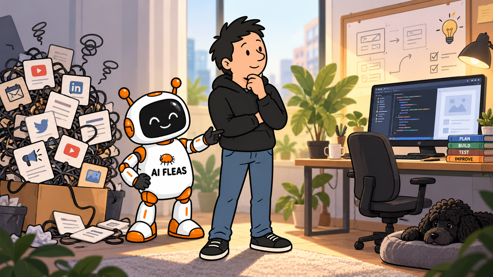
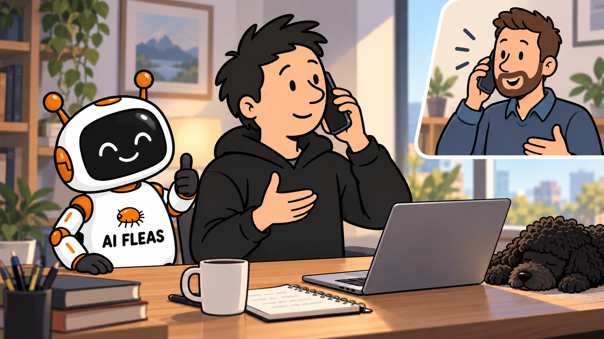

# I Said No. Then I Changed My Mind.

*AI made it easier to do everything myself. That did not make everything worth doing myself.*

*Choosing where attention belongs. Original AI-generated illustration using the author's AI Fleas character references.*

I hung up on the first call. By the third, I had agreed in principle to try a smaller service at CAD 199 a month.

Meanwhile, I spent roughly two days doing my own online visibility work. AI helped. That was part of the problem.

I could improve the website, explain my products, and build the machinery to help people find them. Each task was within reach. Together, they took me away from the products I wanted people to find.

If you build with AI, you may recognize how easily “I can do that” becomes “I should.”

## Three calls, three different decisions

The first conversation kept circling. I could not connect the offer to a clear outcome, and the pricing and commitment needed clarification. I asked for written details and time to think. Eventually, I ended the call.

I would make that decision again. Having a weak online presence did not mean I had to accept an unclear offer under pressure.

On the second call, the representative introduced me to a potential client. Until then, I had been thinking about website and marketing tasks. The introduction gave me another reason to pay attention: this person might connect me with people I would not reach on my own.

For the products I am building, a conversation with someone who understands several properties could teach me more than another batch of anonymous website visits.

On the third call, I saw how the service worked.

*A different conversation, with room to reconsider. AI-generated illustration; the other caller is fictional.*

The representative shared their screen and walked through the workflow and integrations. I could finally see what they proposed to manage.

My own two-day effort was fresh in my mind. It had been useful: I had made myself explain what I was building and who it could help. But the AI usage alone felt close to the monthly price of the smaller offer. That was a rough personal estimate.

Then there was my time.

I had been asking what they could do that I could not. Looking at the screen, I started asking what they could take off my plate.

## What I wanted to buy back

I can build and host a website. I also know how a website project can grow into a continuing job: revise the copy, adjust the presentation, work on discovery, then do it again.

The smaller offer covered another continuing job: maintaining my presence in relevant online sources, monitoring it, and following up periodically. At CAD 199 a month, it gave me a concrete alternative to managing that layer myself.

I want people to be able to find me and understand who is behind the work on my [products page](https://starodubtsev.consulting/products). But some of those products are still being built and tested. Filling my calendar with consulting calls would not necessarily move them forward.

The time I hoped to recover already had a job: improve the products and test what they could deliver.

Personal Governor, the agent I am developing through [AI Fleas](https://aifleas.com/), helped me carry that decision into my monthly plan and the roadmap for the next quarter. Paying someone to free up time would mean little if I immediately filled it with another side project.

I’ll see whether the service earns its place. For now, I have products to get back to.

The question was no longer whether I could do it myself. It was whether I should.
