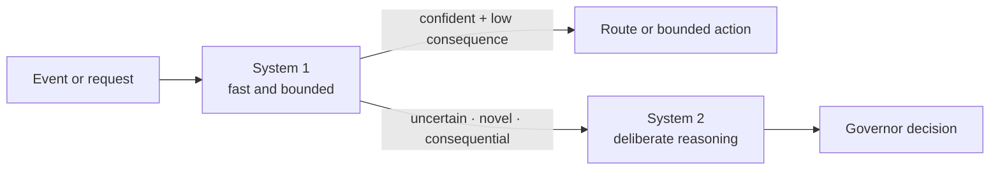
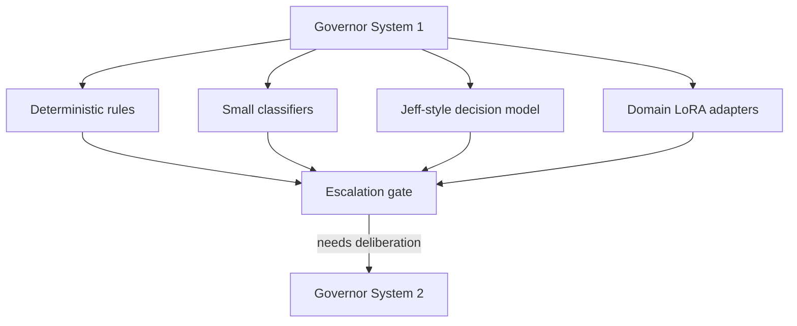
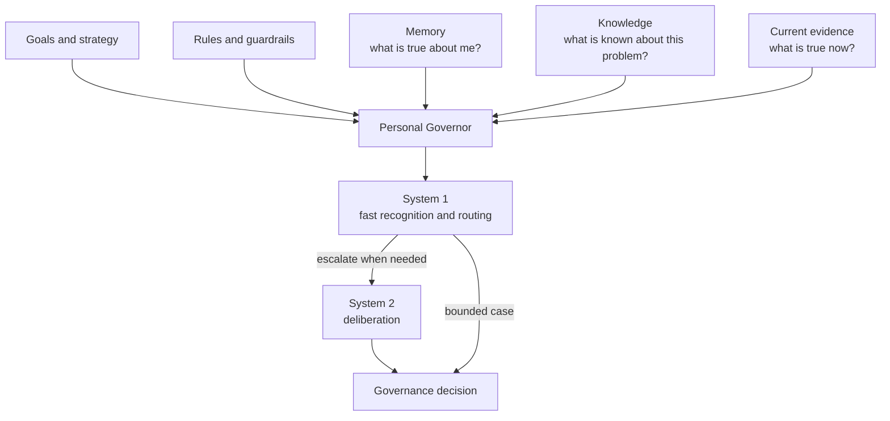

# Why Is Your Most Expensive AI Model Making the Easiest Decisions?

*I started with a tiny routing model. It changed how I think about the Personal Governor itself.*

In many agent systems, the smartest model sits at the top.

Every request reaches it first. It decides what the request means, which agent should handle it, whether a tool is needed, and where the work should go.

That feels logical. Put the smartest model in charge.

But humans do not work like that.

You do not deliberate about pulling your hand away from a hot surface. You do not carefully reason through every familiar sound, every routine choice, every signal you already know how to recognize. Much of the time, something fast reacts first. Deliberation gets involved when the situation deserves it.

That made me wonder whether I had been thinking about my **Personal Governor** backwards.

I have been building the Personal Governor inside AI Fleas as a persistent governance layer: something that knows the goals, remembers decisions, sees current evidence, consults knowledge, and helps decide what deserves attention next.

I had been treating it as a sufficiently intelligent agent sitting above everything else.

Then, after a conversation outside and some investigation into a tiny open model called [Jeff](https://github.com/firelex/jeff), the abstraction clicked: perhaps the Governor should not have one speed of thought.

Perhaps it needs something closer to two.

A fast **System 1** that reacts, classifies and routes.

A slower **System 2** that wakes up when actual deliberation is required.

Jeff did not create that idea. The terminology comes from Daniel Kahneman's [*Thinking, Fast and Slow*](https://www.penguinrandomhouse.com/books/89308/thinking-fast-and-slow-by-daniel-kahneman/), and [TypeSafe AI's Jev](https://typesafe.ai/blog/introducing-system-one-models-and-jev) applies the System One framing directly to machine decision-making.

But Jeff made the architecture concrete enough for me to ask a different question:

**Why should the biggest model answer first?**

## The default architecture may be backwards

A common agent architecture puts the most capable model at the top.

A request arrives. The large model reads it, reasons about it, decides what kind of work it is, chooses an agent or tool, and delegates. If another decision appears, the large model may be asked again.

That is understandable. If the expensive model is the smartest one available, why not let it make the decisions?

Because many decisions are not deep.

Which workflow owns this request?

Does this event look like something we have seen before?

Does this require knowledge retrieval?

Is this worth writing to durable memory?

Is confidence high enough to take a bounded action, or should we escalate?

Those are important decisions. But they are not necessarily problems that need a large reasoning model to generate hundreds or thousands of tokens.

Humans do not work that way either.

## Borrowing System 1 and System 2

Daniel Kahneman popularized the distinction between **System 1** and **System 2** in *Thinking, Fast and Slow*.

System 1 is fast, automatic and reactive. System 2 is slower and more deliberate.

I am borrowing that distinction as an engineering abstraction. I am not claiming that these are literal separable modules in the human brain, or that an AI architecture reproduces human cognition.

But as a way to design a Governor, it is remarkably useful.

The Governor can have at least two cognitive layers:

- **System 1:** fast, bounded decisions—classification, routing, familiar signal detection, simple policy gates.
- **System 2:** deliberate reasoning—novel situations, conflicting evidence, planning, trade-offs and consequential decisions.

And the most important connection between them is not delegation downward.

It is **escalation upward**.



That changes the default.

The expensive model does not have to wake up for everything.

## Jeff made the idea concrete

This is where Jeff became interesting.

[Jeff](https://github.com/firelex/jeff) is an independent open-source project inspired by the same System One direction as [TypeSafe AI's Jev](https://typesafe.ai/blog/introducing-system-one-models-and-jev). The current Jeff project describes its Qwen-based 0.8B model as a fast decision model, not a planner. It takes a situation and candidate options and returns calibrated probabilities rather than generated prose.

That distinction matters.

Jeff's documentation explicitly says: **reason in code, decide with Jeff**. It also warns that small models do not reason; they make fast choices between options.

That sounds much closer to what I want from System 1.

The current Jeff v1.2 documentation reports a 0.8B Qwen base with 1.7 GB of 16-bit weights. With all nine published LoRA adapters loaded, the project reports about 1.96 GB of GPU memory in its test setup. Each adapter is roughly 41 MB.

Those adapters are particularly interesting.

One base model can have different reactive specializations:

- Which workflow should receive this?
- Which tool should an agent call?
- Is this input suspicious?
- Does this answer appear grounded?
- Should this event be retained?
- Does this situation require escalation?

The exact adapters above are examples, not a finished Governor design. But the pattern is attractive: **one small resident System 1 model, several bounded decision modules, and a larger System 2 behind it.**

Jeff's maintainers report that, in one benchmark setup across eight adapters, putting the small model in front of a 27B model improved their measured mean accuracy from 86.6% to 95.3% while reducing mean decision time from 8.1 seconds to 0.25 seconds. They report the small layer passing uncertain cases onward according to per-adapter confidence thresholds.

Those are project-reported results from one setup, not evidence that the same numbers will hold for AI Fleas. I want to reproduce the relevant behavior locally before treating it as an architectural fact.

But it demonstrates the shape.

## System 1 does not have to be one model

The deeper idea is bigger than Jeff.

A Personal Governor's System 1 could be composed of several mechanisms:



Some reactions should remain code.

If a state machine says that an article cannot move from `drafting` directly to `published`, I do not need a neural model to make that rule probabilistic.

But natural-language interpretation around the state machine can be probabilistic.

"The reviewer likes it, but wants the introduction rewritten before publication."

A small decision layer could classify that as a return from review to writing. Deterministic code can then verify that the transition is legal and persist it.

This separation matters:

**System 1 interprets quickly. Code constrains. System 2 deliberates when needed.**

## The hot-kettle problem

A person who touches a hot kettle does not normally write an internal essay about thermodynamics before pulling a hand away.

The reaction comes first.

The analogy is imperfect—human reflexes, learned intuitions and deliberate reasoning are not interchangeable with classifiers and language models—but it points to a useful design question:

**How much of an AI system's expensive reasoning exists only because we have not built a cheaper reaction layer?**

For a Personal Governor, that question appears everywhere.

A calendar event arrives. Most events do not require strategic reconsideration.

A GitHub change appears. Most commits do not deserve permanent memory.

A request arrives. Many can be routed without reconstructing the entire strategy.

A known pattern repeats. Sometimes the useful action is already bounded.

System 1 can absorb that repetitive cognitive traffic.

System 2 can remain relatively lazy—and therefore available for the decisions where deliberation actually matters.

## The Governor is not another person

There is a trap in the name *Personal Governor*: it can sound like I am trying to put another little person above the human.

That is not how I want to think about it.

The human remains the source of goals, values, authority and final judgment. The Governor is closer to an **external cognitive and executive layer** serving that human. It remembers, notices, retrieves, challenges, routes and deliberates, but it does not become the owner of the person it supports.

This is another place where the brain analogy is useful—as long as it remains an analogy.

Kahneman's System 1 and System 2 are psychological abstractions, not two anatomical boxes. Still, some functions we associate with fast, automatic behavior involve circuits including the basal ganglia and sensorimotor systems, while deliberate cognitive control relies heavily on distributed prefrontal and frontoparietal networks. The biology is considerably richer than a two-box diagram.

We probably should not think of the Governor as a brain in the sense of trying to build another human. That would be the wrong goal.

But there is a design lesson worth borrowing from the brain: **expensive deliberation is not the default path for every signal.** Human cognition has ways to recognize, react and act without bringing the full machinery of deliberate reasoning into every moment.

Could we make the Governor economical in a similar way?

Instead of putting a frontier model at the entrance to every decision, we could map cheaper models, classifiers and deterministic mechanisms to cheaper cognitive operations. A fast layer could recognize familiar situations, classify events, route work and clear bounded decisions. In many cases, the expensive model would never need to wake up. In others, System 1 would reduce the problem first and escalate only what actually deserves System 2.

That gives us a different optimization target. We are not merely trying to make inference cheaper. We are trying to spend **cognitive cost in proportion to the decision**—and potentially get an answer faster at the same time.

For the Governor, that suggests a useful separation:

```text
Human
  └─ goals · values · authority
        ↓
Personal Governor
  ├─ System 1 — recognize / route / react
  ├─ System 2 — deliberate / plan / resolve
  ├─ Memory — preserve personal continuity
  └─ Knowledge — retrieve external expertise
        ↓
Workflows / actions
```

The Governor can therefore use brain-inspired abstractions without pretending to be another human—or pretending that an AI model is a literal brain.

## A Governor is more than two models

I do not want to reduce the Personal Governor to a clever router.

The architecture I am moving toward has several distinct inputs:



**Memory** and **Knowledge** are deliberately separate.

Memory contains the changing personal and operational world: goals, decisions, commitments, relationships, outcomes and history.

Knowledge is external expertise: books, papers, frameworks, manuals and other attributable sources that can be retrieved when the problem requires them.

Current evidence says what is happening now.

System 1 and System 2 describe how the Governor can react to those inputs at different cognitive costs.

The Governor itself remains one persistent role and identity.

It may simply have more than one brain resource.

## The inversion I want to test

The architecture I want to test is almost the inverse of the "big model on top" pattern:

```text
Event
  ↓
System 1
  ↓
Can this be handled confidently inside a bounded rule?
  ├─ yes → route / classify / act within authority
  └─ no  → System 2
              ↓
          retrieve deeper memory / knowledge / evidence as needed
              ↓
          deliberate
              ↓
          decision
```

This does not mean every request should pass through an AI classifier. Deterministic routing remains better when the answer is deterministic.

It also does not mean a confidence number makes a risky action safe. Consequence matters independently of confidence. A high-confidence decision can still require System 2 or a human gate.

The point is to stop treating expensive reasoning as the universal entry point.

## What I am testing next

I have added System 1 / System 2 to the public Personal Governor architecture in AI Fleas.

The next step is implementation research, not a declaration that Jeff has already solved it.

I want to test:

- whether Jeff's small local models are reliable enough for Governor-shaped decisions;
- whether custom LoRA adapters can learn narrow routing and governance gates;
- what confidence thresholds produce useful escalation behavior;
- where deterministic rules outperform a learned System 1;
- how much latency and model usage this actually saves on my local hardware;
- and, most importantly, which decisions should never be delegated to System 1 regardless of benchmark accuracy.

If Jeff works, it may become one implementation mechanism.

If it does not, the abstraction survives.

That is what I like about the design.

**System 1 and System 2 describe the Governor I want. Jeff is only one candidate for part of its brain.**

---

## Links

- [Jeff — open-source System 1 decision model](https://github.com/firelex/jeff)
- [TypeSafe AI — Introducing System One Models & Jev](https://typesafe.ai/blog/introducing-system-one-models-and-jev)
- [*Thinking, Fast and Slow* — Daniel Kahneman](https://www.penguinrandomhouse.com/books/89308/thinking-fast-and-slow-by-daniel-kahneman/)
- [AI Fleas](https://github.com/starodubtsevconsulting/ai-fleas)

## Sources and implementation notes

- Daniel Kahneman, *Thinking, Fast and Slow* — the System 1 / System 2 terminology used here as an engineering analogy.
- TypeSafe AI, "Introducing System One Models & Jev" (September 15, 2026): https://typesafe.ai/blog/introducing-system-one-models-and-jev
- Jeff open-source project and current benchmarks: https://github.com/firelex/jeff
- AI Fleas Personal Governor architecture: see the public repository README and Personal Governor role documentation.

The Jeff performance and memory figures in this draft are claims reported by the Jeff project as of October 4, 2026. They have not yet been independently reproduced in my environment.
