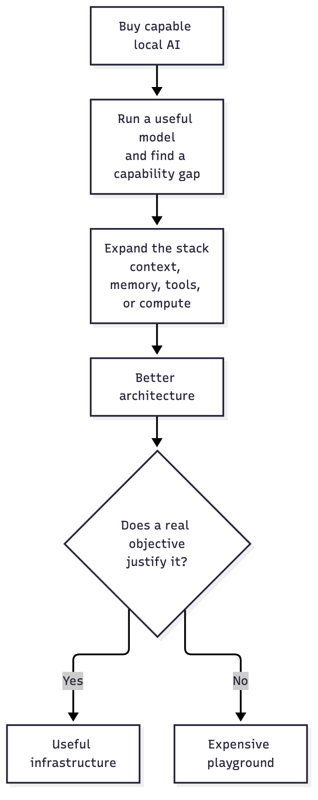
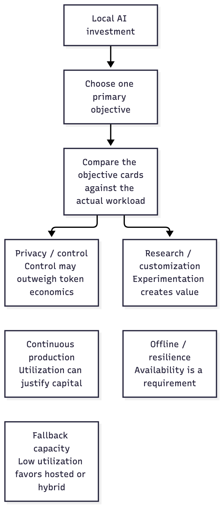
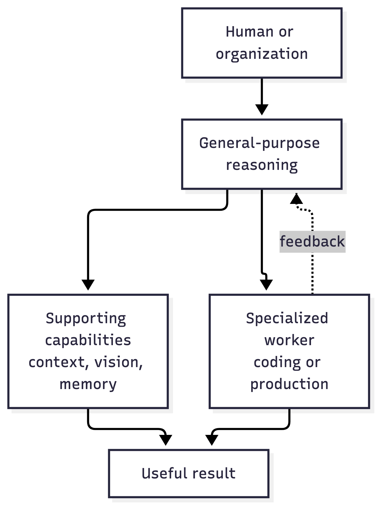
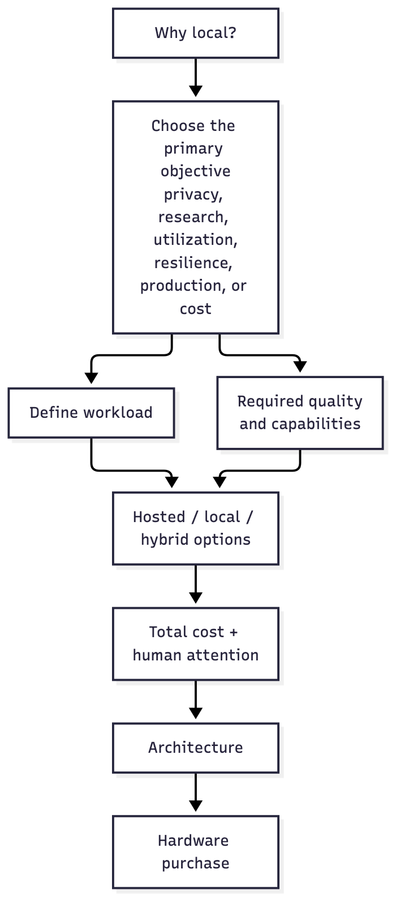

# Before You Buy Local AI, Decide What You Are Optimizing For

*The hardware is the easy part. The expensive mistake is building the wrong local AI system for the problem you actually have.*

There is a dangerous moment in local AI.

It is not when you buy the first machine.

It is when the next machine genuinely would make the architecture better.

That is where I found myself recently.

I had spent weeks experimenting with a capable local AI machine. I ran coding models, changed context sizes, added an agent framework, connected an auxiliary model, extracted expertise from previous work, tested delegation, and watched the system fail in enough different ways that I started to understand what was actually missing.

The coding model could produce code.

With enough context and support around it, it could even produce useful work.

But it was still a poor manager of its own work.

The technically obvious architecture started to emerge. Another capable compute node could keep a broad reasoning model resident above the specialized worker. Smaller supporting models or services could handle context, observation, memory, classification, or other bounded functions.

Technically, I could see why it would work better.

And then I asked the question that matters more:

**Better for what?**

This is the trap I had walked into:

The dangerous part is that every technical step can be reasonable. The architecture can genuinely improve while the business case gets worse.

## The trap is not buying hardware

There is nothing wrong with buying local AI hardware because you enjoy experimenting with it.

People buy cameras, cars, musical instruments, gaming computers and workshops because they enjoy them. A local AI machine can be an extraordinary playground.

The confusion begins when the playground quietly becomes infrastructure.

Once I expect the system to save me time, replace a paid service, protect sensitive information, generate revenue, support research, or keep a business operating, the question changes.

I am no longer asking:

**What can this machine run?**

I am asking:

**What am I optimizing for?**

Those questions produce very different purchasing decisions.

The same class of hardware can be rational for completely different reasons:

Choose the objective that carries the most weight for this decision. The other objectives still matter, but they should be treated as constraints or secondary benefits rather than quietly becoming five competing justifications.

There is no universally correct local-AI budget. There is a configuration that is more or less appropriate for the objective.

## Privacy changes the equation completely

Suppose your primary requirement is privacy.

You are working with proprietary research, sensitive customer information, unreleased intellectual property, legal material, internal strategy, or data that simply must not leave an environment you control.

Then spending tens of thousands of dollars on local inference may be inexpensive.

For a larger organization, spending hundreds of thousands can also be perfectly rational if the alternative violates an important security, regulatory, contractual, or strategic requirement.

The relevant comparison is no longer:

**local machine versus cheaper API tokens**

It may be:

**local machine versus not being able to use the capability at all.**

That changes everything.

But it still does not mean money should be wasted.

A company with a large privacy budget still wants the best architecture it can get for that budget. It still needs to know whether it needs one general model or several specialists, how much context matters, what should remain deterministic software, which workloads need accelerators, what utilization to expect, and where human attention will still be required.

A large budget removes one constraint.

It does not remove the need to think.

## Continuous production is another world

Now imagine a system generating useful output all day and all night.

Perhaps it processes documents, creates media, performs internal analysis, serves private models to employees, runs simulations, or operates an AI-heavy product.

A machine used at high utilization has completely different economics from a machine waiting for the few days each month when somebody runs out of hosted capacity.

The same hardware can therefore be an excellent purchase for one organization and a terrible purchase for another.

This is why simple payback calculations can be misleading before the workload is understood.

You first need to know what the machine will actually be doing.

## Research has its own value

Research is another case where the machine itself may be part of the capability.

If you need reproducible inference, control over models and runtimes, the ability to modify the stack, predictable availability, offline operation, or freedom to run experiments that hosted services do not support, local infrastructure has value beyond token price.

That value may be difficult to express as dollars per million tokens.

It is still real.

The mistake would be pretending that the same argument automatically applies to someone who merely wants a cheaper coding assistant.

## My own case is much less dramatic

My current problem is mostly resilience.

I use strong hosted models for serious work. Sometimes I exhaust the capacity available to me while there is still work left in the day.

I wanted a local lane I could move into.

That sounds like an excellent use for a powerful local machine.

Then reality became more complicated.

The local coding model could write code, but it needed too much supervision. Giving it much more context helped dramatically. An auxiliary model helped it keep goals and context under control. Expertise extraction helped. The agent framework added useful machinery around the model. I am now investigating vision because a worker that spends much of its time changing interfaces while being unable to see them creates an absurd feedback loop.

Each improvement made the system better.

None changed the underlying economic question.

If I need another expensive machine to keep a broad reasoning model resident above the coding worker, I may finally have the architecture I wanted.

But I would also have doubled down on infrastructure to solve a workload that occurs only intermittently.

That is the point where I have to stop being fascinated by the architecture and think like a consultant.

## What a useful local system may actually contain

Once the objective and workload justify local infrastructure, the system may be more than one large model.

My own experiments increasingly point toward a composition like this:

The exact boxes will change as hardware and models change. The capabilities are more durable: something maintains the broader problem, something performs specialized work, and supporting functions reduce the amount of expensive reasoning and human intervention required.

That is why I would design around capabilities first and products second.

## Start with the objective, not the box

If I were advising an organization considering local AI, I would not begin with a model name or a machine.

I would start here:

The order matters.

**Goal → workload → capability → architecture → economics → hardware.**

Hardware comes surprisingly late.

Starting with hardware reverses the process. You buy capacity and then begin searching for enough work to justify owning it.

That is how an experiment can turn into a small infrastructure business without anyone explicitly deciding to start one.

## Do not forget the human in the TCO

One of the most expensive things in my local AI experiments has not been electricity or hardware.

It has been me.

A model that costs almost nothing per token but requires constant correction can be more expensive than a hosted model that completes the assignment while I do something else.

That cost rarely appears on specification sheets.

So I would include human attention in any serious local-AI calculation:

- How often does somebody have to intervene?
- Who maintains the models and runtime?
- Who diagnoses failures?
- How often are models replaced?
- How much work is required to make the agent reliable?
- What happens when the machine is unavailable?
- How much specialist knowledge is required to operate the system?

Cheap inference can become expensive work.

## Hybrid may be the rational answer

There is also no rule saying the decision has to be local *or* hosted.

My own experiments increasingly point toward hybrid architectures.

Keep work local when privacy, control, cost, latency, specialization, or owned capacity make that useful.

Use stronger hosted intelligence when the local system would require disproportionate hardware or human supervision.

Route work according to what it actually needs.

The smartest model does not necessarily need to process every task. The cheapest model should not be forced to solve every difficult problem either.

The useful architecture may be a mixture.

## You cannot get the whole answer by asking an AI which machine to buy

Believe it or not, asking GPT which machine to buy is the easy part.

It can compare specifications. It can explain model sizes. It can calculate rough costs. It can produce a shortlist in seconds.

The difficult part is deciding which questions matter for your organization.

How sensitive is the information?

What quality threshold is actually acceptable?

What happens when the model makes a bad decision?

How much human supervision is tolerable?

Is this system supporting research, replacing labor, generating revenue, providing resilience, or simply satisfying curiosity?

What must remain available if an external provider disappears?

Which parts should be AI at all?

Those answers come from the organization, the workload, experiments, evidence and judgment.

The hardware follows.

## The playground is still open

I am not arguing against local AI.

Quite the opposite.

I have spent enough time with it to see how many different useful systems can be built.

For one person, the correct answer may be a small inexpensive machine used occasionally.

For another, it may be a pair of powerful compute nodes with different cognitive roles.

For a private research organization, it may be a rack of machines and a budget that would look absurd to an individual developer.

All of those can be correct.

The question is whether the architecture matches the objective.

That is also where I think my own experience has become useful beyond my experiments. I tend to look at these systems from several directions at once: engineering capability, model behavior, infrastructure, privacy, human attention, cost and business purpose. I have made mistakes in this process, changed my mind repeatedly, and spent enough time debugging the wrong assumptions to become suspicious of simple answers.

If an organization is considering serious local or hybrid AI, the most valuable first deliverable may not be a shopping list.

It may be a decision:

**What should we actually build, what should remain hosted, what should stay local, and what should we not buy at all?**

That kind of targeted investigation can be considerably cheaper than discovering the answer after the machines arrive.
