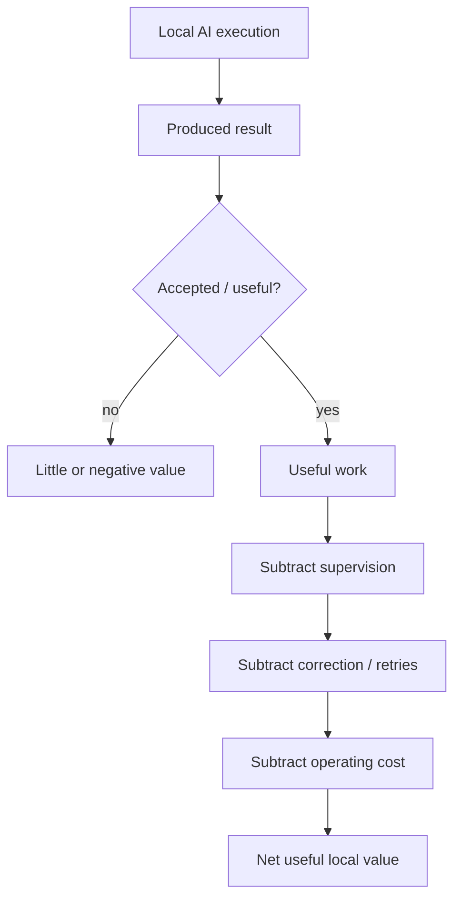
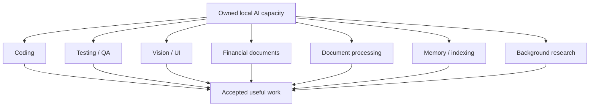
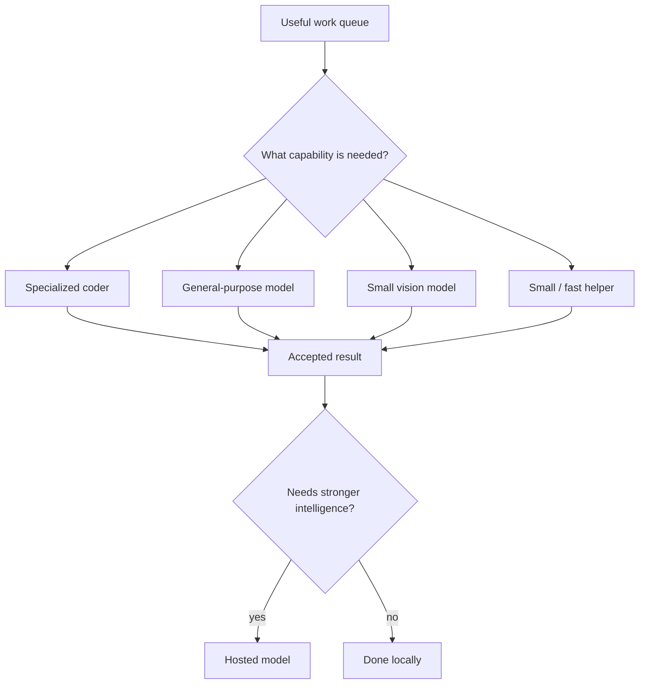

# You Bought the Local AI Machine. Now Make It Earn Its Keep.

*I stopped thinking about model size and GPU utilization. My first target is simpler: about $100 a day of accepted useful work.*

My local AI machine was sitting idle while I was talking about how useful local AI infrastructure could be.

That bothered me.

I had already paid for the compute. The machine was available. There was useful work in my backlog.

And it was producing nothing.

So I gave myself a deliberately imperfect target:

**About $100 a day of accepted useful work from my local AI infrastructure.**

Not $100 worth of tokens generated.

Not $100 worth of GPU time.

Not twelve hours of a fan spinning.

Useful work that I would otherwise have spent hosted AI capacity, human time, or both to get done — and that I am actually willing to accept.

The number is not accounting. Not yet.

It is a forcing function.

## Buying the machine was only the first decision

In [*The Dangerous Moment in Local AI Is When the Next Machine Actually Makes Sense*](2026-10-06-before-you-buy-local-ai-decide-what-you-are-optimizing-for.md), I argued that local AI should start with the objective rather than the hardware:

**Goal → workload → capability → architecture → economics → hardware.**

But there is another problem after the machine arrives.

You can make a perfectly reasonable infrastructure decision and then underuse what you bought.

That is especially easy with local AI because the hardware itself is interesting. You install models. You compare context sizes. You tune runtimes. You make one model talk to another.

Meanwhile, the machine can spend most of the day waiting.

At that point the question changes from:

> Should I own this capacity?

to:

> **What useful work should this capacity be producing today?**

## Twelve hours is not the goal

I want to think of my local infrastructure as having roughly **12 hours a day of potentially productive availability**.

That does not mean I need to keep every GPU at 100% for twelve hours.

If I have no useful work for the machine, making it generate something merely to improve utilization would be absurd.

The twelve hours are an availability envelope.

The target is useful output.

At $100 a day across twelve available hours, the average is only about **$8.33 an hour**.

That sounds much less dramatic than "$100 of AI work."

And that is useful.

A local model does not need to outperform the best hosted model at everything. It needs to perform enough suitable work, reliably enough, that the owned capacity creates material value.

## I have already seen how easy $100 can disappear

Hosted AI makes the comparison concrete for me.

I have had days when a few hours of heavy model use consumed roughly $150 of usage. That does not mean every four hours of AI work is worth $150, and it certainly does not mean local output should be valued by copying API prices mechanically.

It does show something simpler:

**There is real work in my day for which I am already willing to consume expensive intelligence.**

If some of that work can move to machines I already own without creating more human supervision than it saves, local capacity has an economic job to do.

The important phrase is **without creating more supervision than it saves**.

## Cheap inference can still be expensive

One of the biggest lessons from my local coding experiments is that almost-free tokens do not automatically mean cheap work.

Suppose a local coding agent runs for three hours.

It writes code.

I spend two of those hours correcting it, showing it screenshots it cannot see, explaining context it missed, restarting failed turns, and reviewing work that should have been rejected earlier.

Was that three hours of productive local AI?

No.

The GPU was busy.

The human was busy.

The result may still have been expensive.

So my metric cannot be model uptime.

It needs to look more like this:

I do not have instrumentation good enough to calculate that precisely today.

That is fine.

The important step is deciding what I eventually want to measure.

## The machine needs more than one job

This is where my view of local AI has changed.

I originally thought heavily about coding because coding was the workload directly in front of me.

That is too narrow a way to justify a serious local machine.

The same infrastructure can potentially work across several parts of my life and business:

- implement bounded coding tasks;
- run automated tests and long-running QA;
- inspect screenshots and interfaces;
- read invoices and receipts locally;
- prepare accounting information;
- extract and classify documents;
- process images;
- build indexes and memory;
- perform background research preparation;
- review or validate work from another model.

Now the economics look different.

The machine no longer has to win one benchmark spectacularly.

It has to be useful often enough.

## A generalist and specialists may be more useful than one giant model

My current experiments are moving toward a mixed local system.

One model may be specialized for coding.

Another may be a broader general-purpose model that can reason across documents, screenshots, financial information and technical problems.

A smaller vision model may stay available on another machine because keeping a giant multimodal model loaded just to inspect a screenshot would be wasteful.

Tiny models may eventually handle routine classification or routing.

The architecture is not interesting because it has many models.

It is interesting if the combination keeps expensive capabilities focused on the work that needs them.

That is the hybrid system I increasingly want: not "local instead of hosted," but **local first where local is good enough, hosted where stronger intelligence earns its cost**.

## Idle capacity is now a question for my Personal Governor

There is a practical consequence.

If I have useful work waiting and local AI capacity sitting idle, something in my operating system should notice.

So I am adding a question to my Personal Governor:

> **Is useful local capacity sitting idle while there is goal-aligned work it could be doing?**

If the answer is yes, the next question is not:

> How do I keep the GPU busy?

It is:

> What is the highest-value bounded task that this local capability can perform reliably right now?

That distinction prevents utilization from becoming another vanity metric.

The Governor should never invent work to satisfy the machine.

The machine exists to advance the goals.

## The queue matters

This also means that local AI utilization is partly a work-design problem.

A machine cannot pick up useful work continuously if everything in the backlog requires a human to first spend forty minutes preparing it.

Useful local tasks need boundaries.

A coding task needs acceptance criteria.

A document task needs an output contract.

An invoice extraction needs known fields and a way to express uncertainty.

A visual test needs something concrete to compare against.

A benchmark needs a reason to exist and a decision it will inform.

The better I make those work packets, the more local capacity can operate without turning me into its full-time supervisor.

That may be one of the most important parts of local AI economics.

## $100 is a baseline, not a religion

I expect the number to change.

Perhaps $100 a day is too easy.

Perhaps it is unrealistic with the models I can run today.

Perhaps the local system produces $40 of genuinely useful work but saves enough private-data exposure, hosted capacity or human interruption that I still consider it successful.

Perhaps a second machine becomes obvious because the first one has a queue of accepted work waiting behind it.

Those are useful discoveries.

What I do not want is this:

> I bought an expensive AI machine, therefore I must believe it was a good investment.

The target exists specifically to make that reasoning harder.

## What I would measure if I were doing this for a client

If I were helping an organization evaluate local or hybrid AI, I would not start by promising a token-cost reduction.

I would want to know:

- What useful work is actually waiting?
- Which of it can be described clearly enough for an agent?
- Which work is sensitive enough that local processing has extra value?
- Which capabilities are required: coding, vision, documents, reasoning, memory?
- What percentage of local output is accepted?
- How much human correction does it require?
- What is the cost of failures and retries?
- When does hosted AI outperform local enough to justify escalation?
- How many hours does owned compute sit idle while suitable work is waiting?
- What would have been paid, delayed, or done manually without the local system?

That produces a very different infrastructure discussion from:

> Which GPU should we buy?

The organization already knows its business.

The useful outside contribution is often connecting that business reality to AI capabilities, workflow design, infrastructure, model behavior and economics — then measuring whether the resulting system actually works.

## Make the machine prove itself

I still like local AI hardware.

Possibly too much.

But I want the relationship to become stricter.

If I buy compute, I want to know what job it has.

If I add a model, I want to know which workflows need it.

If I add another machine, I want evidence that useful work is waiting for the capacity.

And if my local AI is sitting idle while there is suitable work in the queue, I want my own system to call me out on it.

For now, the number is simple:

**$100 a day of accepted useful work.**

Not because $100 is scientifically correct.

Because infrastructure becomes much easier to reason about when it has to produce something tangible.
