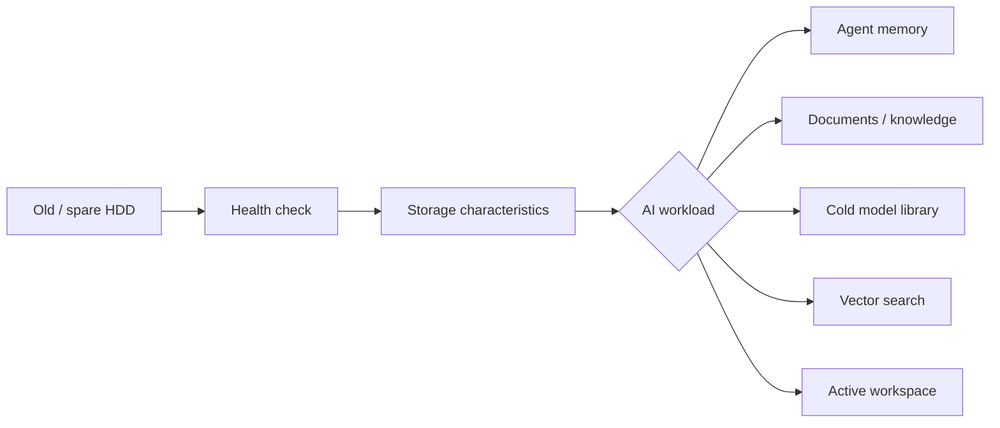
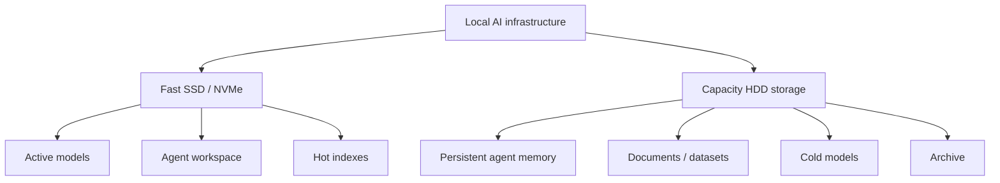

# Your Local AI Has a Brain. Where Does It Keep Its Memory?

You have local models running.

Maybe there is a coding model on one machine. Maybe another model helps with context. Maybe you are experimenting with agents that can work overnight.

Then eventually a less glamorous question appears:

**Where is all of this going to live?**

Not GPU memory. Not the context window.

Actual persistent memory.

Agent histories. Extracted skills. Documents. Artifacts. Old models. Invoices. Images. Knowledge that should still be there after the model stops running.

I ran into this question while building my own local AI infrastructure.

And then I looked at two hard drives I already had.

They came from an old surveillance setup. One was about 3 TB. The other was about 10 TB. They had been sitting around doing approximately nothing.

Could they become useful AI infrastructure?

## You may already own part of your AI memory system

The obvious answer to local storage is easy to make expensive.

Buy a NAS. Add several new drives. Configure redundancy. Add networking. Suddenly the memory system around your local AI starts looking like another infrastructure project.

Sometimes that is exactly what you need.

But sometimes you just need somewhere sensible to put persistent, capacity-oriented AI data.

A relatively inexpensive multi-bay direct-attached enclosure can expose ordinary SATA drives to an existing Linux machine over USB. No full NAS is required just to begin.

The interesting question is not whether an old HDD can store files.

Of course it can.

The useful question is:

**What kind of AI memory is this particular drive actually good for?**



Those workloads are not equivalent.

## A healthy HDD can be excellent AI storage

A rotational hard drive is slow compared with NVMe at random access.

That does not make it useless.

For many AI workloads, capacity and persistence matter more than millisecond access.

A healthy HDD can be a very reasonable place for:

- agent histories and persistent memory;
- extracted skills and artifacts;
- documents, invoices, images and datasets;
- archives and retained evidence;
- cold model files that are not currently serving inference;
- bulk data that can be promoted to faster storage when needed.

But the same disk may be a poor place for:

- active build workspaces;
- latency-sensitive model loading;
- heavily random-access vector indexes;
- workloads constantly touching thousands of tiny files.

The architecture can therefore be simple:



You do not need every byte of AI data on your fastest storage.

## But do not trust an old disk because it spins

This was the part I did not want to do manually every time.

I connected the old drives. Linux saw them immediately.

That was encouraging, but it proved almost nothing.

A drive can mount and still be a terrible candidate for persistent data.

So I added a small public command to AI Fleas called `storage-health`.

It lives in the open-source AI Fleas repository, so the same command can be reused outside my own infrastructure:

https://github.com/starodubtsevconsulting/ai-fleas/tree/main/ai-commands/data/storage-health

This is also a small example of what I want AI Fleas commands to be. Not another application you have to adopt wholesale, but a portable operational capability that can be dropped into an AI-assisted workflow and used by either a person or an agent.

The idea is deliberately simple: take the ugly storage evidence that Linux and SMART tools expose and turn it into something useful for someone building AI infrastructure.

Instead of stopping at:

```text
/dev/sdb
SMART PASSED
```

the command can reason in terms of intended use:

```text
AI workload suitability

Agent persistent memory: GOOD
Knowledge/document store: GOOD
Backup/archive: GOOD
Cold model library: GOOD
Vector/search storage: CONDITIONAL
Active inference storage: POOR
Agent workspace/builds: POOR
```

It also explains why.

## The workflow matters more than the command

The storage workflow I ended up with is:


Discovery should be automatic. I should not have to remember whether yesterday's drive was `/dev/sda` or `/dev/sdb`.

Analysis checks the physical evidence: SMART health, temperature, bad sectors, filesystem signatures and storage characteristics.

Recommendation maps that evidence to AI workloads.

Approval matters because a tool should not silently decide that some newly connected disk is now the permanent home of an agent's memory.

Only after that should the infrastructure bind a stable device identity and start using it.

And then it should keep watching.

## It should also speak human

One unexpected part of building the command was realizing how quickly a storage utility becomes unfriendly.

Linux will happily tell you about block devices, filesystem signatures and SMART attributes.

That does not mean you should have to interpret all of them every time.

So the command now has an interactive mode.

Run it without arguments and it discovers external drives and asks what you want to do: inspect storage, check physical health, inspect existing filesystem signatures, qualify the disk for AI use, or run a SMART self-test.

Long tests can take hours, so it shows previous test history and an estimated duration before asking whether to start another one.

The goal is not to hide the evidence.

It is to put an assessment and a next action in front of it.

**Evidence → assessment → what this means → recommended next step.**

That pattern is useful far beyond hard drives.

## Cheap storage does not mean careless storage

There is an important boundary.

An old HDD becoming useful again does not magically become a backup.

If the information is irreplaceable, it still needs another independent copy.

And if a workload needs fast random access, pretending that a large HDD is equivalent to NVMe because both can hold files will eventually hurt.

The useful part is matching the storage to the workload.

That can make the entry cost surprisingly low.

You may already own the drives.

A simple multi-bay enclosure can turn them into direct-attached capacity for a Linux infrastructure node.

A health and suitability check can tell you which jobs they should and should not receive.

Then your local agents have somewhere persistent to put what they learn and produce.

## The local AI stack is bigger than the model

It is easy to spend weeks comparing models.

I certainly have.

But once the models begin doing real work, the surrounding pieces become just as interesting: context, orchestration, vision, storage, persistent memory, monitoring, and the boring machinery that allows an agent to come back tomorrow and still know where its things are.

If you are already running local models and have reached the point where the surrounding infrastructure is becoming the real project, AI Fleas is where I am publishing these reusable pieces as I build and test them:

https://github.com/starodubtsevconsulting/ai-fleas

Sometimes the next useful piece of AI infrastructure is not another GPU.

It is the hard drive that has been sitting on your shelf for five years.

You just need to know whether you should trust it — and what kind of memory it should become.
