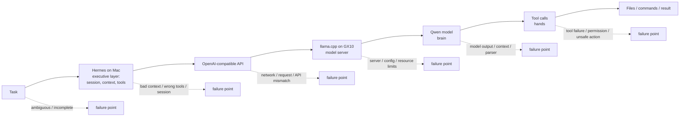

# The model is not the agent — inline visual source

Status: draft visual source for the article
`2026-09-27-i-bought-an-ai-powerhouse-then-the-agent-kept-giving-up.md`.

Final raster asset path:

`notes/articles/assets/2026-09-27-model-is-not-the-agent-stack.png`

## Editorial purpose

Show, at a glance, that a local AI worker is a chain of layers rather than just a model, and that a failure may originate at any layer.

Keep the image explanatory rather than decorative.

## Required message

**The model is not the agent. A local AI worker is a stack, and failures can happen at different layers.**

## Required flow

## Final-image labels

1. **Task**
2. **Hermes on Mac**
   - executive layer: session, context, tools
3. **OpenAI-compatible API**
4. **llama.cpp on GX10**
   - model server
5. **Qwen model**
   - brain
6. **Tool calls**
   - hands
7. **Files / commands / result**

Bottom-line caption:

**Failures can happen at different layers — not only in the model.**

## Style

- 16:9 editorial inline diagram
- white or very light background
- dark, high-contrast typography
- one restrained warning/accent color
- simple flat icons
- no generic humanoid robot imagery
- keep failure callouts secondary to the main flow
- readable at article width on desktop and mobile

## Alt text

The model is not the agent: a local AI worker is shown as a stack from task to Hermes on Mac, API, llama.cpp on GX10, Qwen, tool calls, and final files or commands, with possible failure points under each layer.

## Current generated concept

The approved concept uses a horizontal row of seven cards with small failure warnings beneath the first six layers. The final result card is visually distinct and successful. Preserve that structure when the final PNG is added.
