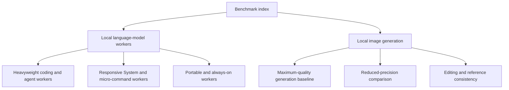

# Benchmark index

These benchmarks evaluate practical local AI configurations for specific jobs. They are acceptance tests for the stated hardware, runtime, model, precision, and workload—not universal model rankings.

## Benchmark families

| Benchmark | What it is for | Selection principle | Current state |
|---|---|---|---|
| [Local language models](local-models/README.md) | Coding, agent/tool workflows, System agents, portable inference, and always-on workers | Strongest useful model that remains fast, reliable, and appropriately sized for its assigned job | Multiple hardware baselines recorded; additional candidates planned |
| [Local image generation](local-image-generation/README.md) | Photorealistic images, anime/illustrated stories, covers, text rendering, and controlled reference edits | Human-reviewed quality joined with startup, latency, memory, stability, architecture support, and license fit | FLUX.2-dev quality baseline and Illustrious XL v2 anime baseline recorded; broader corpus pending |

## Local language-model reports

| Report | Practical purpose | Current model or target | Status |
|---|---|---|---|
| [ASUS Ascent GX10](local-models/gx10.md) | Heavyweight local coding and agent worker with long context and reliable Hermes tool use | Qwen3-Coder-Next Q5_K_M is the current practical choice; larger and higher-quality candidates remain under test | Controlled throughput, latency, memory, and tool-use evidence recorded |
| [RTX 3080 Ti workstation](local-models/rtx-3080-ti.md) | Responsive local System agent and frequent micro-command worker | Qwen3.5 9B Q4_K_M is the current fully GPU-resident Hermes-compatible candidate | Direct inference and operational Hermes evidence recorded |
| [MacBook Pro M5](local-models/macbook-pro-m5.md) | Portable local inference without consuming larger worker capacity | Start near a 30B Q6 class and step down until normal laptop headroom and responsiveness are preserved | Controlled benchmark pending |
| [MINISFORUM UM790 Pro](local-models/minisforum-um790-pro.md) | Compact always-on worker for small background, scheduled, and classification tasks | Determine the strongest practical CPU/integrated-GPU configuration | Controlled benchmark pending |

The shared [language-model methodology](local-models/methodology.md) defines direct-inference measurements, Hermes acceptance testing, purpose profiles, interpretation boundaries, and public-result privacy.

## Image-generation candidates

| Candidate | Benchmark purpose | Capabilities | Production disposition | Status |
|---|---|---|---|---|
| Illustrious XL v2.0 BF16 | Fast anime and illustrated-story production baseline, including recurring-character frames | Text-to-image | CreativeML OpenRAIL-M; commercial use permitted subject to use restrictions and separate output/IP review | Official 6.94 GB checkpoint verified; 11 s load; six-frame acceptance set completed; consistency gaps recorded |
| FLUX.2-dev BF16 | Maximum-quality full-precision baseline on large unified-memory hardware | Text-to-image and image editing | Evaluation/non-commercial; separate commercial license required for commercial model operation | Downloaded, loaded, endpoint-tested, and startup measured; full quality corpus pending |
| FLUX.2-dev NVFP4 | Blackwell-oriented reduced-precision comparison against BF16 | Text-to-image and image editing | Evaluation/non-commercial unless separately licensed | Access, loader integration, and benchmark pending |
| FLUX.1 Krea-dev BF16 | Photographic and aesthetic quality comparison | Text-to-image | Verify model-specific terms before use beyond private evaluation | Pending |
| FLUX.1 dev BF16 | Previous-generation baseline | Text-to-image | Verify model-specific terms before use beyond private evaluation | Pending |
| FLUX.1 Kontext-dev BF16 | Editing and reference-consistency baseline | Image editing | Verify model-specific terms before use beyond private evaluation | Pending |

See the [image benchmark methodology and fixed corpus](local-image-generation/README.md), [GX10 image report](local-image-generation/gx10.md), [candidate metadata](local-image-generation/candidates.json), and [test cases](local-image-generation/cases.json).

Use the [`local-image-benchmark` command](../../ai-commands/data/local-image-benchmark/local-image-benchmark.command.md) for plain-language help, candidate selection, controlled runs, result summaries, service diagnostics, and stream regression tests. The Python files in the benchmark directory are internal workers behind that command.

## Reading benchmark results

- Start with the workload purpose; a model that wins one role may be wrong for another.
- Treat direct inference, full agent workflows, image quality review, and application end-to-end timing as separate measurements.
- A model fitting in memory does not prove adequate headroom, stability, or responsiveness.
- A technically strong result does not imply production eligibility; licensing is an independent acceptance gate.
- Public reports contain sanitized hardware and runtime facts only. Private topology, accounts, credentials, and personal paths do not belong in this repository.

## Adding a benchmark

1. Define the practical job, candidate role, capabilities, and acceptance criteria.
2. Record exact model/runtime configuration and use a fixed, reviewable workload.
3. Measure startup, task latency or throughput, resource use, stability, and failures.
4. Verify output independently and add human review where correctness is not fully automatable.
5. Record licensing and deployment constraints separately from technical performance.
6. Keep public artifacts reproducible and free of personal or private infrastructure data.
7. Add the new report to this index.
