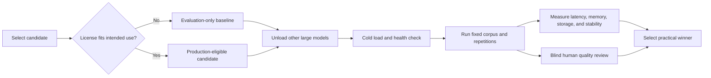
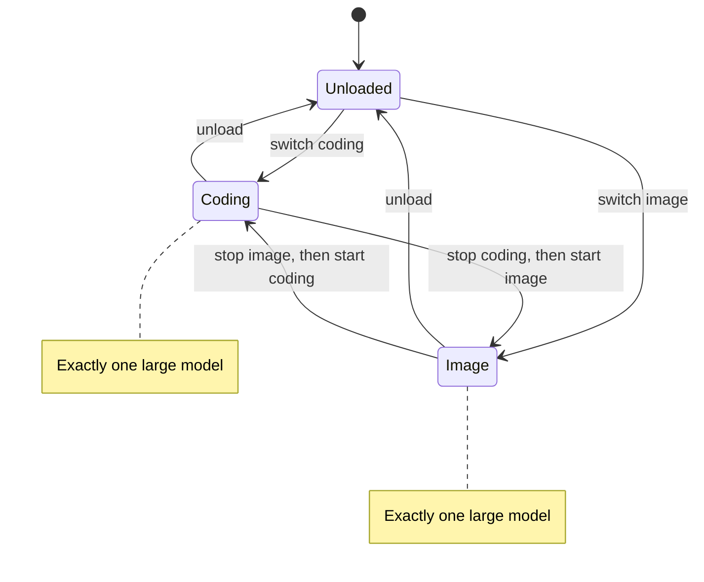

# Local image-generation benchmarks

[All benchmarks](../README.md)

This benchmark finds the strongest practical local image generator for multimedia work. It is quality-first: the largest reliable native/high-precision configuration is established before quantized variants are compared.

## Purpose and acceptance

The practical job is private, local generation of high-quality photographs, illustrations, covers, typography, and controlled reference edits. Each candidate is classified by benchmark role, intended use, capabilities, license disposition, and production eligibility in `candidates.json`.

A practical winner must combine human-reviewed output quality with acceptable cold start, generation latency, memory headroom, storage, repeated-run stability, ARM64/CUDA compatibility, and a license compatible with the intended deployment. A technically superior model is not a production winner when its license does not permit the intended use.



The license decision occurs before performance testing and again before final selection. An evaluation-only model may establish a useful quality ceiling, but it cannot silently become the production choice.

## Current results

This dashboard mirrors the local language-model benchmark registry. A completed baseline means the recorded configuration ran successfully and produced reviewable evidence; it does not mean the candidate passed production acceptance.

| Hardware | Candidate | Purpose | Load or startup | Generation | Acceptance status |
|---|---|---|---:|---:|---|
| ASUS Ascent GX10, 128 GB unified memory | **Illustrious XL v2.0 BF16** | Anime and illustrated-story consistency baseline | 11 s switch/load to ready | 8.77–17.87 s for six fixed 30-step frames | Preliminary baseline complete; technically valid images, but visual reliability and recurring-character consistency failed at tested settings |
| ASUS Ascent GX10, 128 GB unified memory | **FLUX.2-dev BF16** | Maximum-quality full-precision generation/editing baseline | 10 min 19 s–12 min 1 s stopped-to-ready | 3 min 51 s–3 min 55 s for observed 1024×1024, 50-step browser runs | Operational baseline complete; full fixed quality corpus pending; not production-eligible without a separate commercial license |

## Benchmark reports and records

- [ASUS Ascent GX10 report](gx10.md) — shared hardware report for FLUX.2-dev and Illustrious XL v2.0, including startup, generation, resource, transport, license, and qualitative findings.
- [Illustrious XL v2.0 machine-readable result](results/illustrious-xl-v2-gx10-2026-09-21.json) — sanitized parameters, hashes, timing, storage, memory, lifecycle, and qualitative decision for the six-frame preliminary baseline.
- [`candidates.json`](candidates.json) — canonical ordered model registry, benchmark purpose, intended use, capabilities, license disposition, and production eligibility.
- [`cases.json`](cases.json) — canonical fixed test corpus and generation parameters.

The Illustrious record is intentionally classified as a **preliminary baseline** because each fixed anime case currently has one retained run. The shared acceptance method calls for three repetitions per compatible case where practical plus blind scoring. Those remaining measurements must be added before treating it as a completed comparative benchmark or selecting it for production.

## ASUS GX10 target

The first target is one ASUS Ascent GX10 with NVIDIA GB10 and 128 GB unified memory. The benchmark records the exact model revision, runtime, precision, prompt parameters, retained PNG, latency, storage, process/system memory, repeated-run stability, and ARM64/CUDA environment.

Candidate order depends on the intended job:

1. `Qwen/Qwen-Image` in BF16 — production-eligible prompt-adherence, scene-composition, anime, and illustrated-story candidate.
2. `OnomaAIResearch/Illustrious-XL-v2.0` in BF16 — fast production-relevant anime and illustrated-story baseline.
3. `black-forest-labs/FLUX.2-dev` in BF16 — maximum-quality generation/editing baseline.
4. `black-forest-labs/FLUX.2-dev-NVFP4` — official Blackwell-oriented lower-precision comparison.
5. `black-forest-labs/FLUX.1-Krea-dev` in BF16 — photographic/aesthetic comparison.
6. `black-forest-labs/FLUX.1-dev` in BF16 — FLUX.1 baseline.
7. `black-forest-labs/FLUX.1-Kontext-dev` in BF16 — editing/reference-consistency baseline.

Qwen-Image is pinned to repository revision `75e0b4be04f60ec59a75f475837eced720f823b6` and is distributed under Apache 2.0. The production-eligible classification applies to model operation under that license; generated-content and third-party intellectual-property review remain separate acceptance requirements.

Illustrious XL v2.0 is distributed as one 6.94 GB SDXL safetensors checkpoint under CreativeML OpenRAIL-M metadata. That license permits commercial model use subject to its use restrictions, but it does not remove the operator's responsibility for generated content, third-party intellectual property, or separately licensed LoRAs and derivatives. The benchmark pins the official repository revision and checkpoint SHA-256 and does not add a LoRA.

FLUX.2-dev is deliberately ahead of the original card candidates: it is a newer 32B open-weight model that supports generation and editing, and the GX10 is one of the few local machines with enough unified memory to test the full BF16 checkpoint practically. Model access is gated and its license must be accepted by the operator before weights can be downloaded.

FLUX.2-dev was downloaded during exploratory setup under the mistaken assumption that the gated developer weights were free for the intended commercial use. They are not: the benchmark classifies this checkpoint as evaluation/non-commercial, and it cannot become the production model without a separate commercial license. The retained download is used only to establish a quality/performance baseline and to prevent the same licensing assumption from being repeated.

## Measurement set

For consistency with the existing local-model benchmarks, record:

- exact model revision, precision, runtime/container, driver, CUDA, architecture, and package versions;
- downloaded/cache storage and retained output size;
- cold service start from stopped state to successful health response;
- pipeline/model load from Python process start to application readiness, reported separately from service overhead and full-machine reboot time;
- pipeline load time separately from container/service overhead where measurable;
- idle model memory, peak load memory, peak generation memory, minimum available system memory, and swap activity;
- first-generation latency after load, warm-generation latency, dimensions, steps, guidance, seed, and output hash;
- three repeated runs per fixed case where practical, reporting median and range;
- failures, retries, crashes, OOM events, and endpoint health after each run;
- blind human scores for quality, adherence, anatomy/counting, text, composition, and reference consistency;
- switch time to unload the image model and restore the coding model, including a real inference check.

Startup, inference, and end-to-end application timing are reported separately. Linux file cache is not treated as model residency, and a low-step smoke test proves only endpoint/PNG validity—not maximum quality.

The service also exposes llama.cpp-web-client compatibility routes. `/props` advertises the active image model under both its full repository ID and short name. `/v1/chat/completions` treats the last user message as an image prompt, supports normal and streamed OpenAI-compatible responses, stores the PNG under `/outputs`, and returns a same-origin Markdown image link. During a long streamed request it emits an SSE keep-alive every ten seconds so an authenticated reverse proxy does not mistake active generation for an idle origin. Streams carrying `X-Conversation-Id` survive a physical disconnect in a five-minute replay buffer; `/v1/streams/lookup`, `GET /v1/stream`, and `DELETE /v1/stream` let the browser discover, resume, or stop that session without starting duplicate generation. This compatibility path lets the existing protected browser UI exercise image generation; `/v1/images/generations` remains the canonical benchmark API.

## Public-result privacy

Public results must not contain hostnames, IP addresses, account or personal names, secret identifiers, private service URLs, tokens, or personal filesystem paths. Use `--machine-label` with a generic hardware label such as `gx10-128gb`. Exact private topology and authentication evidence stay in the private platform runbook.

## Files

- `../../../ai-commands/data/local-image-benchmark/` — human-facing command, help, safety checks, examples, and tests.
- `cases.json` — fixed, reviewable test corpus.
- `candidates.json` — ordered model/runtime configurations.
- `run.py` — internal one-candidate runner used by the command; retains artifacts and JSONL measurements.
- `serve.py` — internal OpenAI-compatible service worker used by the command and managed service.
- `test_resumable_stream.py` — internal regression worker for replay and duplicate-request suppression.
- `gx10-image-generator.service` — user-service template used by the profile model-mode switch.
- `gx10-anime-generator.service` — mutually exclusive Illustrious XL service template.
- `gx10-qwen-image-generator.service` — dedicated mutually exclusive Qwen-Image service template.
- `image-generator.env.example` — non-secret selected-model configuration.
- `anime-generator.env.example` — non-secret single-file SDXL configuration.
- `qwen-image-generator.env.example` — pinned Qwen configuration with explicit true-CFG and negative-prompt semantics.
- `qwen-image-mode-conflict.conf` — reciprocal systemd exclusion for direct/manual service starts.
- `summarize.py` — internal reporting worker that creates a Markdown comparison table.
- `results/` — sanitized, machine-readable completed benchmark records; generated media remains private unless separately approved.
- `gx10.md` — sanitized hardware-specific report and current measurements.
- `requirements.txt` — minimum Python dependencies; every run additionally records the resolved package versions.
- `references/reference-edit.svg` — fixed editing reference; the runner renders it deterministically to 1024×1024 through CairoSVG.

## Run layout

```text
runs/<run-id>/
  environment.json
  resolved-packages.txt
  results.jsonl
  outputs/<candidate>/<case>/<seed>.png
```

## Running on the GX10

Use the human-facing command for normal operation. It explains the workflow, lists each model's purpose and license status, and invokes the Python workers with consistent safety checks:

```bash
ai-commands/data/local-image-benchmark/local-image-benchmark.command.sh explain
ai-commands/data/local-image-benchmark/local-image-benchmark.command.sh candidates
```

The `run.py`, `serve.py`, `summarize.py`, and `test_resumable_stream.py` files are implementation details. Direct Python invocation is reserved for debugging the command itself.

Use an isolated environment; do not replace the machine's existing Hermes/Qwen Python environment.

```bash
docker pull nvcr.io/nvidia/pytorch:26.08-py3
docker build -t ai-fleas/gx10-image-benchmark:26.08 .
```

The pinned NVIDIA PyTorch container is the preferred ARM64/Grace Blackwell base. Mount this directory, a persistent Hugging Face cache, and the output directory into the container; install `requirements.txt` inside it. A native virtual environment is also supported when a CUDA-enabled ARM64 PyTorch build is already installed:

```bash
python3 -m venv /opt/image-benchmark
/opt/image-benchmark/bin/pip install -U pip
/opt/image-benchmark/bin/pip install -r requirements.txt
LOCAL_IMAGE_BENCHMARK_PYTHON=/opt/image-benchmark/bin/python \
ai-commands/data/local-image-benchmark/local-image-benchmark.command.sh run \
  --candidate flux2-dev-bf16 \
  --output-root /data/image-benchmarks/runs \
  --repeat 3 \
  --machine-label gx10-128gb \
  --confirm-model-isolated
```

For gated Black Forest Labs repositories, authenticate with a Hugging Face token that has accepted the applicable model terms. Never put the token in this repository or the result records.

Run one candidate at a time. The full-precision FLUX.2 test should be run while unrelated large inference models are not resident; otherwise a successful load or memory measurement is not representative. Stopping an existing worker is a separate operational action and must be coordinated with its users.



The switch is sequential: the active model is stopped before the target starts. A failed target start returns to a safe single-mode or unloaded state rather than leaving both models resident.

## Review and selection

Automatic measurements do not select the winner. Retain every output, then review blind by case for:

- visual quality;
- prompt and prohibited-object adherence;
- anatomy and object-count correctness;
- exact composition and requested text;
- editing/reference consistency where applicable;
- repeat stability.

The default image-generator worker is selected only after the human review is joined with the performance/resource table. Generation and image validation remain separate capabilities.

## Sources

- [Qwen-Image model card](https://huggingface.co/Qwen/Qwen-Image)
- [Qwen-Image Apache 2.0 license](https://huggingface.co/Qwen/Qwen-Image/blob/main/LICENSE)
- [FLUX.2-dev model card](https://huggingface.co/black-forest-labs/FLUX.2-dev)
- [FLUX Non-Commercial License v2.1](https://huggingface.co/black-forest-labs/FLUX.2-dev/blob/main/LICENSE.md)
- [Black Forest Labs usage policy](https://bfl.ai/legal/usage-policy)
- [Official FLUX.2-dev NVFP4 model](https://huggingface.co/black-forest-labs/FLUX.2-dev-NVFP4)
- [FLUX.1 Krea-dev model card](https://huggingface.co/black-forest-labs/FLUX.1-Krea-dev)
- [Diffusers FLUX documentation](https://huggingface.co/docs/diffusers/api/pipelines/flux)
- [llama.cpp resumable-stream implementation](https://github.com/ggml-org/llama.cpp/blob/master/tools/server/server-stream.cpp)
