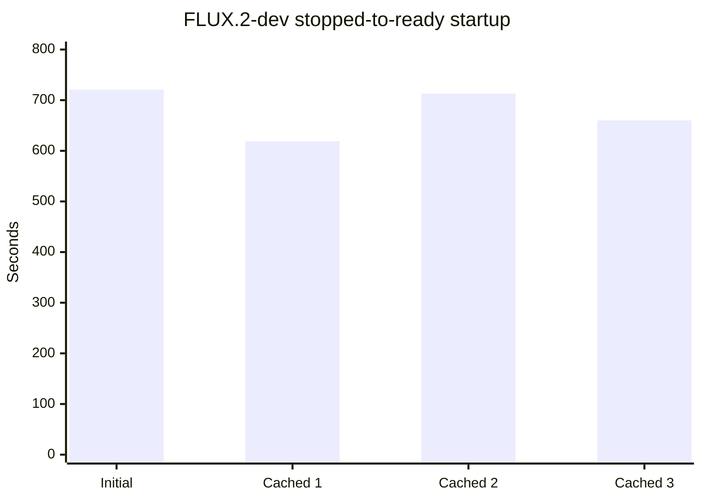
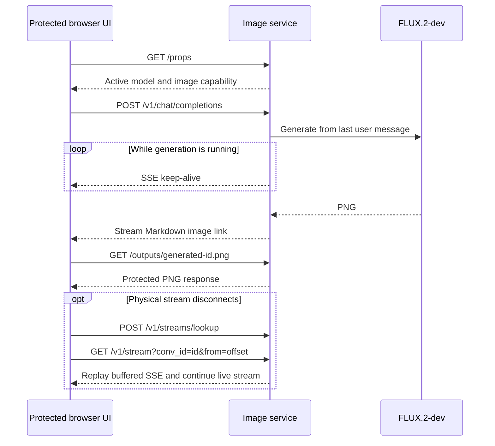
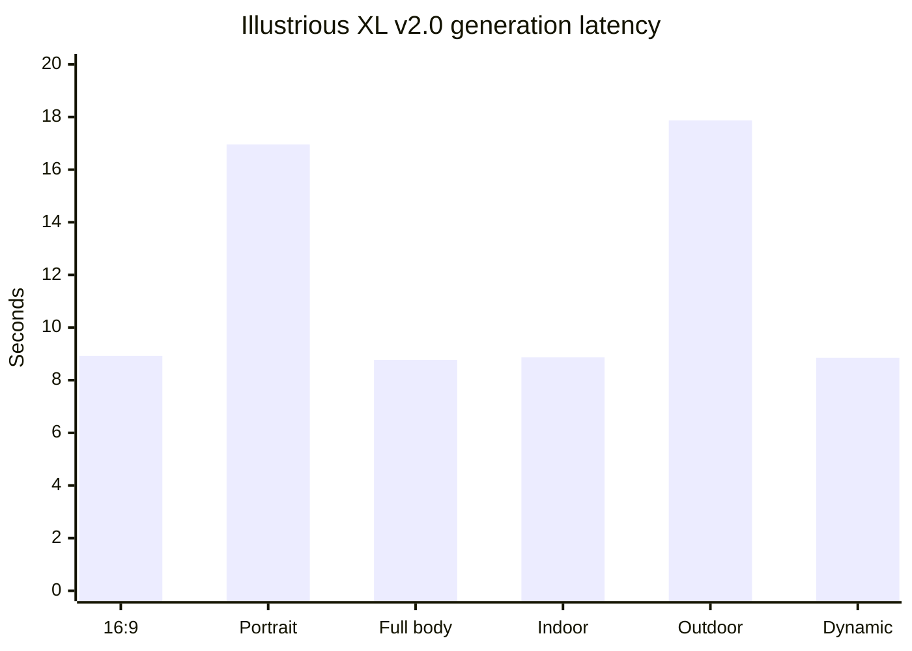

# ASUS Ascent GX10 — local image generation

This report evaluates one NVIDIA GB10 system with 128 GB unified memory as a high-quality local image-generation worker. It contains only sanitized, reproducible benchmark facts; private machine topology, accounts, authentication, and filesystem details are intentionally excluded.

## Purpose

The target workload is private multimedia production: photorealistic images, illustrations, 16:9 covers, exact-text stress tests, and controlled reference edits. The benchmark starts with the highest-quality configuration that fits, then compares lower-precision or specialized candidates for improvements in startup time, memory, throughput, and operational fit.

The winner must satisfy all of these dimensions:

- blind human-reviewed quality and prompt adherence;
- reliable generation and editing where claimed;
- practical cold-start and warm-generation latency;
- enough unified-memory headroom for stable operation;
- repeatable ARM64/CUDA operation;
- licensing compatible with the intended deployment.

## License disposition

FLUX.2-dev BF16 was downloaded during exploratory setup under the mistaken assumption that the gated developer weights were free for the intended commercial use. The [FLUX Non-Commercial License v2.1](https://huggingface.co/black-forest-labs/FLUX.2-dev/blob/main/LICENSE.md) does not permit commercial or production operation of the model without a separate commercial license; the benchmark also follows the official [usage policy](https://bfl.ai/legal/usage-policy).

This candidate is therefore **benchmark-only, evaluation/non-commercial, and not production-eligible** in the current configuration. Its measurements remain useful as a maximum-quality baseline. A production recommendation must either select a model with compatible terms or document a separately obtained commercial license.

## Current FLUX.2-dev BF16 evidence

| Metric | Result |
|---|---:|
| Benchmark role | Maximum-quality full-precision baseline |
| Capabilities under test | Text-to-image and image editing |
| Model revision | `26afe3a78bb242c0a8bb181dcc8937bb16e5c66c` |
| Precision | BF16 |
| Repository files | 39 |
| Local cache storage after completed download | 166 GB |
| Incomplete files after validation | 0 |
| Cold service start to application ready | 12 min 1 s |
| Warm-cache service-restart samples | 10 min 19 s; 11 min 53 s; 11 min 0 s |
| Median pipeline/model load | 11 min 22 s across four loads |
| Other large model resident during load | No |
| Post-load system memory used | 112.4 GiB snapshot after smoke generation |
| Post-load system memory available | 9.2 GiB |
| Post-load swap used | 0.7 GiB of 16 GiB |
| Observed during 50-step generation | 117 GiB used; 4.5 GiB available |
| Idle GPU utilization | 0% |
| Smoke request | 512×512, 4 steps, guidance 4.0, seed 20260920 |
| Smoke generation time | 10.12 s |
| Smoke output | Valid 8-bit RGB PNG, 362,097 bytes |
| Smoke output SHA-256 | `4ed3e43413039b6819629e4ebece78568378ba48c8ef7fab1c6646fdb89edcf5` |
| Browser high-quality requests | 1024×1024, 50 steps; 3 min 51 s and 3 min 52 s |
| First browser output | Valid 8-bit RGB PNG, 1,569,915 bytes |
| First browser output SHA-256 | `026c42c6851903eca5a64c257a9247f13ee8838b872a4972f484c7ce93964f42` |
| Keep-alive end-to-end check | 1024×1024, 50 steps; 3 min 55 s; browser PNG fetch HTTP 200 |
| Keep-alive check output | Valid PNG, 1,478,250 bytes; SHA-256 `bafe02b6f8146523b07060c0b3d41ae8235b3a765960fa424928f379b8d2f352` |
| Production eligible | No—separate commercial license required |

The GX10 itself was not rebooted during these measurements. Each sample began with the image service stopped and the model absent from memory. Service-to-ready measures the systemd start through application readiness; pipeline/model load measures the Python server process through completion of `DiffusionPipeline.from_pretrained(...)` and is the closest observed measure of loading the model into unified memory.

| Sample | Service start | Pipeline start | Application ready | Service-to-ready | Pipeline/model load |
|---|---|---|---|---:|---:|
| Initial load | 23:19:51 | 23:19:55 | 23:31:52 | 12 min 1 s | 11 min 57 s |
| Cached restart 1 | 23:39:40 | 23:39:45 | 23:49:59 | 10 min 19 s | 10 min 14 s |
| Cached restart 2 | 23:51:38 | 23:51:43 | 00:03:31 | 11 min 53 s | 11 min 48 s |
| Cached restart 3 | 00:15:04 | 00:15:08 | 00:26:04 | 11 min 0 s | 10 min 56 s |

The 4-step image is only an endpoint and file-validity smoke test; it is not included in maximum-quality scoring.

The chart shows that cached weights do not make BF16 startup cheap: all four observations remain around ten to twelve minutes.

Three additional stopped-service-to-ready measurements were collected while deploying browser compatibility changes with the model files already cached: 10 minutes 19 seconds, 11 minutes 53 seconds, and 11 minutes. Together with the initial 12-minute-1-second load, these show that startup is operationally expensive and variable even when no download is involved. The samples are reported individually because four observations are insufficient for a stable distribution. Command-level health loops can be longer because they include shutdown and polling overhead; the last restart took 11 minutes 32 seconds end to end, including about 32 seconds spent stopping the prior worker. Exact journal timestamps are used for benchmark comparison.

The existing protected browser frontend expected llama.cpp-style `/props` discovery and initially reported 404 even though the canonical image API was healthy. The service now accepts the full and short model names, supports normal and streamed chat completions, and returns a same-origin Markdown link to the generated PNG. Both discovery aliases and both response modes passed local endpoint validation.

The first two browser-driven 1024×1024, 50-step requests completed successfully at the origin in 3 minutes 51 seconds and 3 minutes 52 seconds. The browser nevertheless received HTTP 524 because the protected proxy saw no response data while synchronous generation was running. This was a transport timeout, not a model crash: both PNGs were retained and the endpoint remained operational. The streamed compatibility route now begins the generation as a background task and sends an SSE keep-alive every ten seconds until it can return the final image link. A direct 1024×1024, 3-step streamed request emitted a keep-alive before returning its image and `[DONE]` after 19.18 seconds. The full protected-browser check then ran 50 steps for 3 minutes 55 seconds without a 524 and fetched the resulting PNG through the browser route with HTTP 200. This closes the observed proxy-idle failure. The canonical benchmark endpoint remains unchanged.

A later browser request exposed a second, distinct compatibility gap: after a transient stream disconnect, the llama.cpp Web UI attempted `POST /v1/streams/lookup` and `GET /v1/stream?conv_id=...&from=...`; both routes returned 404, so the UI could not reattach even though the model completed generation and stayed healthy. The adapter now retains each conversation's SSE bytes independently of its physical connection for five minutes and implements lookup, byte-offset replay, and deletion. A live regression deliberately disconnected after the first 14-byte keep-alive, found the same active session through lookup, resumed from byte 14, and received the final image plus `[DONE]` without a duplicate generation.

GB10 exposes unified memory differently from a conventional discrete GPU: this run's `nvidia-smi` did not report total or used device memory, and Docker's memory counter excluded the CUDA/unified allocation. The report therefore uses OS-level total/available memory and swap for operational headroom. The post-load and active-generation values are whole-system snapshots, not a claim that every used byte belongs to the model. The protected 50-step run reached an observed snapshot of 117 GiB used and 4.5 GiB available. A controlled stopped-versus-loaded delta and higher-frequency sampled peak are still required.

## Illustrious XL v2.0 anime baseline

The official `OnomaAIResearch/Illustrious-XL-v2.0` checkpoint was evaluated as a production-relevant anime and illustrated-story baseline. Repository revision `69459c1` contains one 6,938,040,674-byte safetensors checkpoint with SHA-256 `c2a1a3eaa13d4c107dc7e00c3fe830cab427aa026362740ea094745b3422a331`. The repository declares CreativeML OpenRAIL-M. That permits commercial use subject to the license's use restrictions; generated-content and third-party-IP review remain independent requirements, and no future LoRA inherits approval automatically.

The sanitized machine-readable record is [`results/illustrious-xl-v2-gx10-2026-09-21.json`](results/illustrious-xl-v2-gx10-2026-09-21.json). Retained PNGs remain in private benchmark storage; the public record contains only generic hardware labels, parameters, timings, sizes, hashes, and review findings.

The GX10 had 526 GB free before download and 519 GB free afterward, so no existing model needed to move to network storage. FLUX.2-dev remains installed locally. The managed lifecycle unloaded FLUX before starting Illustrious and verified that Illustrious was the sole active mode.

| Measurement | Observed result |
|---|---:|
| Checkpoint size | 6.94 GB |
| Service switch/load to readiness | 11 s |
| Precision/runtime | BF16, `StableDiffusionXLPipeline.from_single_file`, CUDA ARM64 container |
| 16:9 story frame | 1344×768, 30 steps, 8.92 s |
| Character portrait | 1024×1024, 30 steps, 16.96 s |
| Character full body | 768×1344, 30 steps, 8.77 s |
| Character indoor frame | 1344×768, 30 steps, 8.87 s |
| Character outdoor frame | 1344×768, 30 steps, 17.87 s |
| Character dynamic-pose frame | 1344×768, 30 steps, 8.85 s |
| Peak whole-system used during sampled generation | 20.34 GB |
| Minimum whole-system available during sampled generation | 110.25 GB |

All six retained PNGs passed decoding and hash verification. The model produced attractive anime rendering quickly, and the red scarf, green eyes, and dark school-style outfit survived across most views. However, the fixed-prompt consistency set also exposed production blockers: hair color/style and the crescent clip drifted, the first 16:9 frame duplicated the character, the full-body frame introduced accessory/composition artifacts, the sketchbook was omitted or distorted, and multiple frames added pseudo-text or viewfinder marks despite explicit prohibitions.

Quality at these tested settings is not reliable. The service reliably returns a technically valid image, but semantic and compositional correctness varies sharply: some outputs are attractive while others merge, duplicate, omit, or deform requested elements. The practical operator description is a **“hallucinating painter”**—fast and visually capable, but liable to smash unrelated scene details together. A successful HTTP response and decodable PNG must therefore not be counted as a successful production frame without visual review.

The result therefore establishes Illustrious XL v2.0 as a fast anime experimentation baseline with excellent GX10 resource headroom, but not a reliable production generator at the tested settings and not a passing recurring-character solution. The next experiment should evaluate a separately licensed consistency mechanism or character LoRA as its own candidate; it must not be folded silently into this baseline.

## Remaining measurements

- controlled stopped-versus-loaded system-memory delta;
- full-machine reboot-to-ready timing, kept distinct from service/model load time;
- peak system/unified memory and swap during cold load;
- peak memory and utilization during generation;
- first high-quality generation latency and warm-run latency;
- three repetitions of each fixed compatible case at the recorded steps, guidance, dimensions, and seeds;
- stability and endpoint health after the corpus;
- blind human quality/adherence scores and retained PNG hashes;
- image-to-coding switch time plus real coding inference verification;
- equivalent results for the NVFP4 and other eligible comparison candidates.

All results are empirical for this hardware/runtime/configuration and are not general performance claims.
