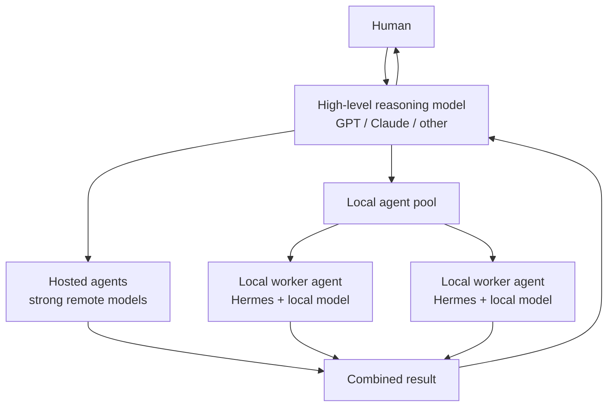

# Local Model Benchmarks

[All benchmarks](../README.md)

## Why local workers

A local model does not have to replace a high-level reasoning model. A useful architecture is to keep a strong hosted model such as GPT or Claude in the coordinating/reasoning role and delegate suitable work to a pool of agents. Some agents can use hosted models while others run locally.

Local workers are especially useful for repetitive, long-running, or high-volume tasks where using a hosted model for every token would be unnecessarily expensive. They can run on demand or continuously, including 24/7 worker-style workloads, while the stronger reasoning model remains available for coordination, difficult decisions, and escalation.

The purpose of these benchmarks is practical: find the strongest local model that can run at an acceptable speed and reliability on the available hardware.

Image-generation models use a separate quality-first corpus and retained-output workflow: [local image-generation benchmarks](../local-image-generation/README.md).

## Current results

| Hardware | Current choice | Context | Generation | Status |
|---|---|---:|---:|---|
| ASUS Ascent GX10, 128 GB unified memory | **Qwen3-Coder-Next Q5_K_M** | 65,536 | 55.68 tok/s | Default single-GX10 worker |
| RTX 3080 Ti, 12 GiB VRAM | **Qwen3.5 9B Q4_K_M** | 65,536 | 95.4 tok/s direct | Hermes-compatible System-agent candidate |
| MacBook Pro M5, ~40 GB unified memory | **Qwen 8B-class** | TBD | TBD | Operationally fast; top-down benchmark pending |
| MINISFORUM UM790 Pro, 32 GB DDR5 | TBD | TBD | TBD | Always-on small-worker benchmark pending |

## Benchmark reports

- [ASUS Ascent GX10](gx10.md) — Qwen worker comparison plus DeepSeek V4 and Gemma 4 31B experiments.
- [RTX 3080 Ti workstation](rtx-3080-ti.md) — System-agent target; 30B Q8/Q4, 8B and 9B experiments plus Hermes overhead.
- [MacBook Pro M5](macbook-pro-m5.md) — portable local-inference tier; benchmark starts from ~30B Q6 and works downward.
- [MINISFORUM UM790 Pro](minisforum-um790-pro.md) — compact always-on worker with Ryzen 9 7940HS, Radeon 780M and 32 GB DDR5; benchmark pending.
- [Methodology](methodology.md) — what is measured and how direct inference differs from full agent acceptance testing.

## Main findings

**GX10:** Qwen3-Coder-Next Q5_K_M remains the preferred worker. Both Qwen candidates and compressed DeepSeek V4 Flash 0731 passed the controlled Hermes tool-use fixture. TrevorJS Gemma 4 31B IT Uncensored Q8_0 is installed as a separate opt-in mode and fits with ample memory headroom, but generated only 6.80 tok/s and failed the fixture by writing correct contents to the wrong directory. It is an uncensored chat/quality experiment, not an accepted worker or default.

**RTX 3080 Ti:** the 30B candidates work but are too slow for an interactive Hermes System agent. Qwen3 8B is fast but cannot satisfy Hermes' 64K context requirement. Qwen3.5 9B Q4_K_M provides both full GPU residency and a 65,536-token configured context and is the current candidate.

**MacBook Pro M5:** an 8B-class Qwen model is already operationally responsive. The next benchmark starts at ~30B Q6 to determine whether the laptop can serve as a practical medium-size worker while retaining enough memory for normal laptop use.

**MINISFORUM UM790 Pro:** not benchmarked yet. Its candidate role is a compact always-on small worker; testing will determine whether local inference is useful on the Radeon 780M/CPU or whether the machine is better reserved for orchestration and conventional services.

## Next experiments

- Benchmark the MacBook Pro M5 from ~30B Q6 downward.
- Benchmark the UM790 Pro from ~14B Q5 downward.
- Repeat Hermes timing on the RTX 3080 Ti after disabling automatic title generation.
- Run a coding-quality suite on the single-GX10 DeepSeek V4 Flash build before considering a default-model change.
- Test the remaining higher-capacity single-GX10 candidates documented in the GX10 report.
- If a second GX10 becomes available, evaluate the official/high-quality DeepSeek V4 FP8/TP=2 configuration across both boxes. This is distinct from the completed compressed single-GX10 benchmark.

Detailed measurements and historical results remain in the hardware-specific reports rather than this dashboard.
