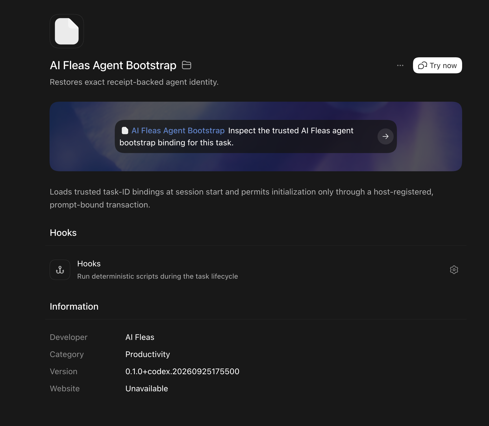
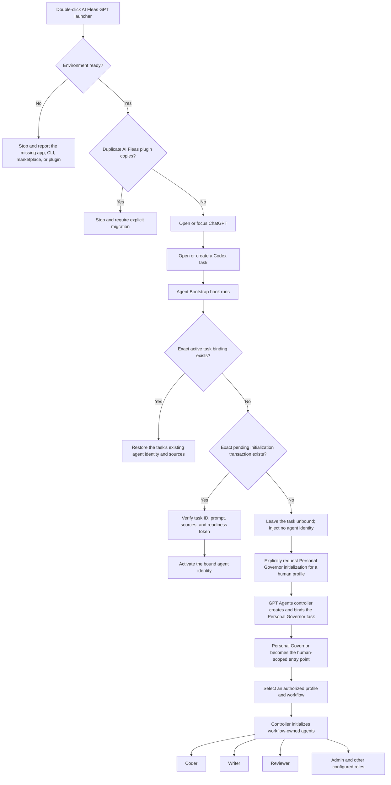

# GPT/Codex App adapter

## Start on macOS

The current launcher supports macOS. Install the ChatGPT desktop application and Codex CLI, then clone this repository.
The `.command` links on GitHub are source previews and cannot execute in a browser. Open the cloned repository in Finder,
navigate to `platforms/gpt-agents/macos`, then Control-click `Setup AI Fleas GPT.command`, choose **Open**, and confirm
**Open** the first time macOS asks. The setup launcher registers the repository's `ai-fleas` plugin marketplace and
installs the Agent Bootstrap and Workflow Router plugins.

If ChatGPT was already running during setup, quit it completely with **ChatGPT → Quit ChatGPT** or `⌘Q`; closing a
window is not sufficient because the process retains its previous plugin snapshot. Then open `AI Fleas GPT.command` from
that same Finder folder. ChatGPT requires a human to review and trust new or changed plugin hooks. Approve those hooks and
start a new Codex task. You can drag the daily launcher to the Dock for easier access. It verifies the application, CLI,
marketplace, and enabled plugins before opening ChatGPT.

Expected Agent Bootstrap plugin page after setup:



The **Try now** button is diagnostic only. It creates an ordinary unbound task, so `No trusted AI Fleas bootstrap binding`
is the expected result. It does not initialize a Governor or workflow agent. Personal Governor initialization must be an
explicit `initialize-governor` controller transaction for an exact human profile; the bootstrap then activates only the
exact task ID registered by that transaction.

After updating the plugin, fully quit and reopen ChatGPT before testing in a new task. Existing tasks and a still-running
desktop process may continue using the previous cached plugin version.

Terminal equivalents:

```sh
node platforms/gpt-agents/launcher.mjs setup
node platforms/gpt-agents/launcher.mjs doctor
node platforms/gpt-agents/launcher.mjs launch
```

If `doctor` reports `migration-required`, the same AI Fleas plugin is still enabled from an older marketplace. Review
the reported plugin IDs, then replace those copies explicitly:

```sh
node platforms/gpt-agents/launcher.mjs setup --migrate
```

The normal setup and launch paths fail closed when duplicate plugin names are enabled, preventing hooks from running
twice. Migration first installs the repository-managed copies and only then removes the reported older copies.

To record an existing private work-profile file during setup:

```sh
node platforms/gpt-agents/launcher.mjs setup --profile /absolute/path/to/sc-work-profile.yml
```

The selected profile path is stored locally and is not committed. Agent creation and reconciliation remain operations of
the profile-aware `gpt-agents` command; the launcher does not duplicate that lifecycle logic. Other operating systems may
implement the same launcher contract, but this first executable intentionally fails closed outside macOS.

## What the launcher does

The launcher prepares and opens the GPT/Codex platform; it does not assign an agent identity to every new task. Identity
is receipt-backed so that an arbitrary chat cannot claim to be a Personal Governor, Coder, Writer, or another agent merely
through its title or prompt.



There are therefore three separate responsibilities:

1. **Launcher:** validates the local installation and opens ChatGPT.
2. **Agent Bootstrap:** restores or activates only an exact controller-registered task binding; an unbound task remains
   unbound.
3. **Personal Governor and GPT Agents controller:** the Governor is the persistent entry point for one governed human.
   After explicit initialization, it can help select authorized profiles and workflows; the controller creates and binds
   their configured agents.

The one-time setup launcher installs the repository marketplace and plugins. The daily launcher only verifies that setup
and opens ChatGPT. Neither launcher silently creates a Governor, selects a human profile, or starts a workflow.

This built-in adapter maps logical AI Fleas agents to user-visible Codex tasks. It owns Codex-specific task creation,
project binding, exact task-ID receipts, task messaging, model and reasoning selection, and recoverable archival.
It also maps the portable read-only `check-update` lifecycle verb to the host application's trusted stable update channel
when that capability is exposed.

It consumes portable workflow and role contracts from `ai-workflows/`. GPT-specific mechanics and role overlays stay here
and may narrow, but never broaden, those contracts.

The portable vocabulary maps as follows:

| Portable concept | GPT/Codex App realization |
| --- | --- |
| logical agent | configured workflow role binding |
| agent instance | user-visible Codex task |
| instance ID | app-returned task/thread ID |
| logical work scope | non-empty selected subset of project records registered by the selected profile workflow |
| primary project | first selected workflow project; hosts rules, commands, workflow definitions, and the Codex saved-project agents |
| associated projects | later selected workflow project entries; unselected registered projects are not required scoped folders |
| missing saved Codex Project | stop before task mutation; the exact folder-backed Project is a GPT-platform prerequisite |
| logical project / group | one exact folder-backed Codex saved project containing its agent tasks |
| project | one profile-registered folder in that saved project's ordered scope |
| activate | create and initialize a task |
| deactivate | recoverably archive the exact task ID |
| send/receive | exact task-ID message delivery |
| bounded utility helper | native GPT subagent, only when the active human binding enables it and the portable utility contract permits the task |
| check update | trusted host update-channel query; no automatic installation |
| delete workflow / delete group | recoverably archive its exact bound tasks; preserve the saved Codex project and scoped folders |

The host persists all immutable IDs in the activated profile's configured `gpt-agents-binding-state.v1` registry. The
caller acts only as a mechanical initialization controller: after resolving and verifying the pre-existing project it creates every
missing roster task directly, including the temporary Admin compatibility role, and initializes them concurrently.

## GPT plugin development

GPT-specific plugins are source-controlled under `platforms/gpt-agents/plugins/`. That directory is authoritative.
Installed plugin copies, Codex caches, marketplace state, task bindings, and dispatch receipts are local runtime
artifacts; do not develop against them or copy them back into the repository as source.

Use this sequence for every plugin implementation or hook change:

1. Edit the plugin under `platforms/gpt-agents/plugins/<plugin-id>/`.
2. Run every test in that plugin's `scripts/` directory.
3. Validate the tracked plugin manifest with the plugin-creator validator.
4. Update the tracked manifest's single Codex cachebuster.
5. Install the tracked plugin through the configured local marketplace.
6. Start a new Codex task and verify the affected lifecycle path.
7. Commit the tracked source, tests, documentation, and manifest together.

Workflow maps and runtime bindings are different concerns: portable maps remain under `ai-workflows/`, while exact
task IDs and runtime receipts remain local and must be reconciled separately on each machine.

Repository ownership is uniform for every GPT integration:

| Concern | Authoritative location |
| --- | --- |
| portable role, flow, state machine, and runtime logic | `ai-workflows/` |
| explicit operator/controller action | `ai-commands/system/gpt-agents/` |
| automatic GPT/Codex lifecycle hook or delivery adapter | `platforms/gpt-agents/plugins/` |
| GPT-specific workflow or role mapping | `platforms/gpt-agents/workflows/` and `platforms/gpt-agents/agents/` |
| installed plugin, cache, task binding, permit, or receipt | local runtime data; never authoritative source |

Apply this split to the whole feature, not one file at a time. For example, the Workflow Router keeps its portable state
machine under `ai-workflows/_common/runtime/` and its Codex hooks under `platforms/gpt-agents/plugins/`; agent bootstrap
uses the same split.

The GPT Personal Governor initializer is also the platform-specific owner of opportunistic utility-subagent routing. It
activates only from an explicit human Governor binding, selects that binding's model/reasoning route per dispatch, and keeps
Governor judgment and workflow-role independence outside utility helpers.

## Common task bootstrap

The [`ai-fleas-agent-bootstrap`](plugins/ai-fleas-agent-bootstrap/README.md) plugin is the GPT host bootstrap layer shared
by workflow-independent and workflow-owned agents. Codex loads it before an agent can reason about its own role. The plugin
restores only exact receipt-backed task identity and gates first-time initialization with a task-ID- and prompt-bound
transaction. It never infers identity from a title, conversation, working directory, or nearby files.

The lifecycle controller remains responsible for creating a fresh task, resolving canonical initialization sources,
registering the pending binding, delivering the exact initialization prompt, verifying readiness, and performing any
successor cutover. Workflow Router behavior begins only after this common bootstrap resolves a workflow-owned identity.
