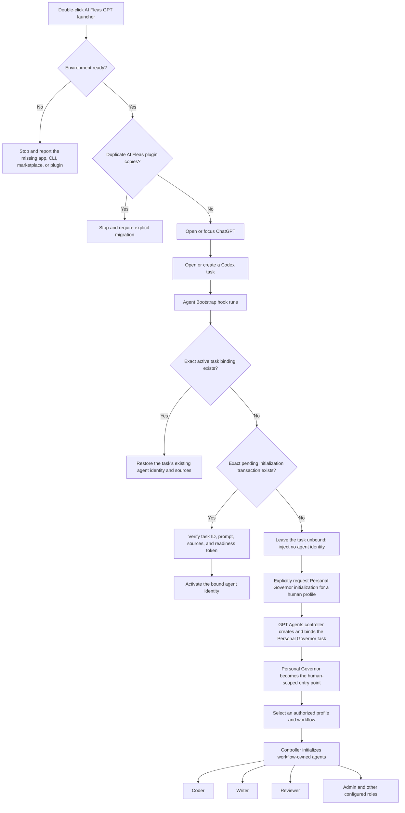

# AI Fleas for ChatGPT

This connects AI Fleas to the ChatGPT/Codex desktop app on macOS.

## Setup

1. Install the ChatGPT desktop app and Codex CLI.
2. Clone this repository.
3. Quit ChatGPT.
4. In Finder, open `platforms/gpt-agents/macos`.
5. Control-click `AI Fleas GPT.command`, choose **Open**, and approve the **AI Fleas GPT** hooks when ChatGPT asks.

## Daily use

Open the same `AI Fleas GPT.command`. It prepares AI Fleas and launches ChatGPT. You can drag it to the Dock for easier
access.

To initialize your Personal Governor, start a new Codex task and ask:

> Initialize Personal Governor for `<human-profile-id>` using the GPT Agents controller.

The **Try now** button is only a connection check; it does not create a Personal Governor.

## Terminal

```sh
platforms/gpt-agents/setup.sh
```

To record a private work profile at the same time:

```sh
platforms/gpt-agents/setup.sh --profile /absolute/path/to/work-profile.yml
```

Diagnostics:

```sh
node platforms/gpt-agents/launcher.mjs doctor
node platforms/gpt-agents/launcher.mjs launch
```

## What the launcher does

The launcher prepares and opens the GPT/Codex platform; it does not assign an agent identity to every new task. Identity
is receipt-backed so that an arbitrary chat cannot claim to be a Personal Governor, Coder, Writer, or another agent merely
through its title or prompt.



There are three separate responsibilities:

1. **Launcher:** connects AI Fleas to ChatGPT and keeps the installation ready.
2. **Agent Bootstrap:** restores or activates only an exact controller-registered task binding.
3. **Personal Governor and GPT Agents controller:** helps select profiles and workflows, then creates and binds their agents.

## GPT plugin development

GPT-specific plugins are source-controlled under `platforms/gpt-agents/plugins/`. That directory is authoritative.
Installed plugin copies, Codex caches, marketplace state, task bindings, and dispatch receipts are local runtime
artifacts; do not develop against them or copy them back into the repository as source.

Use this sequence for every plugin implementation or hook change:

1. Edit the plugin under `platforms/gpt-agents/plugins/<plugin-id>/`.
2. Run every test in that plugin's `scripts/` directory.
3. Validate the tracked plugin manifest with the plugin-creator validator.
4. Update the tracked manifest's single Codex cachebuster.
5. Install the tracked plugin through the configured local marketplace.
6. Start a new Codex task and verify the affected lifecycle path.
7. Commit the tracked source, tests, documentation, and manifest together.

Workflow maps and runtime bindings are different concerns: portable maps remain under `ai-workflows/`, while exact
task IDs and runtime receipts remain local and must be reconciled separately on each machine.

Repository ownership is uniform for every GPT integration:

| Concern | Authoritative location |
| --- | --- |
| portable role, flow, state machine, and runtime logic | `ai-workflows/` |
| explicit operator/controller action | `ai-commands/system/gpt-agents/` |
| automatic GPT/Codex lifecycle hook or delivery adapter | `platforms/gpt-agents/plugins/` |
| GPT-specific workflow or role mapping | `platforms/gpt-agents/workflows/` and `platforms/gpt-agents/agents/` |
| installed plugin, cache, task binding, permit, or receipt | local runtime data; never authoritative source |

Apply this split to the whole feature, not one file at a time. For example, the Workflow Router keeps its portable state
machine under `ai-workflows/_common/runtime/` and its Codex hooks under `platforms/gpt-agents/plugins/`; agent bootstrap
uses the same split.

The GPT Personal Governor initializer is also the platform-specific owner of opportunistic utility-subagent routing. It
activates only from an explicit human Governor binding, selects that binding's model/reasoning route per dispatch, and keeps
Governor judgment and workflow-role independence outside utility helpers.

## Common task bootstrap

The [`agent-bootstrap`](plugins/ai-fleas-gpt/modules/agent-bootstrap/README.md) module inside the single
[`ai-fleas-gpt`](plugins/ai-fleas-gpt/README.md) plugin is the GPT host bootstrap layer shared
by workflow-independent and workflow-owned agents. Codex loads it before an agent can reason about its own role. The plugin
restores only exact receipt-backed task identity and gates first-time initialization with a task-ID- and prompt-bound
transaction. It never infers identity from a title, conversation, working directory, or nearby files.

The lifecycle controller remains responsible for creating a fresh task, resolving canonical initialization sources,
registering the pending binding, delivering the exact initialization prompt, verifying readiness, and performing any
successor cutover. Workflow Router behavior begins only after this common bootstrap resolves a workflow-owned identity.
