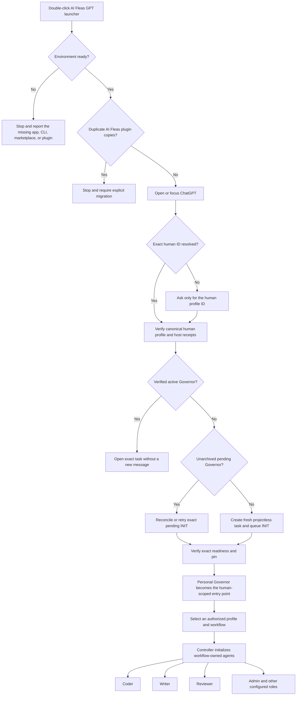

# AI Fleas for ChatGPT

This connects AI Fleas to the ChatGPT/Codex desktop app on macOS.

## Setup

Open the cloned repository, Control-click **`Install AI Fleas.command`**, and choose **Open**. It installs AI Fleas GPT,
adds it to your Dock, and opens ChatGPT.

## Daily use

Click **AI Fleas GPT** in the Dock. It prepares AI Fleas and ensures the Personal Governor for the selected human is
initialized. If one verified Governor is already active, it opens that task without sending a new message;
repeated clicks do not create replacements. If no Governor is active, it reconciles an exact pending task or creates a
fresh-history projectless task, queues the one-time activation, waits for exact readiness, then runs a separate welcome
`INIT` in the active Governor chat. That welcome reports the verified memory and actual scheduled follow-ups (or their
limitations); it must not claim a schedule exists without scheduler evidence. The launcher pins only a verified active Governor.
Archived Governors are terminal and are never reopened. When no unique human ID can be resolved from lifecycle
receipts, the launcher asks only for the exact human profile ID.

Initialization can take several minutes. The Governor may first appear in **Recents** while its activation turn is
running; it moves to **Pinned** only after the host verifies the active binding. On macOS the launcher sends
best-effort progress and completion notifications. If a run remains pending, launch AI Fleas GPT again to reconcile
that exact task; do not assume that a chat title or an early Recents entry means initialization succeeded.

For Dock-launch troubleshooting, the launcher records lifecycle decisions and navigation requests in
`~/.config/ai-fleas/gpt-agents/launcher.log` (owner-readable only). A `navigation-sent` entry confirms macOS accepted
the app-link request; it does not prove which chat the desktop ultimately displayed. The log does not contain profile
contents or memory text.

For a first-ever installation with no Governor receipt, configure the private human-profile catalog once during
setup (the launcher will not guess its path):

```sh
platforms/gpt-agents/setup.sh --humans-dir /absolute/path/to/ai-profile/humans
```

This saves the catalog directory in local launcher configuration, not in the public repository. A later Dock launch
can then ask for just the human ID and resolve its canonical directory from that catalog.

The launcher sets the desktop **Follow-up behavior** to **Queue** before opening ChatGPT. Sending a message while a task
is working then waits for the next turn; use the app's one-message Steer shortcut when you intentionally want to redirect
the current turn. This is a global Codex desktop preference in `~/.codex/config.toml`, not an isolated setting for AI Fleas
chats. If ChatGPT was already running when the launcher changed it, restart ChatGPT once to load the new default.

To initialize your Personal Governor, ask from any Codex task or chat, including an existing workflow/project chat:

> Initialize Personal Governor for `<human-profile-id>`.

The requesting chat stays in its existing role and project. No Admin is required. If the exact human profile ID is not
already resolved by a trusted host selection or uniquely verified Governor receipt, that ID is the only setup detail
the controller may ask the human to provide. The controller checks exact active/pending receipts, creates or
reconciles a separate fresh-history projectless task as required, then runs the checked-in initializer with that exact
task ID and the selected human profile directory:

```sh
node platforms/gpt-agents/launcher.mjs initialize-governor \
  --human <human-profile-id> \
  --human-dir <absolute-human-profile-directory> \
  --thread <exact-new-task-id>
```

The initializer checks the declared Governor role, memory provider, and source files; it then registers a pending
binding in the GPT plugin's host data and queues the exact activation prompt. The first turn returns only
`PERSONAL_GOVERNOR_READY`; after the binding is verified active, the launcher sends a separate welcome `INIT` turn.
That turn should greet the verified human and report memory and scheduling checks in plain language. The command
does not create, adopt, or pin a task by title. The controller reconciles exact active/pending receipts against the
host catalog. An archived Governor is terminal and a later initialization uses a fresh projectless task.

The **Try now** button is only a connection check; it does not create a Personal Governor.

## Terminal

```sh
platforms/gpt-agents/setup.sh
```

To record a private work profile at the same time:

```sh
platforms/gpt-agents/setup.sh --profile /absolute/path/to/work-profile.yml
```

Diagnostics:

```sh
node platforms/gpt-agents/launcher.mjs doctor
node platforms/gpt-agents/launcher.mjs launch
```

## What the launcher does

The launcher prepares and opens the GPT/Codex platform and ensures only the selected Personal Governor. It does not
assign an agent identity to every new task. Identity
is receipt-backed so that an arbitrary chat cannot claim to be a Personal Governor, Coder, Writer, or another agent merely
through its title or prompt.


```mermaid
flowchart TD
    A[Double-click AI Fleas GPT launcher] --> B{Environment ready?}
    B -- No --> C[Stop and report the missing app, CLI, marketplace, or plugin]
    B -- Yes --> D{Duplicate AI Fleas plugin copies?}
    D -- Yes --> E[Stop and require explicit migration]
    D -- No --> F[Open or focus ChatGPT]

    F --> G{Exact human ID resolved?}
    G -- No --> H[Ask only for the human profile ID]
    G -- Yes --> I[Verify canonical human profile and host receipts]
    H --> I
    I --> J{Verified active Governor?}
    J -- Yes --> K[Open exact task without a new message]
    J -- No --> L{Unarchived pending Governor?}
    L -- Yes --> M[Reconcile or retry exact pending INIT]
    L -- No --> N[Create fresh projectless task and queue INIT]
    M --> O[Verify exact readiness and pin]
    N --> O
    O --> Q[Personal Governor becomes the human-scoped entry point]
    Q --> R[Select an authorized profile and workflow]
    R --> S[Controller initializes workflow-owned agents]
    S --> T[Coder]
    S --> U[Writer]
    S --> V[Reviewer]
    S --> W[Admin and other configured roles]
```

There are three separate responsibilities:

1. **Launcher:** connects AI Fleas to ChatGPT and keeps the installation ready.
2. **Agent Bootstrap:** restores or activates only an exact controller-registered task binding.
3. **Personal Governor and GPT Agents controller:** helps select profiles and workflows, then creates and binds their agents.

## GPT plugin development

GPT-specific plugins are source-controlled under `platforms/gpt-agents/plugins/`. That directory is authoritative.
Installed plugin copies, Codex caches, marketplace state, task bindings, and dispatch receipts are local runtime
artifacts; do not develop against them or copy them back into the repository as source.

Use this sequence for every plugin implementation or hook change:

1. Edit the plugin under `platforms/gpt-agents/plugins/<plugin-id>/`.
2. Run every test in that plugin's `scripts/` directory.
3. Validate the tracked plugin manifest with the plugin-creator validator.
4. Update the tracked manifest's single Codex cachebuster.
5. Install the tracked plugin through the configured local marketplace.
6. Start a new Codex task and verify the affected lifecycle path.
7. Commit the tracked source, tests, documentation, and manifest together.

Workflow maps and runtime bindings are different concerns: portable maps remain under `ai-workflows/`, while exact
task IDs and runtime receipts remain local and must be reconciled separately on each machine.

Repository ownership is uniform for every GPT integration:

| Concern | Authoritative location |
| --- | --- |
| portable role, flow, state machine, and runtime logic | `ai-workflows/` |
| explicit operator/controller action | `ai-commands/system/gpt-agents/` |
| automatic GPT/Codex lifecycle hook or delivery adapter | `platforms/gpt-agents/plugins/` |
| GPT-specific workflow or role mapping | `platforms/gpt-agents/workflows/` and `platforms/gpt-agents/agents/` |
| installed plugin, cache, task binding, permit, or receipt | local runtime data; never authoritative source |

Apply this split to the whole feature, not one file at a time. For example, the Workflow Router keeps its portable state
machine under `ai-workflows/_common/runtime/` and its Codex hooks under `platforms/gpt-agents/plugins/`; agent bootstrap
uses the same split.

The GPT Personal Governor initializer is also the platform-specific owner of opportunistic utility-subagent routing. It
activates only from an explicit human Governor binding, selects that binding's model/reasoning route per dispatch, and keeps
Governor judgment and workflow-role independence outside utility helpers.

## Common task bootstrap

The [`agent-bootstrap`](plugins/ai-fleas-gpt/modules/agent-bootstrap/README.md) module inside the single
[`ai-fleas-gpt`](plugins/ai-fleas-gpt/README.md) plugin is the GPT host bootstrap layer shared
by workflow-independent and workflow-owned agents. Codex loads it before an agent can reason about its own role. The plugin
restores only exact receipt-backed task identity and gates first-time initialization with a task-ID- and prompt-bound
transaction. It never infers identity from a title, conversation, working directory, or nearby files.

The lifecycle controller remains responsible for creating a fresh task, resolving canonical initialization sources,
registering the pending binding, delivering the exact initialization prompt, verifying readiness, and performing any
successor cutover. Workflow Router behavior begins only after this common bootstrap resolves a workflow-owned identity.
