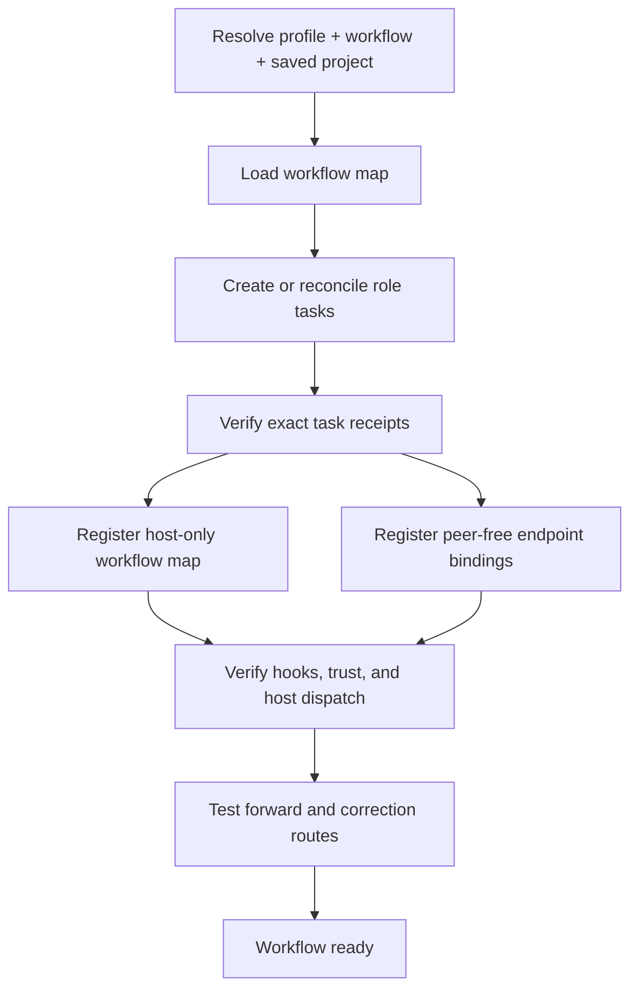

# GPT/Codex workflow initialization: questions and answers

## What does initialization create?

It creates or reconciles one visible Codex task for every workflow role and registers one hidden Workflow Router for
that exact workflow scope. Profile-wide agents are outside this adapter.

```text
Workflow roles -> visible Codex tasks + one hidden Router
```

## What must already exist?

The profile, workflow, authorized project roots, primary work target, and saved Codex Project must already be configured.
The saved project must resolve to the authorized roots by immutable project ID. Initialization does not create a project,
clone, checkout, or worktree.

This saved-project prerequisite applies to managed roster initialization. A human-designated Admin chat uses the manual
bootstrap rule in `AGENTS.md`; it may be created from any chat and need not belong to the saved project. Its authority
still requires an exact configured profile and workflow and an authorized project subset before operational work.

```text
Configured profile + workflow + saved project -> initialization
```

## Where do the agents run?

Every role task uses the saved project's `local` environment and shared primary checkout. Titles and sidebar positions
are presentation only; trusted receipts use immutable project and task IDs.

```text
Saved project -> local shared checkout -> role tasks
```

## What happens during initialization?



## What if every workflow task is archived?

That is a normal recovery state. `initialize` reads both active and archived catalogs to exhaustion, matches only exact
trusted task receipts for the requested profile/workflow/logical-project scope, and restores all matching tasks together.
It does not interpret an empty active catalog as an empty roster and does not create replacements for receipt-backed
archived tasks. After unarchiving, it rereads the active project catalog, refreshes readiness, and continues normal Router
registration and smoke tests.

The adapter feeds these inventories to `reconcile-roster.mjs`. Its `restore-all` result is the mechanical proof that every
declared role has one exact archived receipt in the correct saved project; no title or model judgment participates.

```text
all exact receipt-backed tasks archived -> batch unarchive -> verify project -> refresh readiness
```

## Who knows which agent should go next?

The workflow definition declares the next stage and the role that owns it. The hidden Router executes that declaration;
it does not decide creatively who should work next.

```text
Workflow declaration -> Router execution -> next role
```

## Why use a mechanical Router instead of letting agents communicate through a matrix?

The workflow already defines who goes next. Using another AI agent to interpret a communication matrix would add
unnecessary cost, delay, and mistakes.

```text
Declared transition -> deterministic lookup
                     X AI re-interpretation
```

## Are we creating more complexity by keeping the Router mechanical? Would a lightweight Router agent be better?

The Reviewer/Writer loop came from an incomplete workflow map: it lacked an explicit human-wait state. A Router agent
might have improvised around that omission, but it could make different routing decisions for identical events and hide
missing workflow rules instead of exposing them.

Keep known transitions mechanical because they are inexpensive, repeatable, testable, and auditable. A lightweight AI
may help classify ambiguous human intent into a declared capability or event, but deterministic code must validate and
execute the final route. Human decisions remain explicit waiting states rather than AI guesses.

```text
ambiguous human intent -> lightweight AI classification
declared workflow event -> mechanical Router
human decision required -> pause for human
```

## How is the mechanical Router implemented?

It is a Codex plugin with lifecycle hooks. `UserPromptSubmit` restores the task's workflow binding and creates a Router
correlation. `Stop` validates the agent's `WORKFLOW_ROUTER_RESULT`. The plugin's JavaScript then looks up the returned
stage and event in the registered workflow map, resolves the next role to an exact task ID, and asks the host dispatcher
to deliver the next assignment.

```text
Codex hooks -> Router JavaScript -> workflow map -> host dispatcher
```

Lifecycle initialization is control traffic, not workflow ingress. For an already bound endpoint, the controller uses
`queue-lifecycle-control.mjs` to atomically register a short-lived one-shot permit containing the exact session ID,
SHA-256 digest of the complete lifecycle prompt, expected readiness token, and action, then deliver the same prompt with
daemon-backed `codex queue`. Cross-task tool messages that appear as function-call output do not run `UserPromptSubmit`
and are not valid lifecycle delivery. The Router consumes the permit only for the matching prompt, supplies lifecycle
context, and validates the readiness token without requiring `WORKFLOW_ROUTER_RESULT`. A user-written marker or a
different prompt cannot bypass workflow enforcement.

## Must Codex be restarted every time the plugin code changes?

No. After changing the plugin's JavaScript or hook definition, rebuild or cache-bust and reinstall the plugin, then test
it in a new task so that task loads the new installed version. A full Codex app restart is a fallback only when a fresh
task still loads the old version or the changed hook definition requires its trust state to be refreshed. Batch related
plugin-code changes before reinstalling to avoid unnecessary reload overhead.

A workflow-map or runtime-binding change is Router data, not plugin executable code, and should not require reinstalling
the plugin or restarting Codex.

```text
plugin code or hook     -> reinstall -> new task
fresh task is still stale or trust changed -> restart/review trust
workflow map or binding -> no reinstall and no restart
```

## How does the hidden Router resolve the next agent?

It follows one deterministic lookup:

```text
(current stage, returned event) -> next stage -> owning role -> exact task ID
```

For Writing:

```text
review + changes_required -> correction -> writer
correction + review_ready -> review -> reviewer
review + accepted -> release -> release-coordinator
```

If a transition declares that changed progress is required, the Router also compares its bounded progress references.
Writing does not dispatch `correction -> review` when the Writer returns the same article revision and review packet
already sent to review. A changed article revision or a refreshed packet with new rendered-destination evidence resumes
the declared route.

```text
same article + same review packet -> record without dispatch
changed article or review packet -> resume declared route
```

```text
stage + event -> transition -> role -> task ID
```

## What is the registered workflow map?

It is the host's executable runtime record for one exact workflow scope. Initialization combines:

- the portable `*.workflow-map.json`, which contains stages, roles, events, transitions, and evidence requirements; and
- a private runtime overlay containing the exact scope and receipt-backed task ID for every role.

The plugin contains no Writing-specific Reviewer-to-Writer rule. It runs the transitions supplied by the selected
workflow map.

```text
portable JSON + private task bindings -> registered host map
```

## Does the workflow map have a visual companion?

Yes. Every `*.workflow-map.json` must have a same-name `*.workflow-map.mmd` Mermaid file generated from it. JSON is the
executable projection; Mermaid is the human-readable view. Initialization verifies that they match before registration.

For Writing, see [writing.workflow-map.json](../../../ai-workflows/writing/writing.workflow-map.json) and
[writing.workflow-map.mmd](../../../ai-workflows/writing/writing.workflow-map.mmd).

```text
workflow-map.json -> generated workflow-map.mmd -> human view
```

## What does each agent know?

Each agent receives only its own endpoint binding:

- exact workflow scope;
- its role and owned capabilities;
- authoritative workflow source; and
- Router correlation and result contract.

It does not receive peer task IDs or successor rules. The complete workflow map remains host-only.

```text
Agent: own binding only | Host: full map + all task IDs
```

## Can a human start with any workflow agent?

Yes. A direct message to any active bound endpoint is normal workflow ingress. If that role owns the requested
capability, it performs the work. Otherwise it performs no substitute work and returns `route-required`; the Router
resolves the single workflow-declared owner. Missing or ambiguous ownership blocks instead of guessing.

```text
Human -> any endpoint -> owned work OR route-required -> Router
```

## How does an agent return control to the Router?

Every completed endpoint turn ends with `WORKFLOW_ROUTER_RESULT`. The hook validates the Router-owned correlation,
stage, role, event, and bounded references. The Router then consults the workflow map and dispatches only the declared
successor. Agents never message one another, and Admin is not routine transport.

```text
Agent result -> Stop hook -> Router validation -> declared successor
```

## What happens when the workflow needs a human decision?

The endpoint returns `human_action_required`. The Router records a `waiting-human` stage and dispatches no agent. Human
acceptance follows the declared release route; human rejection returns bounded findings to the declared correction role.

```text
Agent -> human_action_required -> PAUSE -> human accepts OR rejects -> declared route
```

## In what order is the workflow initialized?

1. Validate the exact scope, saved project, roots, workflow source, portable map, diagram, and roster.
2. Enumerate active and archived tasks to exhaustion. Reuse active exact receipts, batch-unarchive exact receipt-backed
   archived roles (including a fully archived roster), create only roles that remain genuinely missing, and, for an
   explicitly authorized roster contraction, recoverably archive every active task in the removed role's exact durable
   receipt history. Never infer retired tasks from titles.
3. Reread the host catalog and verify every task under the exact saved-project ID.
4. Persist active task receipts.
5. Register the portable map plus private scope/endpoint overlay with `scripts/register-workflow.mjs`.
6. Register each peer-free endpoint binding with `scripts/register-binding.mjs`.
7. Verify the installed plugin version and trust for the current hook definition.
8. Test one forward transition and one correction/review loop.
9. Declare readiness only after the exact target task starts and its completed result is observed.

```text
validate -> create -> verify -> register -> trust -> test -> ready
```

## What causes initialization to stop?

Missing receipts, duplicate roles, mismatched roots, stale task IDs, unsupported host capabilities, map/diagram drift,
undeclared transitions, or ambiguous ownership fail closed. Initialization must not create speculative replacement
tasks while an earlier candidate may still resolve.

```text
Any identity, map, receipt, or capability mismatch -> BLOCKED
```

## Does a successful hook or queue call prove delivery?

No. Hook observation and cross-task delivery are separate capabilities. A local queue can accept a message without
waking an idle desktop task. Initialization must verify a connected host dispatcher and a delivery receipt; otherwise it
returns `BLOCKED_ROUTER_IDLE_DISPATCH_UNAVAILABLE` and does not claim unattended execution.

```text
queue accepted -/-> task started -> result observed
```

## How are workflow agents replaced or removed?

Reinitialization reconciles receipt-backed tasks first. Replacement verifies the successor before recoverably archiving
the predecessor. Deleting a workflow group archives only its exact bound tasks and retires its workflow registration;
the saved project, checkout, repository, and work target remain intact.

```text
verify successor -> archive predecessor | preserve project and repository
```
