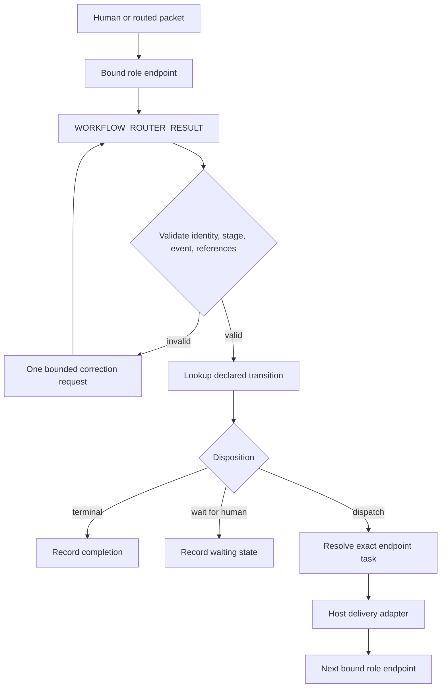
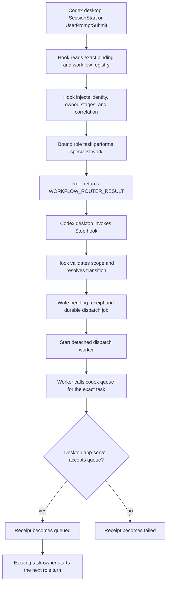

# Workflow Router architecture

## Purpose

The Workflow Router executes declared workflow transitions without asking role agents to discover or message one
another. An endpoint performs specialist work and returns a narrow result. The Router validates that result, looks up
the declared transition, resolves the exact bound endpoint, and asks the host adapter to deliver the next assignment.

This document separates the portable mechanical contract from its Codex-specific implementation. Keep that boundary
visible whenever the plugin changes.

## Architectural boundary

| Concern | Portable AI Fleas contract | Codex plugin adapter |
| --- | --- | --- |
| Workflow authority | The selected `*.workflow.md` and its executable projection | Registers the projection in host-only plugin data |
| Endpoint identity | Exact receipt-bound role, scope, and capabilities | Maps the immutable Codex task ID to that binding |
| Stage completion | `WORKFLOW_ROUTER_RESULT` with a declared event and durable references | `Stop` hook extracts and validates the envelope |
| Transition | `(stage, event) -> next stage -> role` | JavaScript performs the deterministic lookup |
| Delivery | Host must address the exact registered endpoint | `codex queue --thread … --message …` uses the existing desktop app-server owner |
| Evidence | Cross-endpoint references must be durable and resolvable | Packet contains references, not conversation history |
| Idempotency | One transition result produces at most one dispatch | Receipt filename is derived from correlation, stage, and event |
| Human wait | A declared wait state stops automatic dispatch | Receipt records `waitingForHuman` without invoking a task |

The workflow does not depend on Codex hooks, task IDs, or `codex queue`. Those belong to this host adapter. A different
host may implement the same contract with a durable queue, state-machine service, or native lifecycle callbacks.

## Mechanical flow



Role endpoints never select their peers. The workflow owns the route; the registry resolves the concrete destination;
the host adapter only delivers the validated packet.

## Codex lifecycle adapter

Architecture diagrams in this plugin use a top-to-bottom layout by default so they remain readable in narrow Codex
panes and split-screen IDE layouts.



The three hooks have distinct responsibilities:

- `SessionStart` restores trusted task identity after startup, resume, clear, or compaction.
- `UserPromptSubmit` allocates the Router-owned correlation and injects the endpoint contract.
- `Stop` validates the terminal result and advances only a declared transition.

## Why delivery uses `codex queue`

Codex desktop already owns each open task's thread-store writer. Starting `codex exec resume <task-id>` creates another
writer and can fail even when the visible task is idle:

```text
thread-store conflict: thread <task-id> already has an active writer
```

The worker must instead use:

```text
codex queue --thread <task-id> --message <packet>
```

`codex queue` sends the message through the running app-server and its existing task owner. Queue acceptance proves
that the host accepted the message; it does not prove that the role finished its turn. Therefore:

- `pending` means a durable job exists but the host has not accepted it yet;
- `queued` means the existing host owner accepted the message;
- `failed` means the host rejected delivery or the worker could not invoke it;
- endpoint completion is established separately by task lifecycle state and the next valid Router result.

Never rename `queued` to `completed`, and never use CLI process ownership as evidence that the destination role
finished its work.

## Durable state

The plugin data directory contains:

```text
bindings.json                 exact task bindings and registered workflow projections
correlations/<task>.json      current Router-owned correlation for a task
dispatch-jobs/<digest>.json   durable packet and exact destination for asynchronous delivery
dispatches/<digest>.json      idempotency and delivery receipt
```

The dispatch digest is derived from `correlationId`, source stage, and event. Retrying the same terminal result must not
create a second transition. A successful retry may replace a previous `failed` status and must clear its stale error.

## Invariants

Every change must preserve these rules:

1. Unbound tasks are ignored.
2. Identity comes from the host registry, never task titles, nearby files, or conversation claims.
3. A role can return only a stage it owns and an event declared from that stage.
4. Cross-endpoint evidence is a durable `{"kind","ref"}` reference, not prose stored only in a task.
5. Endpoints do not know peer task IDs and do not choose successor roles.
6. Dispatch targets the exact task registered for the resolved role and runtime scope.
7. The same terminal result is idempotent.
8. A transition that declares changed progress does not dispatch when its bounded progress references match an earlier
   successful delivery to the same target stage.
9. Human-wait transitions do not dispatch an endpoint.
10. Queue acceptance and endpoint completion remain different states.
11. Codex delivery uses the existing app-server owner; it never resumes the same desktop task through a second writer.

## Development and regression checklist

Before reinstalling a local change:

1. Run `node --test scripts/*.test.mjs`.
2. Validate the plugin with the plugin-creator validator.
3. Update the single manifest cachebuster and reinstall from the configured local marketplace.
4. Start or use tasks that have loaded the new plugin version.
5. Exercise one real transition between two exact bound tasks.
6. Confirm the dispatch receipt becomes `queued` without a stale `deliveryError`.
7. Confirm the destination task actually starts and produces the expected durable result.
8. If the destination result has a successor, confirm the next mechanical transition as well.

Tests must cover both queue acceptance and queue rejection. A fake CLI test that only emits `thread.started` or
`turn.started` events is insufficient because it can hide a desktop thread-store ownership conflict.
